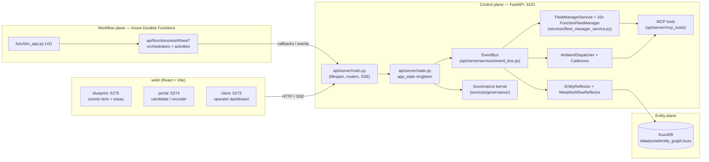

# Architecture

Canonical reference for how the codebase hangs together as of `HEAD` on
`main`. Counts and file paths in this document were verified against the
source tree at write time; if you change a registry, refresh this doc.

The system has four cooperating planes, plus a fifth **autonomous-domain-insights** loop layered on top of them (added in v1.0–v1.3, May 2026 — see §12):

1. **Control plane** — a FastAPI app that owns the singleton Fleet
   Manager, per-function Fleet Managers, the EventBus, the persona
   responder, the simulator, the governance kernel, and the HTTP / SSE /
   MCP surfaces.
2. **Entity plane** — an embedded KuzuDB property graph populated by an
   `EntityReflector` that listens to the bus and runs per-domain
   projection functions.
3. **Workflow plane** — Azure Durable Functions orchestrators (one per
   live domain) registered via the v2 programming model in
   [`function_app.py`](../function_app.py); they call back into the
   control plane through HTTP and emit `FleetEvent`s onto the bus.
4. **Cosmic-lens UI** — three React + Vite SPAs in [`web/`](../web/)
   that consume the same `/api` surface (FastAPI on `:3101`).
5. **Autonomous-domain-insights loop** (§12) — personae publish
   `Insight` nodes via `summary_policy` blocks; operators approve
   proposed actions; the resulting `policy_set` Decisions feed back
   into other personae's `decision_policy` blocks via
   `active_policies_for()`, closing the loop.



---

## 1. Top-level layout

| Path | Role |
|---|---|
| [`api/shared/`](../api/shared/) | Cross-cutting domain + function registries, event model, OTEL, persona/role taxonomy, policies. |
| [`api/server/`](../api/server/) | FastAPI app: routes, services, MCP tools, personae, skills, eval, governance. |
| [`api/functions/`](../api/functions/) | Azure Durable Functions orchestrators + activities, agent executors. |
| [`function_app.py`](../function_app.py) | Azure Functions v2 entry point; registers the orchestrators and their activity wrappers; boots OTEL + governance kernel at module load. |
| [`web/blueprint/`](../web/blueprint/) | Public-facing essay + cosmic-lens 3D visualisation (most active surface). |
| [`web/portal/`](../web/portal/) | Candidate / recruiter SPA. |
| [`web/client/`](../web/client/) | Internal operator dashboard (legacy host, still mounted). |
| [`web/shared/`](../web/shared/) | TS aliased as `@shared` (`humanize.ts`, `types.ts`, `events.ts`). |
| [`mocks/`](../mocks/) | Node/Express MCP mocks for external SaaS surfaces (Workday, Concur, Greenhouse, ServiceNow, ACS, …). |
| [`scripts/`](../scripts/) | Boot/teardown shell + Python utility scripts. |
| [`tests/`](../tests/) | `tests/api/` (pytest), `tests/web/` (vitest TSX), `tests/e2e/` (Playwright). |
| [`data/`](../data/) | Runtime + seed data (sqlite, KuzuDB, fixtures, cadence YAMLs, blueprint recordings). |
| [`docs/`](../docs/), [`plan/`](../plan/) | Documentation and feature plans. |

**Two FastAPI entry points:**

- [`api/server/main.py`](../api/server/main.py) — full app (boots
  governance, FM, ambient dispatcher, simulator ramp loop, persona
  responder, portal orchestration, eval subscriber). Mounts every
  router and serves `web/blueprint/dist/` if present.
- [`api/server/blueprint_app.py`](../api/server/blueprint_app.py) —
  lean shim used by the deployed blueprint microsite. Monkey-patches
  `app_state` with a minimal `EventBus`-only object so KuzuDB,
  WeasyPrint, and the AF SDK never load in that container.

Both bind to **port `3101`** in development (`make server`,
`make up`, `scripts/boot-demo.sh`).

---

## 2. Domain registry

[`api/shared/domains.py`](../api/shared/domains.py) (~1,180 LOC) is the
**single source of truth** for what a "workflow" is. It declares
`Phase`, `HitlGate(gate_phase, external_event, persona, wait_probability)`,
`WakeHint`, and `Domain(workflow_type, display_name, workflow_id_prefix,
orchestrator_name, operator_surface, phases, hitl_gates, skills,
wake_hints, spawn_fn, realistic_interval_seconds, function)`. The
`DOMAINS` dict is keyed by `workflow_type`; helpers include
`get`, `by_prefix`, `resolve_external_event`, `all_wake_hints`,
`all_personae`, and `live_domains()` (filter on `phases != ()`).

**As of May 2026: 37 registered domains** — all live (`phases != ()`)
since the v1.x wave filled in the previously-stubbed CEO meta-workflows.
Verified via `from api.shared.functions import _; from api.shared.domains import DOMAINS, live_domains`.

| Function | Live domains |
|---|---|
| `legacy` | `expense-claim`, `hiring` |
| `finance` | `annual-budget-setting`, `ap-invoice`, `contract-renewal`, `intercompany-recharge`, `monthly-client-pnl`, `purchase-order`, `treasury-fx`, `vendor-kyc`, `vendor-risk-to-pay` |
| `hr` | `employee-onboarding`, `freelancer-onboarding`, `hire-to-productive`, `intercompany-talent-transfer`, `perf-review`, `talent-redeployment`, `travel-preapproval` |
| `revenue` | `account-onboarding`, `client-renewal`, `lead-to-cash`, `new-business-pipeline-scrub` |
| `marketing` | `creative-awards-submission`, `creative-campaign`, `media-pitch-to-win`, `quarterly-creative-awards`, `weekly-pitch-review` |
| `legal` | `contract-review`, `privacy-dpia` |
| `tech` | `it-access-request` |
| `data` | `data-clean-room-setup` |
| `ops` | `crisis-response` |
| `ceo` | `agency-network-roll-up`, `board-prep`, `fy-close`, `m-and-a-integration`, `policy_set` |

The `policy_set` entry (added v1.1, owned by `ceo`) is the generic
one-shot workflow spawned when an operator approves a persona's
proposed action; its projection records a `Decision` with
`phase="policy_set"` that other personae query via
`active_policies_for()` (§12). Function membership is back-filled by
`_wire_function_back_refs()` at import of `api.shared.functions`.

**Why a separate `Domain` registry rather than just declaring it on
each orchestrator?** The control plane needs to reason about workflows
*without loading the Durable Functions worker* — for the cosmic lens,
the simulator, the per-function FMs, the ambient dispatcher, and the
boot-time validators. Decoupling the metadata from the orchestrator
keeps the FastAPI app slim and lets us run the constellation against a
seeded graph with no Functions host at all.

The 11 org **functions** are declared in
[`api/shared/functions.py`](../api/shared/functions.py)
(`finance`, `hr`, `revenue`, `ops`, `legal`, `marketing`, `tech`,
`data`, `customer-success`, `ceo`, `legacy`). Boot-time validators
`_wire_function_back_refs()` and `_validate_persona_hierarchy()` raise
on orphan domains or persona roles missing a `SKILL.md`.

---

## 3. Persona system

Personae live in [`api/server/personae/`](../api/server/personae/), one
directory per role, each containing a `SKILL.md` consumed by the
persona responder and the FMs.

**79 persona roles** (verified by `find api/server/personae -mindepth 1
-maxdepth 1 -type d | wc -l`). They cover every persona gate in the live
domains plus the manager hierarchy declared by each function in
`api/shared/functions.py`. Examples: `cfo`, `controller`, `treasurer`,
`hr_bp`, `recruiter`, `cpo`, `gc`, `dpo`, `contracts_counsel`,
`creative_director`, `category_manager`, `ssc_reviewer`, `candidate`,
plus per-domain reviewer roles like `vendor_kyc_finance_bp`,
`it_access_line_manager`, `perf_review_hr_bp`, `onboarding_it_admin`.
The `ceo` persona (added v1.0) is the only persona today whose
`summary_policy` block synthesises across the others (§12).

Personae are pure data — no per-persona Python — and are validated at
import time. Each `SKILL.md` carries YAML frontmatter declaring up to
**three executable blocks**:

- `decision_policy` (required) — closes a persona gate with a
  `{"decision","reason"}` outcome. **No human in the loop**: the
  persona's deterministic Python decides, the persona-responder raises
  the external event back to Durable.
- `summary_policy` (optional, v1.0+) — observes the entity graph on
  every cadence tick and returns a structured `Insight` payload
  (headline / body / kpis / proposed_actions / fingerprint).
- `voice_render` (optional, v1.2+) — re-renders the structured `body`
  in first-person prose for buyer-comprehensible UI surfaces.

The **persona responder**
([`api/server/services/persona_responder.py`](../api/server/services/persona_responder.py))
subscribes to `workflow.hitl.requested` and `domain.summary.requested`
events, compiles each block in a sandboxed `exec` namespace with `graph`,
`active_policies_for`, `query_precedents`, and `authority_check` injected,
and applies the result. POC1 hand-built domains (`expense-claim`,
`hiring`) opt out and use `persona_seed` + hand-written resolvers
instead.

**10 personae** carry a `summary_policy` block today: `ceo`, `cfo`,
`treasurer`, `hr_director`, `sourcing_lead`, `dpo`, `gc`,
`it_admin_director`, `chief_data_officer`, `recruiter`. **6 of those
also carry a `voice_render` block** (cfo, ceo, hr_director, dpo,
chief_data_officer, treasurer). See §12 for the closed-loop semantics.

---

## 4. Entity graph + reflector + projections

The entity plane is implemented by
[`api/server/services/entity_graph.py`](../api/server/services/entity_graph.py)
(~1,600 LOC) — an embedded **KuzuDB** property graph at
`data/portal/entity_graph.kuzu`. **16 node kinds** (verified against
`CREATE NODE TABLE` statements):

- *People & orgs:* `Person`, `Organisation`, `Subsidiary`.
- *Things & money:* `Asset`, `Money`.
- *Agency narrative:* `Brand`, `Campaign`, `Pitch`, `MediaPlan`.
- *Finance substrate:* `Account`, `CostCentre`.
- *Spine:* `Decision`, `Workflow`, `Place`, `Period`.
- *Persona output (v1.0+):* `Insight` — one row per persona summary
  publication; columns `role`, `scope`, `headline`, `body`, `kpis`
  (JSON), `proposed_actions` (JSON), `fingerprint`, `decided_at`.

The `Decision.verdict` vocabulary is canonicalised through
[`api/server/services/decision_vocab.py`](../api/server/services/decision_vocab.py).
The 7 original verdicts (`approve`, `reject`, `escalate`, `defer`,
`request_changes`, `partial`, `void`) were extended in v1.0 with
**three policy verdicts** (`freeze`, `unfreeze`, `cap`) used by the
generic `policy_set` workflow (§12).

**35 rel tables** group into five families. Every rel carries a
`decided_at TIMESTAMP` (default-stamped on `link()` if not supplied):

- *Org/people:* `EMPLOYED_BY`, `MANAGES`, `OWNS`, `TRANSACTS`,
  `BELONGS_TO`, `LOCATED_IN`, `PART_OF`.
- *Decisions:* `DECIDED_ON`, `DECIDED_PERSON`, `DECIDED_MONEY`,
  `DECIDED_ASSET`, `DECIDED_ORG`, `DECIDED_PERIOD`, `DECIDED_PLACE`,
  `DECIDED_BRAND`, `DECIDED_CAMPAIGN`, `DECIDED_PITCH`,
  `DECIDED_MEDIAPLAN`, `DECIDED_SUBSIDIARY`, `TOUCHED`,
  `PRECEDENT_OF`.
- *Workflow ↔ workflow / period:* `SUB_WORKFLOW_OF`,
  `WORKFLOW_IN_PERIOD`.
- *Agency:* `BRAND_OF`, `CAMPAIGN_FOR`, `EXECUTED_BY`, `SUPPLIED_BY`,
  `PITCH_FOR`, `RESULTED_IN`.
- *Accounts substrate:* `PAYS`, `OWED_BY`, `BOOKED_AGAINST`,
  `BOOKED_AGAINST_CC`, `COSTED_TO`, `COSTED_TO_BRAND` — these and
  the `BRAND_OF` / `CAMPAIGN_FOR` / `EXECUTED_BY` edges are the
  agency-finance substrate landed by the entity-graph-coherence work
  ([`docs/superpowers/plans/archive/2026-05-12-entity-graph-coherence.md`](superpowers/plans/archive/2026-05-12-entity-graph-coherence.md)).

`Decision` also carries first-class columns `amount_gbp`, `vendor_id`,
`client_brand`, etc. (projected from `attributes` JSON) so common
filters don't have to JSON-parse.

The schema is bootstrapped via DDL on first construction and seeded
from `data/synthetic/employees.json` plus
`api/server/fixtures/{vendors,agencies}.json`. The graph emits
`entity.upserted`, `entity.linked`, `decision.recorded`, and
`entity.read` onto the bus. Because KuzuDB is single-writer per file,
the env flag `ENTITY_PLANE_ENABLED=0` disables it (and the
per-function FMs and ambient dispatcher) inside the Functions worker
process so it doesn't race FastAPI for the file lock.

[`EntityReflector`](../api/server/services/entity_reflector.py)
subscribes to the bus, governance-gates each event, and dispatches it
through per-domain projection functions registered in
[`api/server/services/entity_projections/__init__.py`](../api/server/services/entity_projections/__init__.py).
[`MetaWorkflowReflector`](../api/server/services/meta_workflow_reflector.py)
mirrors `workflow.sub_spawned` events into a `Workflow → Workflow`
self-relation so meta-workflow trees are queryable.

**As of May 2026: 37 projections** registered via auto-import in
`entity_projections/__init__.py`. The original 12 cover the POC live
domains; the rest were added with the agency-pitch wave plus
ramp-up workflows. The most recent is `policy_set` (v1.1) — records a
`Decision` with `phase="policy_set"` whenever an operator approves a
persona's proposed action via the new approve route (§12). The
projection canonicalises `verdict` (so `"frozen"` → `"freeze"`) and
links the Decision to every node id in `decided_on` via the matching
`DECIDED_<KIND>` rel (Brand, Money, Organisation, Person, Period,
Place, Asset, Subsidiary, Campaign, Pitch, MediaPlan).

| # | Projection | File |
|---|---|---|
| 1 | `ap-invoice` | [`ap_invoice.py`](../api/server/services/entity_projections/ap_invoice.py) |
| 2 | `contract-renewal` | [`contract_renewal.py`](../api/server/services/entity_projections/contract_renewal.py) |
| 3 | `contract-review` | [`contract_review.py`](../api/server/services/entity_projections/contract_review.py) |
| 4 | `creative-campaign` | [`creative_campaign.py`](../api/server/services/entity_projections/creative_campaign.py) — emits first-class `Brand`, `Campaign`, `MediaPlan` plus `CAMPAIGN_FOR` / `EXECUTED_BY` edges. |
| 5 | `employee-onboarding` | [`employee_onboarding.py`](../api/server/services/entity_projections/employee_onboarding.py) |
| 6 | `it-access-request` | [`it_access_request.py`](../api/server/services/entity_projections/it_access_request.py) |
| 7 | `perf-review` | [`perf_review.py`](../api/server/services/entity_projections/perf_review.py) |
| 8 | `privacy-dpia` | [`privacy_dpia.py`](../api/server/services/entity_projections/privacy_dpia.py) |
| 9 | `purchase-order` | [`purchase_order.py`](../api/server/services/entity_projections/purchase_order.py) |
| 10 | `travel-preapproval` | [`travel_preapproval.py`](../api/server/services/entity_projections/travel_preapproval.py) |
| 11 | `treasury-fx` | [`treasury_fx.py`](../api/server/services/entity_projections/treasury_fx.py) |
| 12 | `vendor-kyc` | [`vendor_kyc.py`](../api/server/services/entity_projections/vendor_kyc.py) |
| 13 | `policy_set` (v1.1) | [`policy_set.py`](../api/server/services/entity_projections/policy_set.py) — records a `Decision` with `phase="policy_set"` + the proposed verdict. |

(The other 24 — `account-onboarding`, `agency-network-roll-up`,
`annual-budget-setting`, `board-prep`, `client-renewal`,
`creative-awards-submission`, `crisis-response`,
`data-clean-room-setup`, `expense-claim`, `freelancer-onboarding`,
`fy-close`, `hire-to-productive`, `hiring`, `intercompany-recharge`,
`intercompany-talent-transfer`, `lead-to-cash`, `m-and-a-integration`,
`media-pitch-to-win`, `monthly-client-pnl`,
`new-business-pipeline-scrub`, `quarterly-creative-awards`,
`talent-redeployment`, `vendor-risk-to-pay`, `weekly-pitch-review`
— ship under `api/server/services/entity_projections/` with the
same auto-registration shape.)

---

## 5. EventBus — publishers and subscribers

The bus is a synchronous in-process publisher/subscriber implemented in
[`api/server/services/event_bus.py`](../api/server/services/event_bus.py)
(`on(type, h)`, `on_any(h)`, `emit(event)`; per-handler try/except
isolates bad subscribers). The event model is
[`FleetEvent`](../api/shared/events.py) — a Pydantic model with
`extra="allow"` and a free-form `type: str`, deliberately widened so
per-domain event names work without registry churn.

The bus is constructed inside
[`api/server/state.py`](../api/server/state.py) as part of the
`AppState` singleton (`app_state.bus`). The same module owns the
EntityGraph, governance kernel, ambient dispatcher, cadences, KPI
store, magic-link store, blob store, SSE hub, and (after
`init_function_fms()` is called from `main.py`) one
`FunctionFleetManager` per non-legacy function. `_run_cadence()` drives
cron schedules through `croniter`.

**Publishers** (representative — `bus.emit(...)` callsites):

- `services/entity_graph.py` — `entity.upserted`, `entity.linked`,
  `decision.recorded`, `entity.read`.
- `services/fleet_manager_service.py` — `fleet.tick`, `fleet.overload`,
  `kpi.published`.
- `services/simulator_orchestrator.py` — workflow lifecycle + ticks.
- `services/persona_responder.py` — `persona.thinking`,
  `persona.decided`, plus the resolving external event.
- `services/ambient_dispatcher.py` — `ambient.decided`.
- `services/portal_orchestration.py` — magic-link / candidate
  lifecycle.
- `routes/blueprint.py`, `routes/portal*.py`,
  `routes/internal_durable_event.py`, `routes/a2a.py`,
  `routes/webhooks_servicenow.py`, `routes/accuracy.py`.
- `api/functions/graphs/executors/agents/*` — agent executors emitting
  back into the FastAPI bus from Functions activities.

**Subscribers:**

- `main.py` lifespan wires `bus.on_any(...) → SSEHub.broadcast("fleet", …)`.
- `EntityReflector` — bus → projection → KuzuDB writes (governance-gated).
- `MetaWorkflowReflector` — `workflow.sub_spawned` → graph self-relation.
- `AmbientDispatcher` — registers per-`AmbientAgent` `BusTrigger`
  handlers.
- `FleetManagerService` — feeds its own `FleetManagerQueue` (debounced,
  triaged via `services/triage.py`, with `WAKE_TYPES` from
  `api/shared/events.py` plus per-domain `WakeHint`s).
- `eval/online_subscriber.py` — streams `agent.completed` to Foundry
  evaluation.

Routes that need realtime fan-out subscribe through
[`SSEHub`](../api/server/services/sse_hub.py) (`/api/stream/fleet`,
`/api/stream/fleet-manager`, `/api/stream/orchestration`,
`/api/blueprint/stream`). The blueprint observatory throttles via a
token bucket (default 20 events/sec, `MAX_OBSERVATORY_EVENTS_PER_SEC`)
and curates a whitelist of event types in `routes/blueprint.py`.

---

## 6. MCP tools surface

MCP tools live in [`api/server/mcp_tools/`](../api/server/mcp_tools/).
Two factories in
[`mcp_tools/__init__.py`](../api/server/mcp_tools/__init__.py) build
the toolsets handed to the Fleet Managers:

- `build_fleet_manager_tools(store, audit)` — **singleton FM toolset
  (7 tools)**: `query_fleet`, `query_traces`, `compose_exception`,
  `propose_skill_amplification`, `dry_run_policy`,
  `query_reviewer_decisions`, `query_economics`.
- `build_function_fm_tools(store, audit, graph, function_name, *,
  kpi_store=None)` — **per-function FM toolset (5 tools)**:
  `query_fleet_state`, `query_kpi`, `query_recent_decisions`,
  `query_entity`, `find_entities`. The CEO-FM additionally receives
  `query_function_fm` for delegation across the other function FMs.

Other tools in the directory back the agent skills (POC1/POC2 surfaces
and the generated `fleet-*` skills): `find_entities`,
`query_precedents`, `precedents_search`, `recall_similar_hires`,
`policy_search`, `policy_cite`, `dry_run_policy`,
`delegated_authority`, `propose_skill_amp`, `compose_exception`,
`adverse_media`, `sanctions_api`, `vendor_registry`, `brand_rag`,
`identity_provider`, `audit_query`, `claim_*`, `concur_travel_*`,
`workday_hr_employee`, `contract_repository`, `invoice_repository`,
`market_pricing`, `performance_norms`, `feedback_collector`,
`ocr_extract`, `image_gen`, `avatar_render`, `calendar_service`,
plus an `_otel.py` helper.

**Security.** Every tool call routes through the **governance kernel**
([`services/governance/kernel.py`](../api/server/services/governance/kernel.py)),
which is the **sole importer** of the AGT policy evaluator
(`agent_os.policies.PolicyEvaluator` — the `agent_os` package is the
import surface of the Microsoft Agent Governance Toolkit; no code
outside `api.server.services.governance.*` is allowed to import from
`agent_os.*` per CON-002 of the AGT integration plan). The kernel
is built from `data/synthetic/authority/matrix.json` plus
`data/policies/tools.yaml` via `policy_compiler.py`, and folds in the
operator break-glass kill-switch surface at
`POST /api/governance/kill` (with companion `GET` and `DELETE`
endpoints). Denials emit `governance.find_entities.denied` and similar
events for observability. Each `find_entities` / `query_entity` call
is also gated by the actor's authority scope, and denied calls emit
`entity.write.{failed,killed}` so the cosmic lens can visualise
enforcement in real time.

---

## 7. Cosmic-lens UI architecture

The frontend is **three sibling Vite + React 19 + TypeScript apps**.
See [`web/README.md`](../web/README.md) for the operating manual.
All three proxy `/api` to FastAPI on `:3101`.

| App | Dev port | Audience | Notes |
|---|---|---|---|
| [`web/blueprint/`](../web/blueprint/) | `5275` | Public — essay + 3D constellation | `@react-three/fiber` + `three` + `d3-force`. [`App.tsx`](../web/blueprint/src/App.tsx) renders the editorial `Opening → Closing` section stack by default; standalone full-screen pages are addressable via `?view=` (`constellation`, `entities`, `accounts`, `functions`, `org-clone`) — see `pages/`. The cosmic-lens scene tree lives in `src/components/cosmicLens/` (`CosmicLens.tsx`, `HubDisc`, `FunctionPlanets`, `Cities`, `Rockets`, `Trails`, `EntityEdges`, `WorkflowDrawer`, `KnowledgePulse`, `HotFunctions`). Live data via SSE through `lib/useLiveCosmic.ts`. **Deployed bundle is editorial-only**: shipped as a static nginx container ([`web/blueprint/Dockerfile`](../web/blueprint/Dockerfile)) where the Observatory replays bundled fixtures via [`useReplayObservatory`](../web/blueprint/src/lib/useReplayObservatory.ts) (`composition.fixture.ts`, `personas.fixture.ts`, `authority.fixture.ts`, `recordings.fixture.ts`). The `?view=` pages need a live FastAPI backend on `:3101`. **Most active surface in the repo.** |
| [`web/portal/`](../web/portal/) | `5274` | External candidates + recruiters | `react-router-dom`. Routes: `Apply`, `Portal`, `Screen`, `Book`, `Recruiter`, `RecruiterCandidate`. Realtime voice screen via `voice/RealtimeCall.ts`. |
| [`web/client/`](../web/client/) | `5273` | Internal operator / agent admin | Mounted by repo-root `index.html` + `vite.config.ts`. Single-shell **Feed of Work** at `/` (`FleetControlShell` → `Feed` with workflow / exception / HITL cards) plus a right-side workflow drawer (Decision / Activity / Audit). Other routes: `PolicyAndAutonomy`, `Analytics`, `Evaluations`, `Economics`, `HiringManager`. Legacy paths `/fleet`, `/exceptions`, `/reviewer-queue` redirect into the feed with a filter; `/workflows/:id` opens the drawer over the feed. Hooks: `useSSE`, `useFleetManagerStream`, `useWorkflows`, `useExceptions`, `useOrchestrationStream`. |
| [`web/shared/`](../web/shared/) | — | Library — TS types/utilities | Aliased as `@shared` (e.g. `humanize.ts` for persona/event/orchestration label normalisation). |

State management is intentionally minimal — local React hooks plus
SSE; no Redux or global store in any of the three apps.

The deployed blueprint microsite is shipped as a **static nginx
container** ([`web/blueprint/Dockerfile`](../web/blueprint/Dockerfile))
serving the pre-built `web/blueprint/dist/` bundle. There is no
FastAPI in the production blueprint container — the composition,
personas, authority, and observatory streams are bundled fixtures
under `web/blueprint/src/lib/*.fixture.ts`. When running locally
against the full stack, FastAPI also exposes the same bundle through
`mount_blueprint_static(app)` in
[`api/server/static_blueprint.py`](../api/server/static_blueprint.py)
(no-op in dev when `dist/` doesn't exist), which serves
`web/blueprint/dist/` as an SPA + `/assets` and blocks `/api/` and
`/internal/` paths from the catchall.

---

## 8. Phase-3/4 additions: function FMs, ambient dispatcher, cadences

### Per-function Fleet Managers

[`services/fleet_manager_service.py`](../api/server/services/fleet_manager_service.py)
defines both `FleetManagerService` (the singleton "fleet of fleets"
manager) and `FunctionFleetManager` (per-function variant). Each FM
holds a long-running `github-copilot-sdk` session and emits
`kpi.published`, `fleet.tick`, `fleet.overload`. `init_function_fms()`
in [`state.py`](../api/server/state.py) constructs **one
`FunctionFleetManager` per non-legacy function** (10 in total, keyed by
`finance`, `hr`, `revenue`, `ops`, `legal`, `marketing`, `tech`,
`data`, `customer-success`, `ceo`); the CEO-FM additionally gets the
`query_function_fm` delegation tool so it can fan queries out to its
peers.

### Ambient dispatcher

[`services/ambient_dispatcher.py`](../api/server/services/ambient_dispatcher.py)
subscribes to ambient-agent triggers declared in
[`services/ambient_agents/`](../api/server/services/ambient_agents/).
**18 modules total**: ten per-function (`ceo`, `customer_success`,
`data`, `finance`, `hr`, `legal`, `marketing`, `ops`, `revenue`,
`tech`) plus eight cross-cutting pattern-watchers
(`auto_block_rule_learner`, `brand_budget_watcher`,
`kpi_history_recorder`, `story_pack_writer`,
`subsidiary_capacity_watcher`, `talent_transfer_cascade`,
`trend_cadence_watcher`, `vendor_block_watcher`). Three trigger
types are supported: `BusTrigger` (subscribe to a bus event),
`CypherTrigger` (periodic sweep of the entity graph via a Cypher
query), and `CadenceTrigger` (cron). Each decision emits
`ambient.decided` and is appended to the audit log. Ambient agents are
cross-validated at import against `FUNCTIONS[fn].ambient_agents`.

### Cadences

[`services/cadence_loader.py`](../api/server/services/cadence_loader.py)
loads cron schedules from
[`data/governance/cadences/`](../data/governance/cadences/) — currently
`morning-sweep.yaml`, `period-close.yaml`, `quarterly-okr.yaml`. Each
cadence fires an ambient agent on its schedule via the `_run_cadence()`
async loop in `state.py` (driven by `croniter`). The HTTP surface
([`routes/cadences.py`](../api/server/routes/cadences.py)) exposes the
list at `/api/cadences`.

### Workflow plane integration

[`function_app.py`](../function_app.py) is the Azure Functions v2 entry
point at the repo root. It registers each Durable orchestrator
(`ExpenseClaimOrchestrator`, `HiringOrchestrator`,
`FleetTravelPreapprovalOrchestrator`, etc.) and a wrapper
`@app.activity_trigger` for every activity defined in
[`api/functions/workflows/`](../api/functions/workflows/). Each domain
contributes a `*_orchestration` and `*_activities` module. Agent
executors in `api/functions/graphs/executors/agents/` (e.g.
`agent_notification`, `agent_audit_summariser`) emit `FleetEvent`s back
onto `app_state.bus` so the cosmic lens and per-function FMs see
activity originating from the Durable worker. OTEL is initialised in
both the FastAPI lifespan and at Functions module load
(`api/shared/otel.py`).

**Agentic segments (hiring).** Hiring no longer runs ten per-phase
activities. The orchestrator now branches into four goal-shaped
*segments* — `B` (sourcing → triage → screening), `D` (interview
decisioning), `E` (compliance + offer prep), `F` (onboarding with
reversibility tracking) — declared under
[`api/functions/segments/`](../api/functions/segments/) and registered
as activity triggers in [`function_app.py`](../function_app.py). Each
segment is a single agent session that calls MCP tools through the
`LLMRuntime` Protocol
([`api/functions/graphs/executors/agents/runtime.py`](../api/functions/graphs/executors/agents/runtime.py)).
Two implementations ship: `GHCPRuntime` (production GitHub Copilot SDK)
and `FakeRuntime` (deterministic, used by unit tests to bypass the
subprocess). See [`docs/runtime-providers.md`](runtime-providers.md)
for provider contracts and the GHCP-shaped seams the Protocol still
exposes. Every tool call inside a segment is gated by the AGT
pre-tool hook
([`api/server/services/governance/permission_handler.py`](../api/server/services/governance/permission_handler.py))
using the per-skill agent identity (no hard-coded runtime label);
ACL rows for every hiring skill + segment label are seeded in
[`api/shared/agents.py`](../api/shared/agents.py).

---

## 9. HTTP surface (selected)

All routers are mounted in
[`api/server/main.py`](../api/server/main.py). Highlights:

| Mount | Module | Purpose |
|---|---|---|
| `/api/health` | inline | Liveness. |
| `/api/stream/*` | `routes/stream.py` | SSE: `/fleet`, `/fleet-manager`, `/orchestration`. |
| `/api/workflows`, `/api/exceptions` | `routes/workflows.py`, `routes/exceptions.py` | Workflow + exception CRUD. |
| `/api/policy`, `/api/policy-md`, `/api/governance`, `/api/authority` | `routes/policy*.py`, `routes/governance.py`, `routes/authority.py` | Policy dry-run + change requests; authority matrix; kill-switch. |
| `/api/simulator` | `routes/simulator.py` | Inject test workflows / failures. |
| `/api/audit`, `/api/evals`, `/api/accuracy`, `/api/foundry` | `routes/audit.py`, `routes/evals.py`, `routes/accuracy.py`, `routes/foundry.py` | Audit + eval surfaces. |
| `/internal/durable-event` | `routes/internal_durable_event.py` | Callback from the Durable Functions worker. |
| `/api/portal*` | `routes/portal*.py` | Candidate apply + screen + book + recruiter + voice (`/portal/voice/{session,rtc,…}`) + admin decisions. |
| `/api/blueprint/*` | `routes/blueprint.py` | Composition manifest, observatory SSE, demo trickle, recorder. |
| `/api/personas`, `/api/entities`, `/api/functions`, `/api/cadences`, `/api/cities` | `routes/personas.py`, `routes/entities.py`, `routes/functions*.py`, `routes/cadences.py`, `routes/cities.py` | Read-only views consumed by the cosmic lens (functions, ambient agents, entities, persona library, cadences, city affinities). `/api/entities/{id}/precedents` walks the `PRECEDENT_OF` chain for the entity-view drawer. |
| `/api/personas/{role}/insights/latest`, `/api/personas/insights/latest`, `/api/personas/{role}/actions/{id}/approve`, `/api/personas/labels/preview`, `/api/personas/colors` | `routes/insights.py`, `routes/personas.py` | **v1.0+** Persona Insight surface (§12). Latest-per-role + cross-role snapshot; one-click approve that spawns a `policy_set` workflow + records the Decision inline so other personae's `decision_policy` blocks see it on the next gate. `/labels/preview` returns the verdict/scope/persona-role plain-language maps. `/colors` returns the per-persona hue palette consumed by ticker, drawer chip, and planet rendering. |
| `/api/ticker/recent`, `/api/ticker/stream` | `routes/ticker.py` | **v1.1+** Live decision + insight ticker. REST snapshot + SSE stream subscribed to bus events; powers the bottom-strip rolling feed on the constellation. |
| `/api/demo/trigger/{aurora-overrun, brand-overrun, in-flight-invoices, fx-exposure, vendor-concentration, department-attrition, full-aurora-arc, reset}` | `routes/demo_triggers.py` | **v1.1+** Operator-driven scripted scenarios. The full-arc trigger orchestrates the whole 5-min Aurora demo synchronously (overrun → CFO observe → approve → cascade auto-escalate → CEO synthesise) with a configurable `delay_seconds` for visual pacing. The reset trigger wipes demo-added Money / Workflows / Decisions for clean re-runs. |
| `/api/accounts/summary`, `/api/accounts/by-brand` | `routes/accounts.py` | Chart-of-accounts roll-up + per-brand spend tile, fed by `BOOKED_AGAINST` / `COSTED_TO_BRAND`. |
| `/api/webhooks/servicenow`, `/api/webhooks/finance-bp`, `/api/a2a` | `routes/webhooks_*.py`, `routes/a2a.py` | External + agent-to-agent inbound. |

---

## 10. Build, run, test

From the [`Makefile`](../Makefile):

- `make install` — `uv sync && npm install`.
- `make azurite-up` / `azurite-down` — local Azure Storage emulator.
- `make functions` — `func start --port 7071` (uses `.funcvenv`,
  Python 3.11 because the Functions host bundles its own runtime).
- `make server` — `uv run uvicorn api.server.main:app --port 3101
  --reload`.
- `make up` / `make down` — `scripts/boot-demo.sh` /
  `scripts/down-demo.sh` (full stack: azurite + mocks + func + fastapi
  + vite).
- `make test` — `uv run pytest -q && npm test --silent`.
- `make test-e2e` — `npx playwright test`.
- `make agt-doctor` / `make agt-verify` — Microsoft Agent Governance
  Toolkit CLI.

Frontend dev servers: `npm run dev:client` (5273), `npm run dev:portal`
(5274), `npm run dev:blueprint` (5275).

---

## 11. Where to look next

- **Adding a new domain** — see [`docs/ADD-A-DOMAIN.md`](ADD-A-DOMAIN.md)
  for the path from idea → graduated workflow_type. The fully
  automated path uses the `compose-domain` skill (v4) at
  [`docs/superpowers/skills/compose-domain/SKILL.md`](superpowers/skills/compose-domain/SKILL.md)
  — write a brief YAML, run the skill, the generated sandbox + a
  `graduate.sh` script wires everything into the live trees.
- Adding a new function → extend `FUNCTIONS` in
  `api/shared/functions.py`, add an ambient-agents module under
  `api/server/services/ambient_agents/<function>.py`, and (if needed)
  a cadence YAML under `data/governance/cadences/`.
- Adding a new persona `summary_policy` (the v1.0+ closed-loop layer,
  §12) → add a `summary_policy:` block to the persona's `SKILL.md`
  YAML frontmatter; the `_load_personae()` discovery picks it up on
  next FastAPI restart and the cadence loop fires it every
  `INSIGHT_REFRESH_SECONDS` (default 300, demo profile 15). Optional
  `voice_render:` block re-renders the structured body in
  first-person prose. See `api/server/personae/cfo/SKILL.md` for a
  worked example.
- Adding a new MCP tool → drop a module in `api/server/mcp_tools/` and
  wire it into the appropriate factory in `mcp_tools/__init__.py`.
- Touching the cosmic lens → start at `web/blueprint/src/App.tsx` and
  the `cosmicLens/` component tree; live data flows through
  `lib/useLiveCosmic.ts` against `/api/blueprint/stream`. The §12 HUD
  components (DemoHUD, DecisionTicker, PolicyRipple, Narrator,
  WorkflowDrawer persona-insight panel) live under
  `web/blueprint/src/components/cosmicLens/HUD/`.

---

## 12. Why this architecture? — design rationale

This section is the missing "WHY" behind the choices above. None of
them are accidents; each one trades off something specific. Reading
this is the fastest way to know what *not* to change without thinking
hard.

### Why two FastAPI entry points (`main.py` + `blueprint_app.py`)

`main.py` boots everything: governance, the FM toolset that pulls in
`github-copilot-sdk` + `agent-framework`, KuzuDB, WeasyPrint, the
Functions worker callback wiring, the simulator. That image is ~1.4GB
and slow to start. The deployed blueprint microsite only needs to
*serve a static React bundle plus a synthetic observatory stream*; it
doesn't need any of those heavy deps. `blueprint_app.py` is a lean
shim that monkey-patches `app_state` with a stub `EventBus` and mounts
just the four routes the editorial page actually calls. Result: the
deployed container is small, starts in seconds, and never imports the
SDKs that aren't legally bundleable in the public image.

### Why a shared in-process EventBus instead of a broker

Every event publisher and subscriber lives in one Python process —
there is no Kafka, no Service Bus, no Redis pub/sub. The bus is a
synchronous in-memory dict of handlers in
[`event_bus.py`](../api/server/services/event_bus.py). This is a
deliberate constraint:

- **Simplicity.** No broker means no infra to provision, no schema
  registry, no DLQ handling, no consumer-group rebalances.
- **Visibility.** Every event flows through `bus.emit(...)` in the
  same process where the cosmic lens / SSE hub / governance / FM /
  reflector live. You can put a `logging` line on `bus.on_any` and
  see literally everything.
- **Synchronous handler isolation.** The bus wraps each handler in
  try/except so a misbehaving subscriber can't poison the pipeline.

The price is that the substrate is single-process: no horizontal
scaling of FastAPI, and KuzuDB's single-writer constraint matches
this assumption naturally. For a buyer-demo POC this is the right
trade. A production version would swap the bus for a real broker
without touching publishers (because they all call `bus.emit(event)`
with no infra knowledge).

### Why KuzuDB instead of Postgres / Neo4j / a JSON store

The substrate stores **a typed property graph of decisions and the
entities they affect** — Money, Brand, Decision, Workflow, Insight,
plus 35 typed rel tables. Three properties picked KuzuDB:

- **Embedded, file-based, zero ops.** KuzuDB lives as a single
  directory under `data/portal/entity_graph.kuzu` — no daemon, no
  network, no auth. Boot the Python process, the graph is there.
  Critical for a POC that needs to spin up in seconds on a laptop.
- **Cypher.** The persona policy code (`graph.query("MATCH …")`),
  the cosmic lens, `active_policies_for`, and the entity HTTP routes
  all use Cypher. A relational store would force a JOIN choreography
  per traversal that the persona authors would have to know about.
- **Typed rel tables.** Kuzu requires `(FROM Decision TO Brand)` etc.
  to be declared per rel kind. That's why we have eleven `DECIDED_<KIND>`
  shards rather than one polymorphic `DECIDED_ON`. The cost is more
  rel tables; the payoff is that every rel carries typed source +
  target columns (no `(srcKind, srcId, dstKind, dstId)` blob), and
  Cypher reads stay cheap because the planner sees the types.

The cost is a 0.6.x-era driver with quirks (no `SET n += $map`, no
inline `id STRING PRIMARY KEY`, reserved param names, single-writer
file lock). All quirks are catalogued in stored memories and the
codebase comments around them.

### Why personae are pure data (`SKILL.md` with executable blocks) instead of Python classes

Adding a new persona used to mean writing a Python file, registering
it in some `__init__`, and shipping a code change. The `SKILL.md`
contract reframes the persona as a **markdown document with
executable YAML frontmatter blocks** (`decision_policy`,
`summary_policy`, `voice_render`). The persona responder discovers
files, parses the YAML, and `compile()`s each block into a sandbox
where only `context` + `graph` + `active_policies_for` +
`query_precedents` + `authority_check` + a tiny stdlib subset are
visible.

- **Hot-reload at boot.** Restart the API and every SKILL.md change
  is live; no Python module compile churn.
- **Sandbox safety.** The executable blocks can't `import os`, can't
  open files, can't reach into `app_state` directly. A typo in a
  SKILL.md raises at compile time and skips that one persona;
  everything else stays up.
- **Persona-as-spec.** The same file documents the rule in prose
  *and* implements it. A reviewer can read either half.

The cost is a carefully-curated builtins set (no `import`, no
`sorted`, no `json` — see the v1.x lessons in the night-build report)
and the loss of static type checks on the policy code.

### Why two MCP tool factories (`build_fleet_manager_tools` vs `build_function_fm_tools`)

The two factories build **two semantically different toolsets** for
two different consumers:

- **`build_fleet_manager_tools(store, audit)` → 7 tools.**
  The singleton "fleet of fleets" FM. Its job is *cross-org
  triage* — it answers "what's burning across all functions, and
  what skill amplification should we propose to fix it long-term?".
  Tools: `query_fleet`, `query_traces`, `compose_exception`,
  `propose_skill_amplification`, `dry_run_policy`,
  `query_reviewer_decisions`, `query_economics`. None of these need
  graph access; they all hit the relational fleet state + audit log.
- **`build_function_fm_tools(store, audit, graph, function_name, *,
  kpi_store=None)` → 5 tools.** The 10 per-function FMs (one per
  non-legacy function). Each is *function-scoped* — it answers
  "what's happening in MY function, given MY KPIs?". Tools:
  `query_fleet_state`, `query_kpi`, `query_recent_decisions`,
  `query_entity`, `find_entities`. These DO need graph access (for
  KPI rollups and entity recall) and DO need the function's name
  (to scope queries automatically).

The CEO-FM additionally receives `query_function_fm` so it can
delegate to its peers — that one tool is the "talk to your direct
report" capability the others don't need.

Two factories ≠ two MCP servers. There's one MCP transport surface;
the factories just choose which tools each FM session sees. The
split matches the org-shape: a central SVP and ten functional
directors with different responsibilities and different visibility.

### Why a separate `EntityReflector` instead of writing to the graph directly

Every workflow projection runs in two stages:

1. The bus emits a domain event (`workflow.completed`, etc).
2. The `EntityReflector` picks it up, **governance-gates** the write
   via the kernel, looks up the matching `WORKFLOW_TYPE → project`
   function, runs it, and applies the resulting `EntityWrite` /
   `RelWrite` / `DecisionWrite` rows.

Writing direct from a workflow handler would mean every handler
needs the graph + the kernel + the authority scope. The reflector
centralises the policy enforcement and gives one chokepoint for
audit + replay. It also means projections are pure functions
(`Workflow → list[Write]`) — easy to unit-test, no async, no graph
dependency.

### Why a `policy_set` workflow type instead of writing the Decision directly from the approve route

When an operator clicks Approve on a CFO Insight, two things must
happen: the freeze must land in the graph (so other personae see it),
and an audit record must capture *who* approved *what*, *when*,
under *which* AGT policy version. The cleanest way to thread both is
to spawn a one-shot `policy_set` workflow whose projection records
the Decision; the workflow is the audit handle, the projection is the
graph write. The route's `_spawn_policy_set` shim runs the projection
inline (so the closed loop is observable without a real durable
worker) but still emits `workflow.spawn.requested` on the bus so any
external listener — durable functions, telemetry, an audit log
mirror — sees the request.

### Why `summary_policy` returns a fingerprint

The cadence loop fires every persona's `summary_policy` every
`INSIGHT_REFRESH_SECONDS`. Without de-duping, the graph would
accumulate one Insight node per persona per tick — most of them
redundant ("nothing changed since last time"). The persona returns
a string fingerprint that should be deterministic over its inputs;
the responder writes a new Insight only when the fingerprint differs
from the last one. **No-change ticks become free.** This is also why
the night-build lessons emphasise determinism: any non-deterministic
fingerprint (e.g. one that includes `now()`) writes on every tick and
defeats the optimisation.

### Why the cosmic lens is editorial-only in production

`web/blueprint/dist/` shipped as a static nginx container has no
FastAPI behind it. Composition manifest, persona roster, authority
matrix, observatory events — all four come from JSON fixtures bundled
into the SPA (`web/blueprint/src/lib/*.fixture.ts`). This means:

- **The deployed page works offline / behind a corporate proxy with
  no API allowlist.**
- **The demo replay is reproducible** — the same observatory frames
  fire in the same order every time the page loads.
- **The deploy footprint is one nginx container** instead of nginx +
  FastAPI + KuzuDB + Functions runtime + Azurite + … the local stack
  needs ~500MB of layered images.

When you run locally with `make up`, FastAPI on `:3101` proxies the
same bundle through `mount_blueprint_static(app)` AND backs it with
the live `/api`, so the `?view=` pages (constellation, entities,
accounts, functions, org-clone) become useful.

### Why `ENTITY_PLANE_ENABLED=0` exists

KuzuDB is single-writer per file. When the Functions worker boots in
the same repo (it imports `api.server.state` to get the bus + audit
logger), it would race FastAPI for the `entity_graph.kuzu/.lock`.
`ENTITY_PLANE_ENABLED=0` disables KuzuDB construction (and the
per-function FMs and ambient dispatcher) inside the worker process so
the lock stays with FastAPI. Boot scripts set this env var explicitly
when launching `func start`.

---

## 13. Autonomous-domain-insights closed loop (v1.0–v1.4, May 2026)

The fifth plane — added in five merges between v1.0 (`2baf956a`) and
v1.4 (persona-in-the-loop, May 13). Closes the loop where personae
**observe their domain**, **propose policies**, **self-apply gated
only by the AGT matrix**, and have those policies **reach forward
into in-flight workflows** by constraining other personae's gate
decisions.

There is **no operator approval click**. The operator has no role in
the loop. The matrix is the single gatekeeper: a persona's proposed
policy is applied iff `kernel().check_authority(role=persona_role,
action="policy_set", category=scope)` resolves to `allowed=True` from
the matrix rules in `data/synthetic/authority/matrix.json`. Denied
proposals land as `policy_set.denied` audit entries with the
`governing_rule_id` for full traceability.

Designed to add no new abstractions: composes the existing entity
graph + persona registry + persona responder + AGT governance kernel
+ Decision-as-policy semantics + one-shot workflow spawn path. The
only new node kind is `Insight`; the only new generic workflow type is
`policy_set`.

### 13.1 The loop

```
                 ┌─────────────────────────────────────────────────┐
                 │     Kuzu entity graph (existing)                │
                 │   Money, Account, Brand, Decision, Workflow…    │
                 └──────────────────┬──────────────────────────────┘
                                    │ reads
        ┌───────────────────────────┼───────────────────────────┐
        │                           │                           │
   ┌────▼───┐  ┌────▼────┐  ┌────▼────┐  …  ┌─────▼─────┐
   │  cfo   │  │treasurer│  │hr_dir   │     │ chief_data │
   │summary │  │ summary │  │ summary │     │  _officer  │
   └────┬───┘  └────┬────┘  └────┬────┘     └─────┬─────┘
        │ writes Insight on change (skips no-op via fingerprint)
   ┌────▼──────────────────────────────────────────────────────┐
   │   Insight nodes: {role, scope, headline, body, kpis,      │
   │                    proposed_actions, fingerprint}         │
   └────┬──────────────────────────────────────────────────────┘
        │ same cadence tick → apply_proposed_actions(role, …)
   ┌────▼──────────────────────────────────────────────────────┐
   │  AGT kernel: check_authority(role, "policy_set", scope)   │
   │    matched POL-* rule? → spawn one-shot policy_set        │
   │    workflow → projection records Decision with            │
   │    phase=policy_set, verdict=freeze (or unfreeze / cap),  │
   │    attributes.governing_rule_id = matrix rule_id          │
   │    no match? → audit `policy_set.denied`, no Decision     │
   └────┬──────────────────────────────────────────────────────┘
        │ next gate evaluation, anywhere in the org
   ┌────▼──────────────────────────────────────────────────────┐
   │  ap_clerk + controller decision_policy blocks query       │
   │    `active_policies_for(graph, scope_kind, scope_id)`     │
   │    on every gate; auto-escalate when an active freeze     │
   │    applies. The policy *reaches forward* into in-flight   │
   │    work the moment it lands.                              │
   └───────────────────────────────────────────────────────────┘
```

### 13.2 Components shipped

| File | Role |
|---|---|
| [`api/server/services/policy_lookup.py`](../api/server/services/policy_lookup.py) | `active_policies_for(graph, *, scope_kind, scope_id, verdict)` — the single primitive personae use to honour another persona's policy. Reads `Decision` rows with `phase="policy_set"`, filters by `decided_on` rel target + verdict + expiry (`attributes.expiry_days`), latest-decided_at wins. |
| [`api/server/services/policy_application.py`](../api/server/services/policy_application.py) | `apply_proposed_actions(persona_role, actions)` — for each `kind="policy_set"` action, calls `kernel().check_authority(role=persona_role, action="policy_set", category=scope)`. If allowed, spawns a one-shot `policy_set` workflow + records the Decision (with `governing_rule_id` stamped on the attributes). If denied, writes a `policy_set.denied` audit entry. **No human in the path**, ever. |
| [`api/server/services/persona_responder.py`](../api/server/services/persona_responder.py) | Extended to (a) inject `graph` + `active_policies_for` into the sandbox namespace; (b) parse optional `summary_policy` and `voice_render` blocks; (c) handle `domain.summary.requested` events with fingerprint-based change detection (no-op when fingerprint is unchanged); (d) drive the cadence loop; (e) call `apply_proposed_actions` immediately after writing each new Insight. |
| [`api/server/services/entity_projections/policy_set.py`](../api/server/services/entity_projections/policy_set.py) | Projection for the generic `policy_set` workflow. `build_decision()` canonicalises the verdict via `decision_vocab.canonical_verdict`. |
| [`api/server/services/plain_language.py`](../api/server/services/plain_language.py) | Translates technical fields (`verdict=freeze, scope=po, persona_role=cfo, decided_on=BRAND-aurora`) into buyer-comprehensible strings (`"CFO Policy: Freeze Aurora purchase orders (14 days)"`). Used by the WorkflowDrawer + ticker via `/api/personas/labels/preview`. |
| [`api/server/routes/insights.py`](../api/server/routes/insights.py) | Read-only persona-Insight HTTP surface (per-role + cross-role + labels-preview). No POST; the v1.0 `/approve` route was removed in v1.4 since the cadence loop self-applies. |
| [`api/server/routes/ticker.py`](../api/server/routes/ticker.py) | REST snapshot + SSE stream of recent Decisions + Insights. Bus-subscription pattern with `loop.call_soon_threadsafe`; sub-millisecond latency. |
| [`api/server/routes/demo_triggers.py`](../api/server/routes/demo_triggers.py) | Eight scenario routes for stress-testing the loop on demand (the matrix still gates every applied policy). The `in-flight-invoices` route synchronously runs the ap_clerk → controller → cfo cascade per spawned invoice so the auto-escalation moment is visible without a real durable workflow runtime. The `full-aurora-arc` route orchestrates the whole 5-minute demo arc in 50ms (or 12s with `delay_seconds=2.0` pacing). |
| [`data/synthetic/authority/matrix.json`](../data/synthetic/authority/matrix.json) | Matrix carries one `POL-*` rule per (persona, scope) pair authorised to issue policies — `POL-CFO-001` (cfo + po), `POL-CDO-001` (chief_data_officer + data), `POL-DPO-001` (dpo + data), `POL-GC-001` (gc + contracts), `POL-HRD-001` (hr_director + hiring), `POL-IT-001` (it_admin_director + access), `POL-REC-001` (recruiter + hiring), `POL-SRC-001` (sourcing_lead + vendor_po), `POL-TRS-001` (treasurer + fx). Adding a new persona policy capability = adding a row here, not a code change. |

### 13.3 Cadence

`persona_responder.attach()` spawns `_insight_loop(bus)` as an
asyncio task. Every `INSIGHT_REFRESH_SECONDS` (default 300; demo
profile sets 15), the loop emits one `domain.summary.requested`
FleetEvent per persona with a `summary_policy` block. The responder
runs the persona's `summarise(...)` callable, compares the returned
fingerprint with the last persisted Insight's, and **writes a new
Insight node only when the fingerprint changes**. Disabled entirely
with `INSIGHT_LOOP_ENABLED=0` (the default for unit tests).

### 13.4 Cosmic-lens HUD additions

Five new components under
[`web/blueprint/src/components/cosmicLens/HUD/`](../web/blueprint/src/components/cosmicLens/HUD/):

| Component | Behaviour |
|---|---|
| `DecisionTicker` | Bottom-strip rolling feed. Fetches `/api/ticker/recent` for the initial snapshot, subscribes to `/api/ticker/stream` SSE for live updates. Persona-name spans coloured via `/api/personas/colors`. |
| `DemoHUD` | Floating top-left button (visible only with `?demo=1`). Expands into a card with eight scenario triggers. The "🎬 Full Aurora Demo Arc" card calls `triggerNarrator(...)` on success. |
| `PolicyRipple` | Subscribes to `/api/ticker/stream`, filters for `Decision` events with `phase="policy_set"`, and triggers a 2.5s expanding-circle CSS animation in the persona's hue (3 staggered rings). |
| `Narrator` | Centred text-bubble overlay activated by `triggerNarrator(arcResult)`. Six bubbles, one per phase from the full-arc response, hand-crafted prose lines, paced to match `delay_seconds`. |
| `WorkflowDrawer` (extended) | `EntityView` and `FunctionView` both render a `<PersonaInsightPanel>` at the top when the open entity / function maps to a persona with a published Insight. The CEO planet's senior-persona override surfaces the org-wide synthesis directly inside the planet drawer. |

The per-persona color palette is declared on the `Persona` dataclass
(`display_color: str | None`, ~31 personae assigned hex colors grouped
by function family — finance blue, HR rose, procurement gold, tech
teal, creative violet, legal emerald, CEO warm gold) and exposed at
`/api/personas/colors`. `FunctionPlanets.tsx` resolves each function
planet's hue via the senior persona in `personaHierarchy.role` so the
ticker chip, drawer chip, and 3D planet share one identity per
persona.

### 13.5 Today's behaviour on the seeded graph

On a freshly materialised `data/portal/entity_graph.kuzu`, after one
cadence tick (~15s with `INSIGHT_REFRESH_SECONDS=15`):

- **CFO** flags 3 brand budget overruns (Aurora 123%, Solace 294%,
  Quartz 1043%) with three proposed `freeze` actions.
- **DPO** flags 3 red-band vendors with one proposed data-sharing
  restriction.
- **CDO** flags 22 active data workflows with one proposed clean-room
  setup freeze.
- **HR / Treasurer / Sourcing / GC / IT / Recruiter** publish calm
  baselines (waiting on demo triggers or fresh decisions to react to).
- **CEO** synthesises across all of them: *"Org snapshot — 9 domain(s)
  reporting"* with a body listing each persona's headline.

The `POST /api/demo/trigger/full-aurora-arc?delay_seconds=2.0&count=3`
route fires the entire five-minute Aurora arc as a 12-second
cinematic.

### 13.6 Provenance

Spec: [`docs/superpowers/specs/2026-05-12-autonomous-domain-insights-design.md`](superpowers/specs/2026-05-12-autonomous-domain-insights-design.md).
Plan: [`docs/superpowers/plans/archive/2026-05-12-autonomous-domain-insights-v1.md`](superpowers/plans/archive/2026-05-12-autonomous-domain-insights-v1.md).
Merges: `2baf956a` (v1.0), `993a30f3` (v1.1), `9038a4ab` (v1.2),
`ad4b9b73` (v1.3).
