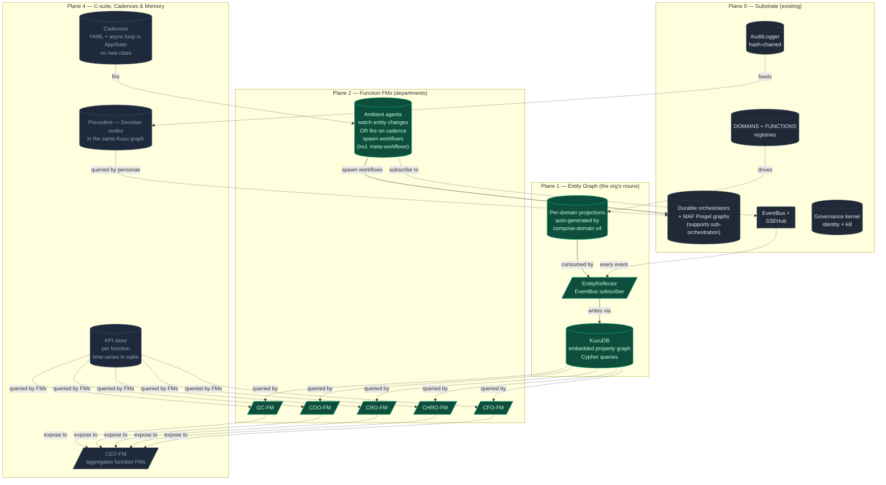
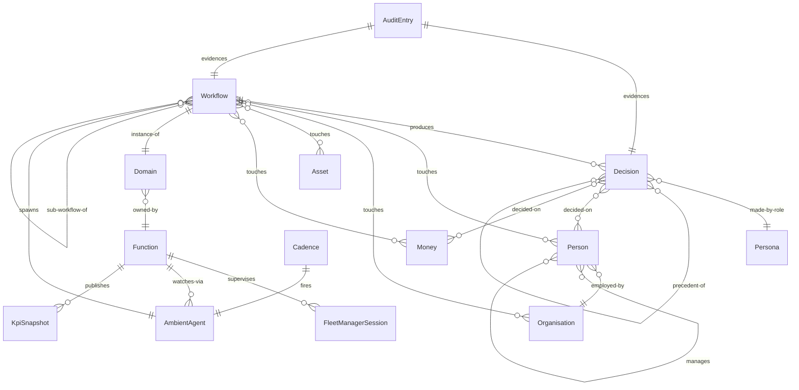
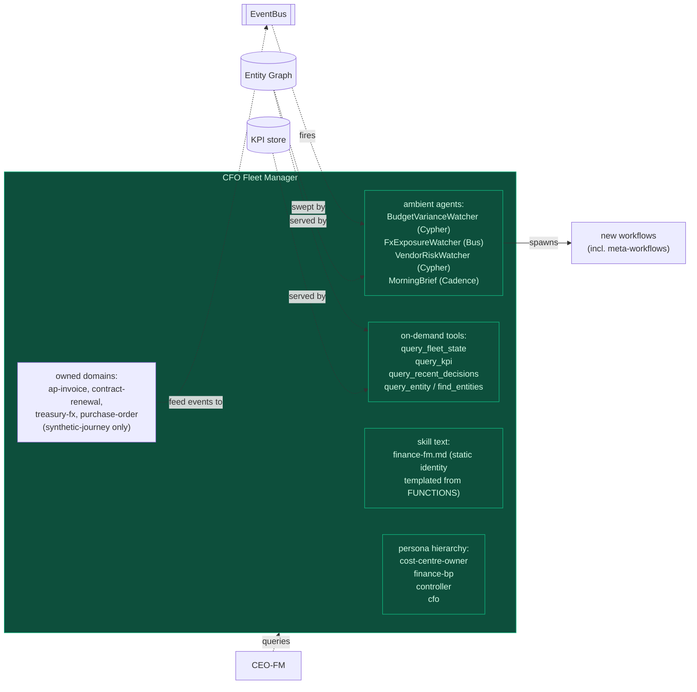

# Agentic Org — top-down blueprint

> **Status:** design v3, top-down spec. Decisions locked.
> **Audience:** us, before we touch any code.
> **Companion docs:** [agentic-org-design.md](agentic-org-design.md) is the
> Plane 1 deep-dive that came out of v1.
>
> **Outcome we're designing for:** a substrate that can host a *digital
> clone of an organisation* — its people, its decisions in flight and at
> rest, the institutional memory it draws on, the cadences it runs to, and
> the ambient watching its function leaders do — all on top of the
> agent + Durable + persona substrate we already have.

This document is a **specification**, not an implementation plan. It exists
to lock in cross-plane decisions before we start building, so a Phase 1
choice doesn't break Phase 4. The implementation plans come after, one per
phase, in `plan/feature-agentic-org-phase-N-*.md`.

**v3 changes from v2** (operator decisions locked 2026-05-08):
- Kuzu locked as the entity-graph engine.
- Function source of truth: `FUNCTIONS` registry owns; `Domain.function`
  derived back-ref at boot. Boot validator catches orphans.
- **Tenancy dropped entirely.** Each customer gets a forked repo. No
  `TenantState`, no `data/portal/graph/<tenant>.kuzu`, no per-tenant
  paths. Removes a whole layer of complexity from every phase. **Zava is
  the canonical reference org we build out.**
- Decision id: **ULID per decision**, persisted; idempotency dedupe at
  write-time keyed on `(workflow_id, phase, persona_role)` so re-emits
  don't double-write.
- Trigger model: bus + cypher + cadence as discriminated union, confirmed.
- compose-domain catalogue: per-customer repo fork, not per-tenant in one
  process. Zava domains are the canonical catalogue.
- PersonaTree lives on `FUNCTIONS` registry in Phase 3, confirmed.
- **POC1 and POC2 deprioritised.** We push on with synthetic / fleet
  journeys only. Entity projections are not authored for `expense-claim`
  or `hiring`; they continue to run as-is for the existing demo, but they
  are not first-class citizens of the entity graph in v1. Their payload
  shape stays as-is — no migration work.
- FM context strategy: **hybrid** — static identity (KPIs owned, domains
  covered, persona hierarchy) in templated skill text; dynamic state via
  on-demand tool calls (`query_fleet_state`, `query_kpi`,
  `query_recent_decisions`).

**v2 changes still in effect:**
- Plane 3 dissolved. Cross-function workflows are meta-workflows
  (ordinary domains whose orchestrator calls sub-orchestrators).
- No `CadenceRunner` class — YAML files + one async loop in `AppState`.
- `compose-domain` v4 is a sequential enrichment pipeline, not a bigger
  schema.

---

## 1. North star — "digital clone of an organisation"

Concretely, what we're building is a system where you can ask:

- "Show me everyone in the EMEA finance team and what they're working on
  right now." → org graph + workflow ledger.
- "What did we decide last time a vendor in a high-risk jurisdiction was
  proposed?" → precedent store grounded in the entity that decided.
- "What's the CFO worrying about today?" → CFO-FM session log + ambient
  alerts it has fired in the last 24h.
- "What happens when we hire someone in Berlin?" → meta-workflow that
  calls IT-access, payroll, badge, manager-onboarding-plan as
  sub-orchestrations.
- "What's the policy spine of this org?" → registered personae + their
  delegated authority + the matrix they decide against.
- "Replay the org's last 30 days." → audit ledger + entity-graph
  time-travel + workflow replay.

Each of those is one or two queries against a *coherent model of the
organisation*, not a manual stitch across N isolated `payload: dict`s.

When we say "digital clone" we mean: the substrate exposes the same surface
area a CEO would query about a real org, and it can simulate forward (run
workflows, watch ambient signals, fire on cadence) the same way the real
org operates. **Zava is the org we are cloning** — one codebase, one
canonical org. EasyJet/GSK/Unilever each get a fork when we go customer.

---

## 2. The four planes



### Plane 0 — Substrate (we have this)

Layered on top of:
- Durable orchestrators + MAF Pregel graphs
  ([api/functions/workflows](../api/functions/workflows/)). Durable
  natively supports sub-orchestration via `context.call_sub_orchestrator`,
  which is the mechanism we use to dissolve "choreographies" into normal
  workflows.
- `EventBus` + `SSEHub`
  ([api/server/services/event_bus.py](../api/server/services/event_bus.py),
  [api/server/services/sse_hub.py](../api/server/services/sse_hub.py))
- `AuditLogger` with Ed25519 signing + hash chain
  ([api/server/services/audit_logger.py](../api/server/services/audit_logger.py))
- `GovernanceKernel` (identity + kill switches)
  ([api/server/services/governance/kernel.py](../api/server/services/governance/kernel.py))
- `DOMAINS` registry
  ([api/shared/domains.py](../api/shared/domains.py)) — gains a `function`
  back-ref derived at boot from the new `FUNCTIONS` registry.

We add no foundations here. Everything new is additive.

### Plane 1 — Entity graph

The org's nouns. Person, Organisation, Asset, Money, Decision, Place,
Period. Persistent, queryable, related.

**Tech: KuzuDB** (embedded property graph, MIT, Python wheel, Cypher 9,
ACID, file-backed at `data/portal/entity_graph.kuzu`). Why Kuzu:
- 3+ hop traversals are one Cypher MATCH, vs 10s of lines of recursive CTE.
- Cypher is portable: same query runs on Neo4j, Memgraph, Apache AGE,
  Cosmos Gremlin if we ever need to migrate up.
- Embedded means still local-first — no server, no infra. ~30MB binary,
  Python wheel.
- It's the right tool for the job; sqlite is undershooting at exactly
  the moment the design is locking in.

**Schema (v0):**

```cypher
CREATE NODE TABLE Person (
    id STRING PRIMARY KEY,
    name STRING, email STRING, role STRING, market STRING, department STRING,
    employed_from DATE, employed_to DATE,
    source_workflows STRING[],
    attributes STRING            -- JSON for everything else
);
CREATE NODE TABLE Organisation (
    id STRING PRIMARY KEY,
    name STRING, kind STRING,    -- vendor / customer / regulator / us
    country STRING, jurisdiction STRING, risk_band STRING,
    source_workflows STRING[],
    attributes STRING
);
CREATE NODE TABLE Asset (
    id STRING PRIMARY KEY,
    kind STRING,                 -- laptop / contract / license / IP / brand
    identifier STRING, status STRING,
    acquired_at DATE, retired_at DATE,
    source_workflows STRING[],
    attributes STRING
);
CREATE NODE TABLE Money (
    id STRING PRIMARY KEY,
    amount DOUBLE, currency STRING,
    kind STRING,                 -- claim / invoice / budget-line / payroll / fx
    period STRING,
    source_workflows STRING[],
    attributes STRING
);
CREATE NODE TABLE Decision (
    id STRING PRIMARY KEY,       -- ULID, persisted, deduped on (workflow_id, phase, persona_role)
    workflow_id STRING, phase STRING, persona_role STRING,
    verdict STRING, reason STRING, decided_at TIMESTAMP,
    source_event STRING,
    attributes STRING            -- the full decision payload
);
CREATE NODE TABLE Place (
    id STRING PRIMARY KEY,
    kind STRING, name STRING, parent_id STRING,
    attributes STRING
);
CREATE NODE TABLE Period (
    id STRING PRIMARY KEY,
    kind STRING, starts TIMESTAMP, ends TIMESTAMP, label STRING
);

CREATE REL TABLE EMPLOYED_BY (FROM Person TO Organisation, role STRING, since DATE);
CREATE REL TABLE MANAGES (FROM Person TO Person, since DATE);
CREATE REL TABLE OWNS (FROM Person TO Asset);
CREATE REL TABLE TRANSACTS (FROM Person TO Money, role STRING);
CREATE REL TABLE BELONGS_TO (FROM Money TO Period);
CREATE REL TABLE LOCATED_IN (FROM Person TO Place);
CREATE REL TABLE DECIDED_ON (FROM Decision TO Person);
CREATE REL TABLE PRECEDENT_OF (FROM Decision TO Decision);
CREATE REL TABLE TOUCHED (FROM Person TO Decision, role STRING);
```

**Decision-id idempotency:** `Decision.id` is a ULID minted at write-time
(random + monotonic). Re-emits dedupe at the **reflector** layer via a
unique constraint on `(workflow_id, phase, persona_role)` — the reflector
checks for an existing Decision with that triple before minting a new ULID.
Net behaviour: deterministic at the natural-key level, opaque ids
downstream. Trade-off: one tiny extra Cypher lookup per decision write,
acceptable.

The reflector pattern from the v0 design stays. **Projections are
authored only for synthetic / fleet domains** (the eleven `fleet-*`
domains, `creative-campaign`, and any future synthetic journeys we
graduate). POC1 (`expense-claim`) and POC2 (`hiring`) are not first-class
citizens of the entity graph in v1 — they keep running for the legacy
demo but their workflow records do not produce entities. If we ever need
them in the graph later, that's a one-projection-per-domain follow-up.

### Plane 2 — Function FMs (the departments)

A function isn't a label; it's a **persistent agentic department** with:

- Its own `FleetManagerService`-shaped runtime, instantiated per function
  (CFO-FM, CHRO-FM, CRO-FM, COO-FM, CMO-FM, GC-FM, CTO-FM, CDO-FM, CCO-FM).
- Function-level KPIs persisted in a `kpi_store`.
- An **ambient agents** layer: subscribers to the `EventBus` that watch for
  entity-state changes and *spawn workflows* without operator input. Today,
  all our agents are reactive — only operators spawn. Ambient agents are
  also the trigger surface for **meta-workflows**: when `hiring.completed`
  fires with `outcome=offer-accepted`, an ambient agent in CHRO-FM spawns
  the `hire-to-productive` meta-workflow.
- A persona hierarchy mapping to the org chart, with delegated authority
  bands and named approvers per band.

```python
class FunctionFleetManager:
    function: str
    operator_surface: str
    domains: list[str]
    kpis: list[KpiSpec]
    ambient_agents: list[AmbientAgent]
    persona_hierarchy: PersonaTree
```

**Function source of truth — `FUNCTIONS` owns, `Domain.function` derived
back-ref:**

```python
# api/shared/functions.py — single source of truth
FUNCTIONS = {
    "finance": Function(
        name="finance", display="Finance",
        operator_surface="cfo",
        owns_domains=["ap-invoice", "contract-renewal", "treasury-fx",
                      "purchase-order"],   # synthetic-journey domains
        ambient_agents=["budget-variance", "fx-exposure", "vendor-risk",
                        "morning-brief"],
        kpis=["dso", "dpo", "budget-variance-pct", "fraud-rate"],
        persona_hierarchy=PersonaTree(...),
    ),
    "hr": Function(...),
    "revenue": Function(...),
    # ... one entry per function
}

# api/shared/domains.py — at import time
def _wire_function_back_refs():
    for fn_name, fn in FUNCTIONS.items():
        for d in fn.owns_domains:
            if d not in DOMAINS:
                raise ValueError(f"FUNCTIONS['{fn_name}'] claims unknown domain '{d}'")
            DOMAINS[d].function = fn_name
    orphans = [d for d, dom in DOMAINS.items() if dom.function is None]
    if orphans:
        raise ValueError(f"unclaimed domains (no function owns these): {orphans}")
```

Loud failure on orphans + unknown domains. Adding a domain to a function
is a one-line edit to `FUNCTIONS`; the `function` back-ref on `Domain`
keeps existing call sites (`d.function`) cheap. POC1 and POC2 domains
(`expense-claim`, `hiring`) get assigned to placeholder
`function="legacy"` so the boot validator passes; they're not surfaced in
any function FM.

**Ambient agents** (the big new primitive):

```python
class AmbientAgent:
    name: str
    function: str
    triggers: list[Trigger]         # bus events OR cypher patterns OR cadence ticks
    reasoning_skill: str | None     # GHCP SDK skill that decides what to spawn (None = deterministic)
    spawnable_workflow_types: list[str]
```

Triggers come in three shapes — all surfaced as the same `Trigger`
discriminated union so an ambient agent can mix them:
- `BusTrigger(event_type="workflow.completed", filter=...)` — reactive.
- `CypherTrigger(pattern="MATCH (m:Money) WHERE m.attributes.variance > 0.10", sweep_seconds=3600)` — declarative; evaluated on a sweep tempo.
- `CadenceTrigger(cron="0 9 * * 1-5")` — scheduled.

Examples:
- `BudgetVarianceWatcher` (CFO-FM) — `CypherTrigger`, hourly sweep, spawns
  `variance-investigation`.
- `HireToProductiveTrigger` (CHRO-FM) — `BusTrigger` on `hiring.completed`,
  spawns the `hire-to-productive` meta-workflow.
- `MorningSweep` (CEO-FM) — `CadenceTrigger`, fires the daily-brief skill.

**Function FM context strategy — locked: hybrid.**

Static skill text holds the function's **identity** (templated at session
start from `FUNCTIONS["finance"]`):
- KPIs owned and current targets
- Domains covered + their workflow_types
- Persona hierarchy (org-chart slice for this function)
- The ambient agents this FM watches with

Dynamic state is **on-demand tool calls** the FM invokes in-session:
- `query_fleet_state(filter)` — workflows in flight in this function
- `query_kpi(metric, period)` — KPI snapshots from the kpi_store
- `query_recent_decisions(persona_role, limit)` — Decision nodes for
  precedent-aware reasoning
- `query_entity(kind, id)` — fetch one entity by id from the graph
- `find_entities(cypher_pattern)` — arbitrary Cypher when the FM needs
  cross-entity reasoning

This keeps session-creation cost O(1) in workflow count and lets the FM
reason over the whole function without the skill text exploding past
~30k tokens.

### Plane 3 — *(dissolved)*

The v1 spec had a "Plane 3 — Cross-function Choreography" with a
`ChoreographyEngine`, `Choreography` schema, and per-choreography YAML.

Operator feedback: that's just a workflow. Big workflows that span functions
are still workflows.

**Dissolution:**
- `hire-to-productive`, `lead-to-cash`, `vendor-risk-to-pay`,
  `incident-to-resolution` are **graduated domains** like any other.
  `compose-domain` produces them.
- Their orchestrator's "phases" are calls to other domains'
  orchestrators via Durable's native `context.call_sub_orchestrator(...)`.
- The `payload_from` Cypher queries that v1 needed at choreography level
  are now just **inputs to the meta-workflow's first phase**, fetched by a
  deterministic activity that queries the entity graph.
- The trigger that v1 put on `Choreography` is now just an `AmbientAgent`
  with a `BusTrigger` in Plane 2.

Result: one fewer concept, one fewer registry, one fewer engine. Same
behaviour. Same compose-domain skill produces it. Same governance / audit
applies. Same blueprint observatory shows it.

We call them **meta-workflows** in documentation when we want to flag the
cross-function shape, but the substrate sees them as ordinary domains.

### Plane 4 — C-suite, cadences & memory

Three sub-pieces; all small.

**CEO-FM** is a `FleetManagerService` whose "domains" are *the function FMs
themselves*. Reads each function's KPIs, alerts, in-flight strategic
workflows. Owns workflows that no function FM owns: M&A diligence, FY
close coordination, board-pack assembly, OKR cycle, restructure,
divestiture. Those are graduated by compose-domain like any other domain
— `function: ceo`.

**Cadences** are YAML files + an async loop. No new class.

```yaml
# data/governance/cadences/morning-sweep.yaml
name: morning-sweep
schedule: "0 9 * * 1-5"     # cron — weekdays 09:00 local
fires_ambient_agent: morning-sweep   # an AmbientAgent with a CadenceTrigger
```

The async loop in `AppState` reads `data/governance/cadences/*.yaml` at
boot, parses the cron, and on each tick dispatches to the matching ambient
agent. <100 lines. The "cadence" concept is just the trigger shape on an
ambient agent we already have.

**Memory & precedent** lives in the same Kuzu graph as everything else:
- Every closed `Decision` is a node, linked to the entities and the
  workflow it decided on. Personae query it before deciding ("how did we
  decide on similar AP invoices last quarter?"). Today we have a 50-row
  stub at [data/synthetic/precedents.json](../data/synthetic/precedents.json);
  the real version is a Cypher query against `Decision` nodes.
- KPIs are time-series in sqlite at `data/portal/kpis.sqlite` (one table,
  FM-scoped). Function FMs publish; CEO-FM reads.
- Institutional rules (`policy.md` style + executable `decision_code` in
  personae) — no new tech, we already have this.

---

## 3. The unified data model



Key shapes:

- `Workflow` (existing in `StateStore`) ↔ entity graph via the reflector.
  The graph is the "outside" view; the workflow row is the "inside" view.
- `Workflow → Workflow` self-relation captures meta-workflows (a
  `hire-to-productive` instance is the parent of the IT-access,
  onboarding, payroll-setup instances it spawned via
  `call_sub_orchestrator`).
- `Decision` is a graph node *and* an audit entry. The audit entry is the
  cryptographic evidence; the graph node is the queryable shape. ULID id;
  reflector enforces uniqueness on the natural key
  `(workflow_id, phase, persona_role)`.
- `Function` is the new container that maps domains to FMs. Source of
  truth is `FUNCTIONS` registry; `Domain.function` is a derived back-ref.
- `Cadence` is a thin YAML/loop pair, not a class — it lives in the model
  here as a relationship, not as a stored entity.

There is **no `Tenant` entity**. One repo = one org. EasyJet/GSK/Unilever
each get a fork.

---

## 4. How a domain plugs in — `compose-domain` v4

Today's `compose-domain` (v3) generates the orchestrator + graphs +
personae + MCP tools + skills. It does **not** know about entities,
functions, or sub-orchestration.

For the substrate to scale to 30+ synthetic-journey domains cleanly,
`compose-domain` v4 is restructured as a **sequential enrichment pipeline**
— each sub-skill reads the working brief, enriches one section, validates,
hands off. The brief grows through passes. Same shape as today's sub-skill
dispatch, but **stateful around a shared artefact** instead of fan-out
from one prompt.

```mermaid
flowchart LR
    BRIEF0[("Brief v0<br/>raw idea")] -->
    AS["author-domain-skeleton<br/>+ phases<br/>+ personae"] -->
    BRIEF1[("Brief v1")] -->
    AE["author-entity-projection<br/>+ entities: reads/writes<br/>(validates against schema)"] -->
    BRIEF2[("Brief v2")] -->
    AD["author-decision-mapping<br/>+ decisions: per HITL<br/>(generates Decision-node Cypher)"] -->
    BRIEF3[("Brief v3")] -->
    AF["author-function-membership<br/>+ function: field<br/>(validates against FUNCTIONS)"] -->
    BRIEF4[("Brief v4")] -->
    AA["author-ambient-trigger<br/>(optional)<br/>+ ambient: block"] -->
    BRIEF5[("Brief v5<br/>fully enriched")] -->
    GEN["existing v3 generators<br/>orchestrator, graphs,<br/>personae, MCP stubs,<br/>+ projection.py<br/>+ precedent_queries/*.cypher"] -->
    SBOX[("Sandbox<br/>tools/scratch/compose-domain/<br/>&lt;run-id&gt;/")] -->
    GRAD[("graduate.sh<br/>idempotent, mechanical")]

    classDef new fill:#0d4f3c,stroke:#10b981,color:#d1fae5
    class AE,AD,AF,AA new
```



Each enrichment skill is small (~100 lines), reads the brief, writes
exactly one new section, runs a structural validation, and hands the
enriched brief to the next skill. Fail-fast: if entity-projection
validation fails, the pipeline stops there and reports — we don't try to
recover by guessing.

The five enrichments produce, on the sandbox side:

- `entities:` block → `api/server/services/entity_projections/<domain>.py`
- `decisions:` block → `api/server/services/precedent_queries/<domain>_<phase>.cypher`
- `function:` field → entry in the relevant `FUNCTIONS["<fn>"].owns_domains` list (graduate.sh patches)
- `ambient:` block → entry in `api/server/services/ambient_agents/<function>.py`
- The composable result: per-domain projection, per-decision Cypher,
  per-function ownership, optional ambient hook — all from one brief, all
  auto-generated.

The substrate now has **one place to define a domain end-to-end**, and the
graph stays consistent across 30+ synthetic-journey domains because the
projection is auto-generated, not hand-written per domain. By the time we
have 30 domains, none of them needed retrofitting; each was generated
alongside its orchestrator.

The pipeline is also **extensible**: when Phase 4 needs precedent-queries
to wire into persona `decision_code`, that's a sixth sub-skill in the
pipeline, not a rewrite of the meta-skill.

---

## 5. How a function FM works



Two new primitives the substrate needs:

**`FunctionRegistry`** — `FUNCTIONS` dict in `api/shared/functions.py`,
declarative like `DOMAINS`. Source of truth for function-shaped metadata
(KPIs, ambient agents, persona hierarchy, owned domains). Boot validator
enforces every domain is claimed by exactly one function and every claim
resolves.

**`AmbientAgent`** runtime — a small loop per function FM that subscribes
to the bus (for `BusTrigger`s), sweeps Cypher patterns at the agent's
declared tempo (for `CypherTrigger`s), and gets ticked by the cadence loop
(for `CadenceTrigger`s).

The CEO-FM is a `FleetManagerService` whose skill text is templated from
`FUNCTIONS` — same trick as today's per-domain templating in
[api/server/skills/fleet-manager/SKILL.md](../api/server/skills/fleet-manager/SKILL.md).

---

## 6. Meta-workflows — the cross-function shape

A meta-workflow is just a domain whose orchestrator calls
sub-orchestrators. No new substrate, no new YAML, no new engine.

```python
# api/functions/workflows/hire_to_productive.py — generated by compose-domain v4
@app.orchestration_trigger(context_name="context")
def HireToProductiveOrchestrator(context):
    payload = context.get_input()
    person_id = payload["person_id"]

    # Phase 1 — fetch joiner context from entity graph (deterministic activity)
    joiner = yield context.call_activity("hire_to_productive_fetch_joiner", {"person_id": person_id})

    # Phase 2 — provision IT access (sub-orchestrator against existing domain)
    access = yield context.call_sub_orchestrator(
        "FleetItAccessRequestOrchestrator",
        {"employee_id": person_id, "department": joiner["department"]},
    )

    # Phase 3 — onboarding + payroll + badge in parallel
    tasks = [
        context.call_sub_orchestrator("FleetEmployeeOnboardingOrchestrator", {...}),
        context.call_sub_orchestrator("PayrollOnboardingOrchestrator",       {...}),
        context.call_sub_orchestrator("FacilitiesBadgeIssueOrchestrator",    {...}),
    ]
    results = yield context.task_all(tasks)

    # Phase 4 — manager onboarding plan
    plan = yield context.call_sub_orchestrator(
        "ManagerOnboardingPlanOrchestrator",
        {"new_joiner_id": person_id, "manager_id": joiner["manager_id"]},
    )

    return {"status": "complete", "person_id": person_id, "results": results}
```

The trigger that fires this is an `AmbientAgent` in Plane 2:

```python
# api/server/services/ambient_agents/chro.py
HireToProductiveTrigger = AmbientAgent(
    name="hire-to-productive-trigger",
    function="hr",
    triggers=[BusTrigger(
        event_type="workflow.completed",
        filter="workflow_type == 'synthetic-hiring' and outcome == 'offer-accepted'",
    )],
    reasoning_skill=None,                    # deterministic spawn, no LLM
    spawnable_workflow_types=["hire-to-productive"],
)
```

That's the entire cross-function story. Every primitive already existed:
Durable sub-orchestration, ambient agent with bus trigger, compose-domain
generation. The `hire-to-productive` domain shows up in the blueprint
observatory exactly like every other domain — its phases happen to be
sub-orchestrator calls instead of agent graphs.

---

## 7. Single-tenant — one repo per org

We do not run multiple customer organisations in the same process. Each
customer (Zava, EasyJet, GSK, Unilever, …) gets its own forked repo with
its own canonical `FUNCTIONS` + `DOMAINS` + entity graph.

This means we can:
- Drop `TenantState` from the design entirely.
- Use one `entity_graph.kuzu` per repo.
- Use one `kpis.sqlite` per repo.
- Customise `FUNCTIONS` per customer in their fork (EasyJet has crew
  rostering and irops; Unilever has trade promo and demand planning;
  Zava has the 13 synthetic-journey domains we author here).

The catalogue of domains (compose-domain briefs in
`docs/superpowers/specs/`) is **per-fork**. The compose-domain skill
itself is **shared mechanism**. Forks diverge on what they author; they
share how it's authored.

Zava is the canonical reference fork — the one we build out top-down
through the 4 phases below. Customer-specific forks happen later, by
copying Zava and overlaying.

---

## 8. Governance & observability

Existing `GovernanceKernel` (identity + kill switch) and `AuditLogger`
extend cleanly:
- Every entity write is an audit event (`entity.upserted`, `entity.linked`).
- Every Decision write is an audit event (`decision.recorded`, ULID matches
  the audit entry's `decision_id`).
- Every meta-workflow spawn is an audit event (`workflow.sub_spawned`,
  carrying parent + child workflow ids).
- Every cadence tick is an audit event (`cadence.tick`).
- Every ambient agent decision is an audit event (`ambient.decided`,
  carrying the trigger that fired and the spawn outcome).

Kill switches gain wildcard reach: `kill --actor=ambient.* --tool=*` pauses
all ambient agents fleet-wide.

**New observability surface:** an `/admin/org-clone` page in the existing
blueprint microsite that shows:
- Entity graph counts by kind
- Active meta-workflows with their sub-workflow tree
- Ambient agents with last-trigger and current-state
- Function FMs with last-cycle KPI snapshot
- Cadence schedule view (next run per cadence)

---

## 9. Sequenced rollout — 4 phases

Each phase is a separate implementation plan in `plan/`. **No phase starts
until the prior phase's smoke tests pass and the artefact from the prior
phase is being read by something real.**

### Phase 1 — Entity graph (Plane 1)
Plan: `plan/feature-agentic-org-phase-1-entity-graph.md`
- KuzuDB embedded, `EntityGraph` service, `EntityReflector` subscriber.
- Per-domain projection functions for the **synthetic-journey domains**
  (eleven `fleet-*` + `creative-campaign` = 12 today, plus whatever new
  synthetic journeys we author next). Hand-written this round; compose-
  domain v4 auto-generates them in Phase 2 going forward.
- POC1 (`expense-claim`) and POC2 (`hiring`) **explicitly excluded** —
  they continue running for the legacy demo but produce no entities.
- Bootstrap from `data/synthetic/employees.json`,
  `api/server/fixtures/vendors.json`, etc.
- `/api/entities` read API + blueprint `/entities` page.

**Done means:** every synthetic-journey workflow, when it completes, has
its entities visible in the graph. The blueprint shows the org-graph
growing in real time as fleet-* and creative-campaign workflows run.

### Phase 2 — `compose-domain` v4 (sequential enrichment pipeline)
Plan: `plan/feature-agentic-org-phase-2-compose-v4.md`
- Restructure compose-domain into sequential enrichment sub-skills:
  `author-domain-skeleton` → `author-entity-projection` →
  `author-decision-mapping` → `author-function-membership` →
  `author-ambient-trigger` (optional) → existing v3 generators.
- Each sub-skill enriches a shared brief object, validates, hands off.
- Backfill: for each synthetic-journey domain, author the entities +
  decisions + function blocks in its YAML brief and re-run compose-domain
  *just* to regenerate projections. Orchestrators don't change; only
  projections + decisions + function membership land.

**Done means:** every new `compose-domain` run produces an entity-aware,
function-aware, decision-recording domain by construction; we can never
again add a synthetic-journey domain that doesn't populate the graph or
claim a function owner.

### Phase 3 — Function FMs + ambient agents (Plane 2)
Plan: `plan/feature-agentic-org-phase-3-function-fms.md`
- `FUNCTIONS` registry; widen `DOMAINS` registry with `function` derived
  back-ref; boot validator catches orphans.
- `FunctionFleetManager` runtime; one per function.
- `AmbientAgent` primitive with three trigger shapes (bus, cypher, cadence).
- First three concrete ambient agents: BudgetVarianceWatcher,
  VendorRiskWatcher, AccessAnomalyWatcher.
- The five FM tools (`query_fleet_state`, `query_kpi`,
  `query_recent_decisions`, `query_entity`, `find_entities`) implemented
  as in-process MCP tools.
- Per-function FM session SSE topics; blueprint `/functions` page.
- POC1/POC2 domains assigned to placeholder `function="legacy"` so the
  validator passes.

**Done means:** the substrate has 5+ FMs running, each watching its
function's slice of the graph, each spawning at least one ambient workflow
in the autonomous-profile demo.

### Phase 4 — C-suite, cadences, memory, meta-workflows (Plane 4 + the cross-function moves)
Plan: `plan/feature-agentic-org-phase-4-ceo-fm.md`
- `CEO-FM` (graduated as `function: ceo` via compose-domain v4).
- Cadence YAML loader + async loop in `AppState` (<100 LoC, no class).
  First three cadences (morning-sweep, period-close, quarterly-okr).
- KPI store. Each function FM publishes; CEO-FM aggregates.
- Precedent queries: `Decision` nodes in the graph; personae call
  `precedent_query` Cypher before deciding (sourced from
  `api/server/services/precedent_queries/<domain>_<phase>.cypher`,
  generated by compose-domain v4).
- First three **meta-workflows** graduated via compose-domain v4 with
  sub-orchestrator phase generators: `hire-to-productive`,
  `vendor-risk-to-pay`, `lead-to-cash`. Their ambient triggers land in
  the relevant function FM's agent list.
- Strategic workflows (FY close, board-prep) — composed via compose-domain
  v4 like any other domain, but with `function: ceo`.

**Done means:** the org-clone is end-to-end. The blueprint shows Zava
running on cadences, FMs alerting, meta-workflows firing across functions,
the CEO-FM producing a daily brief from real data the substrate generated
overnight.

---

## 10. Locked decisions

| # | Decision | Outcome |
|---|---|---|
| 1 | Graph engine | **KuzuDB** — embedded property graph, MIT, Cypher 9, file-backed at `data/portal/entity_graph.kuzu` |
| 2 | Function source of truth | **`FUNCTIONS` owns domain lists; `Domain.function` derived back-ref at boot; orphan validator** |
| 3 | Tenancy | **Dropped.** One repo per customer. Zava is canonical. |
| 4 | Decision id | **ULID per decision, persisted; reflector dedupes on `(workflow_id, phase, persona_role)`** |
| 5 | Ambient trigger shapes | **Bus + Cypher + Cadence as discriminated union** |
| 6 | Domain catalogue | **Per-fork.** Shared compose-domain mechanism, per-customer briefs. |
| 7 | Persona hierarchy | **`PersonaTree` on `FUNCTIONS` registry, in Phase 3** |
| 8 | POC1/POC2 (`expense-claim`, `hiring`) | **Deprioritised.** Continue running for legacy demo; not first-class in entity graph; assigned `function="legacy"` placeholder so validators pass. **No payload migration.** |
| 9 | FM context | **Hybrid: static identity (templated from FUNCTIONS) + dynamic state (5 in-process MCP tools)** |

---

## 11. What this is *not*

To stay disciplined, the spec rules these out:

- **No new agent runtime.** GHCP SDK + MAF stays.
- **No new orchestrator engine.** Durable Functions stays. Meta-workflows
  use Durable's native sub-orchestration.
- **No `ChoreographyEngine`, no choreography YAML schema.** Cross-function
  = meta-workflow domain + ambient agent trigger.
- **No `CadenceRunner` class.** YAML files + async loop in `AppState`.
- **No `TenantState`.** One repo per customer; fork to onboard.
- **No external graph DB until something forces it.** Kuzu is local-first.
  If a fork ever needs a real Neo4j cluster, the Cypher we write is
  portable.
- **No POC1/POC2 entity projections in v1.** They keep running for the
  legacy demo. Not first-class graph citizens unless we explicitly add
  them later.
- **No payload migration.** POC1/POC2 typed fields stay as-is. Synthetic-
  journey domains use `payload: dict` (already do).
- **No ML training loop.** Personae have `decision_code` (Python). Skills
  are SDK-driven (LLM). Agents have RAG. Nothing in this design is "the
  org learns by gradient descent" — separate conversation.
- **No real-time UI rewrite.** Blueprint microsite gains pages; operator
  UI gains panels. No SPA migration.

---

## 12. Open questions (none blocking; flag for later phases)

These are noted now so we don't lose them, but they don't block any phase
plan being written.

1. **Decision-as-precedent retrieval shape.** Phase 4 wires
   `precedent_query` Cypher into persona `decision_code`. Do personae
   read precedents through a tool call (consistent with FM context
   strategy) or do we inline precedent fetch into the persona responder?
   Decide when writing the Phase 4 plan.
2. **CEO-FM operator surface.** What does it look like in the blueprint?
   Same shape as a function FM, or a different page? Decide when writing
   the Phase 4 plan.
3. **Kpi schema versioning.** When a function changes its KPI list, what
   happens to old snapshots? Probably "schema versioned per snapshot,
   readers tolerate missing keys" — confirm in Phase 4.
4. **Ambient agent reasoning_skill economics.** Some ambient agents will
   spawn an LLM call before deciding to spawn a workflow (e.g.
   "BudgetVarianceWatcher fired — really worth investigating?"). Cost
   ledger needs to capture this. Trivial; flag for Phase 3.
5. **Meta-workflow visualisation.** The `Workflow → Workflow`
   sub-orchestrator relationship needs a tree-shaped view in the
   blueprint. Existing `/api/workflows` returns flat list. Decide in
   Phase 4 plan.

---

## 13. Glossary

- **Entity** — a graph node representing a real-world thing (Person,
  Organisation, Asset, Money, Decision, Place, Period).
- **Projection** — a per-domain function the reflector calls to map a
  workflow's payload into entity writes.
- **Reflector** — the bus subscriber that runs projections.
- **Function** — a department of the org (Finance, HR, Revenue, …).
  Owns N domains. Source of truth: `FUNCTIONS` registry.
- **Function FM** — the persistent agentic supervisor for one function.
- **Ambient agent** — a watcher with one or more triggers (bus event,
  Cypher pattern on the graph, cadence tick) that spawns workflows when
  it fires.
- **Meta-workflow** — a workflow domain whose orchestrator calls
  sub-orchestrators against other domains. The cross-function shape, no
  new substrate.
- **Cadence** — a YAML-declared cron schedule that ticks ambient agents
  with `CadenceTrigger`s.
- **CEO-FM** — the FM whose "domains" are the function FMs themselves.
- **Decision (node)** — a graph-native record of a closed persona decision,
  cross-linked to the entities it decided on. The audit entry's evidence
  is the cryptographic proof; the graph node is the queryable shape.
- **Synthetic journey** — a domain that is purely synthetic + scenario-
  driven (the eleven `fleet-*` domains, `creative-campaign`, and any
  future ones we author top-down). The opposite of POC1/POC2 which were
  hand-shaped around specific demo scripts.

---

## Pointers

- Today's substrate maturity:
  [api/shared/domains.py](../api/shared/domains.py),
  [api/server/services/state_store.py](../api/server/services/state_store.py),
  [api/server/services/event_bus.py](../api/server/services/event_bus.py),
  [api/server/services/audit_logger.py](../api/server/services/audit_logger.py),
  [api/server/services/governance/kernel.py](../api/server/services/governance/kernel.py)
- Today's design-time meta:
  [docs/superpowers/skills/compose-domain/SKILL.md](superpowers/skills/compose-domain/SKILL.md),
  [.github/skills/add-domain/SKILL.md](../.github/skills/add-domain/SKILL.md)
- Plane 1 deep-dive (will be folded into the Phase 1 plan):
  [docs/agentic-org-design.md](agentic-org-design.md)
- The substrate-parity plan that established "registry-first" as a pattern:
  [plan/feature-fleet-domain-substrate-1.md](../plan/feature-fleet-domain-substrate-1.md)
- Kuzu docs: https://kuzudb.com/docusaurus/ (embedded property graph,
  MIT, Cypher 9, Python wheel)
