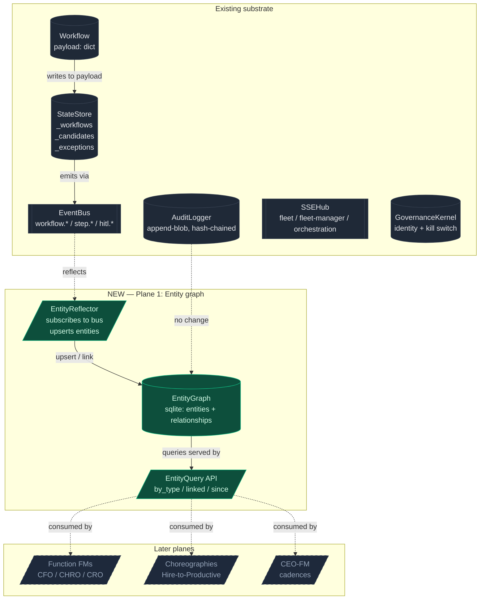
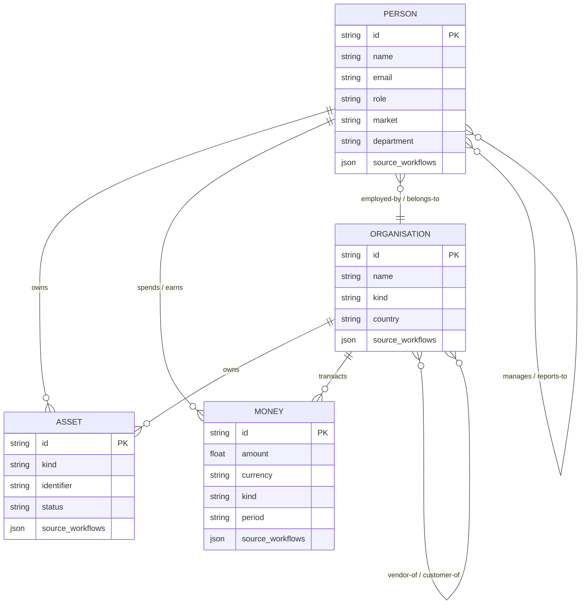

# The Agentic Org — design sketch

> **Status:** 🗄️ **archived 2026-05-11.** Superseded by [`../agentic-org-blueprint.md`](../agentic-org-blueprint.md) (v3, locked 2026-05-08). Plane 1 implementation tracked in [`../../plan/archive/feature-agentic-org-phase-1-entity-graph.md`](../../plan/archive/feature-agentic-org-phase-1-entity-graph.md) and shipped on branch `feature/agentic-org-phase-1-entity-graph` (2026-05-09).
> The sqlite-based design below is preserved for historical context only — the live implementation uses **KuzuDB** (embedded property graph, MIT, Cypher 9, file-backed at `data/portal/entity_graph.kuzu`). `Decision` is a first-class graph node with ULID id and dedupe on `(workflow_id, phase, persona_role)`. Per-domain projections cover the eleven `fleet-*` synthetic-journey domains plus `creative-campaign` (POC1/POC2 explicitly excluded). The reflector + read API + blueprint observatory `/entities` page are live.
> **Do not read as current state.**

> **Status:** design v0. First-slice MVP only. Everything past the MVP is a
> reasoned bet, not a commitment.
>
> **Constraint:** local-first. Sqlite + Azurite + file system. No Fabric IQ,
> no Cosmos, no external graph DB until something forces it.

## What this is

We have a control-plane substrate that runs **18 domains** end-to-end — POC1
expense, POC2 hiring, eleven `fleet-*` domains graduated by `compose-domain`,
and POC3 `creative-campaign`. Each domain is a Durable orchestration with
HITL gates, persona auto-close, audit chain, the lot. It is genuinely good.

It is also genuinely **a bag of workflows**. There is no organisation. Each
workflow lives inside its own `payload: dict`. Hiring writes a Person.
IT-access reads that Person. Onboarding gives that Person Assets. Today they
have no idea about each other.

This document sketches what it looks like when those 18 (and the 60+ to come)
become an **organisation that runs on agentic loops**, and describes the
first concrete slice we can build on top of what already exists.

## Five planes

A real org running on agents has five planes:

| # | Plane | What it is | What we have today |
|---|---|---|---|
| 1 | **Entity graph** | The org's nouns: Person, Organisation, Asset, Money, Place, Time. Persistent, queryable, related. | A handful of typed dataclasses (`Vendor`, `ClaimData`) embedded in `Workflow.payload`. Plus `_candidates` in `StateStore` — the only entity that has a life outside one workflow. |
| 2 | **Function FMs** | Persistent agentic departments (CFO-FM, CHRO-FM, CRO-FM, …) with their own KPIs, ambient agents that watch entities and *fire workflows*, and persona hierarchies mirroring the org chart. | One generic `FleetManagerService` with hand-written skill text in `api/server/skills/fleet-manager/SKILL.md`. Personas exist (29) but they're flat — no per-function FM. |
| 3 | **Cross-function choreography** | Hire-to-Productive, Lead-to-Cash, Quote-to-Renewal, Incident-to-Resolution. Named, designed, multi-domain workflows that span functions. | Nothing. Every domain runs in isolation. |
| 4 | **C-suite layer** | CEO-FM that reads from every function FM. Strategic workflows (M&A, FY close, board prep). Cadences (daily/weekly/monthly). | Nothing. |
| 5 | **Memory & precedent** | Every decision feeds a queryable precedent store. Personas read history before deciding. | `data/synthetic/precedents.json` — 50 hand-authored stubs for one domain. Real version doesn't exist. |

We build them in order. Plane 1 is the foundation; without it Planes 2–5 are
sand.

---

## What we're building first — Plane 1: the entity graph

### Why this first

It's the cheapest design exercise that unlocks the most. Without it:

- "Hire-to-Productive" is impossible — there's no shared `Person` to thread
  through HR → IT → Finance → Facilities.
- The CFO-FM has nothing to watch ambiently — there are no `Budget` or
  `Vendor` entities outside individual workflow `payload`s.
- Personas can't read precedent grounded in *their entity* (this vendor's
  history, this employee's pattern) — only in raw decision text.

### What it is

A **first-class entity layer** that lives alongside `StateStore`, with:

- A small set of **canonical entity types** (start with 4: Person, Organisation,
  Asset, Money) modelled as Pydantic classes, sibling to `Workflow`.
- A **graph store** (sqlite, two tables: `entities`, `relationships`) under
  `data/portal/entity_graph.sqlite`.
- An **event-driven reflector** that subscribes to the existing `EventBus` and
  upserts/links entities when workflows write to their `payload`.
- A **query API** (`api/server/services/entity_graph.py`) that personas, FMs,
  and ambient agents call to read across workflows.
- Optional **observability** — surface the graph in the existing blueprint
  microsite under a new `/entities` route.

### What it's not

- Not a new database. Sqlite + a sibling service.
- Not a graph DB (Kuzu, Neo4j) yet — sqlite with two tables handles 100k
  entities trivially. Swap later if a real graph query forces it.
- Not a schema migration of `Workflow.payload`. The reflector reads payloads;
  workflows keep writing whatever they write.
- Not a rewrite of any existing domain. New plane, additive.

---

## How it slots into what exists



### Entity model (v0)



`source_workflows` is an array of workflow ids that touched the entity —
the bridge back to the existing `Workflow` table. No primary keys are
recycled across types; ids stay namespaced (`PERSON-EMP-0042`,
`ORG-vendor-acme`, `ASSET-laptop-MAC-92x`).

---

## MVP slice — concrete

Five files. Each one small enough to read in one sitting.

### 1. `api/shared/entities.py` (new)

Pydantic dataclasses for `Person`, `Organisation`, `Asset`, `Money`. Each
carries `id`, `kind`-discriminator fields, a `source_workflows: list[str]`,
and `attributes: dict` for everything else (don't over-model v0).

### 2. `api/server/services/entity_graph.py` (new)

```python
class EntityGraph:
    def __init__(self, db_path: Path): ...

    # Writes
    def upsert(self, entity) -> None: ...
    def link(self, src_id: str, rel: str, dst_id: str, **attrs) -> None: ...

    # Reads
    def get(self, id: str): ...
    def by_type(self, kind: str, **filters) -> list: ...
    def linked(self, id: str, rel: str | None = None) -> list: ...
    def touched_by(self, workflow_id: str) -> list: ...
```

Sqlite at `data/portal/entity_graph.sqlite`. Two tables:

```sql
CREATE TABLE entities (
    id TEXT PRIMARY KEY,
    kind TEXT NOT NULL,
    name TEXT,
    attrs TEXT NOT NULL,            -- JSON
    source_workflows TEXT NOT NULL, -- JSON array
    created_at REAL NOT NULL,
    updated_at REAL NOT NULL
);
CREATE INDEX idx_entities_kind ON entities(kind);

CREATE TABLE relationships (
    src TEXT NOT NULL,
    rel TEXT NOT NULL,
    dst TEXT NOT NULL,
    attrs TEXT NOT NULL,            -- JSON
    created_at REAL NOT NULL,
    PRIMARY KEY (src, rel, dst),
    FOREIGN KEY (src) REFERENCES entities(id),
    FOREIGN KEY (dst) REFERENCES entities(id)
);
CREATE INDEX idx_rel_src ON relationships(src, rel);
CREATE INDEX idx_rel_dst ON relationships(dst, rel);
```

Lift the file path from the existing `_PORTAL_DATA_DIR` pattern in
`api/server/state.py`. Same neighbourhood as `magic_links.sqlite`.

### 3. `api/server/services/entity_reflector.py` (new)

Subscribes to `EventBus.on_any(...)`. On each `FleetEvent`:

1. Look at `event.type` and `event.workflow_id`.
2. Resolve the workflow from the existing `StateStore.get_workflow(id)`.
3. Inspect `workflow.payload` (and `workflow.metadata` for POC2 back-compat,
   `workflow.claim` / `workflow.invoice` for POC1).
4. Map to entities via per-domain projection rules (see below).
5. Call `EntityGraph.upsert` and `.link` — idempotent, last-write-wins.

The projection rules are **per-workflow_type**, declared in a small dict:

```python
PROJECTIONS: dict[str, Callable[[Workflow], list[EntityWrite]]] = {
    "hiring":            project_hiring,
    "expense-claim":     project_expense,
    "vendor-kyc":        project_vendor_kyc,
    "employee-onboarding": project_onboarding,
    "ap-invoice":        project_ap_invoice,
    # ... one per domain. Default: no-op (entity graph is opt-in per domain).
}
```

Each projection function is ~15 lines. We add them as we touch each domain.

### 4. Wire into `AppState` (edit `api/server/state.py`)

```python
class AppState:
    def __init__(self) -> None:
        ...
        self.entities = EntityGraph(_PORTAL_DATA_DIR / "entity_graph.sqlite")
        self.entity_reflector = EntityReflector(self.bus, self.store, self.entities)
        self.entity_reflector.start()
```

The reflector wires itself to `self.bus` at construction. No code anywhere
else changes.

### 5. `api/server/routes/entities.py` (new — read-only HTTP surface)

```
GET  /api/entities                       # ?kind=person&limit=50
GET  /api/entities/{id}                  # entity detail
GET  /api/entities/{id}/linked           # ?rel=manages
GET  /api/entities/touched-by/{wf_id}    # entities created/touched by a workflow
GET  /api/entities/_stats                # counts by kind, hot entities, recent links
```

Mirrors `api/server/routes/workflows.py` shape. Used by the next slice
(blueprint /entities page) and by ambient agents in Plane 2.

---

## What this unlocks

**Day 1 of the entity graph existing:**

- The Hiring workflow finishes. The reflector materialises a `Person`. The
  IT-access workflow that fires next reads the same `Person` instead of
  re-extracting from a fresh `payload`.
- The Vendor-KYC workflow materialises an `Organisation`. The next time the
  AP-invoice workflow runs against that vendor, it can call
  `entities.linked(vendor_id, "kyc-decided")` and find the prior decision —
  no duplicate diligence.
- The blueprint observatory gains an `/entities` page that shows the
  org-graph growing in real time as workflows run. That page is the most
  honest demo of "this is a substrate, not a bag of demos" we'll ever have.

**Plane 2 becomes mechanical:**

- A `CFO-FM` is just a `FleetManagerService` whose skill text is templated
  from `entities.by_type("money", period="2026-Q3")` plus
  `entities.by_type("vendor", risk="amber")` etc.
- Ambient agents are `entity_reflector`-style subscribers that *also* spawn
  workflows: "every time a `Money` entity lands with `kind='budget-line'`
  and `variance > 0.1`, spawn a `variance-investigation` workflow."

**Plane 3 (choreography) becomes a 50-line file per choreography:**

```python
class HireToProductive:
    domains = ["hiring", "employee-onboarding", "it-access-request"]
    def on_hiring_completed(self, person_id):
        spawn("employee-onboarding", payload={"person_id": person_id})
        spawn("it-access-request", payload={"person_id": person_id})
```

Without the entity graph, the right-hand side has no `person_id` to pass.
With it, the choreography is trivial.

---

## Open questions to decide before building

1. **Entity ids.** Stable `EMP-0042` style from existing fixtures, or
   ULID-fresh? Recommendation: **keep existing ids where they exist** (the
   employees fixture already uses `EMP-NNNN`), mint ULID for net-new entities
   the substrate creates (vendor IDs from KYC, asset IDs from onboarding).
2. **Multi-tenant from day 1?** When customers like EasyJet, GSK, Unilever
   each get a fleet, they'll each want their own entity graph. Sqlite makes
   this trivial — one `entity_graph.<tenant>.sqlite` per tenant. Recommend
   we *design* for tenant from day 1 (the path is parameterised) but ship
   single-tenant for the MVP.
3. **Audit.** Does an entity write hit `AuditLogger`? Recommendation:
   **yes, but lazily** — entity writes are reflections, not actions, so
   they're a separate `entity.upserted` / `entity.linked` event class on
   the bus, audit-eligible but not by default.
4. **Drift.** What happens when the workflow says "EMP-0042 is now in
   department=Engineering" but the entity graph says
   `department=Account`? Recommendation: **last write wins, audit the
   delta**. The entity is a projection of the workflow stream, not a source
   of truth.
5. **Where this seeds from.** On boot, do we populate from
   `data/synthetic/employees.json` etc.? Recommendation: **yes, one-shot
   bootstrap** — read the existing fixtures into `Person` and `Organisation`
   entities at startup, mark `source_workflows=["bootstrap"]`. Same for
   vendors, agencies, claims-as-money.

---

## Boundary of this design

This document covers Plane 1 only. Planes 2–5 are sketched but not designed
— each one deserves its own document when we get there. The five files in
the MVP slice should land before we even seriously discuss Plane 2.

The hard rule that keeps this honest: **no plane gets built until the plane
below it is real and being used**.

---

## Pointers

- Today's state shape: [api/shared/types.py](../../api/shared/types.py),
  [api/server/services/state_store.py](../../api/server/services/state_store.py)
- The candidate carve-out (the only existing entity-graph-shaped code):
  `attach_candidate_to_role` in
  [api/server/services/state_store.py](../../api/server/services/state_store.py)
- Local-persistence pattern we mirror:
  [api/server/services/magic_link.py](../../api/server/services/magic_link.py)
  (sqlite under `data/portal/`),
  [api/server/services/blob_store.py](../../api/server/services/blob_store.py)
  (Azurite fallback)
- Event bus we reflect from:
  [api/server/services/event_bus.py](../../api/server/services/event_bus.py),
  [api/shared/events.py](../../api/shared/events.py)
- Existing seed data we bootstrap from:
  [data/synthetic/employees.json](../../data/synthetic/employees.json),
  [api/server/fixtures](../../api/server/fixtures/), and the per-domain
  corpora under `data/synthetic/<workflow_type>/`
- The substrate maturity moment that made the registry-first pattern work:
  [plan/archive/feature-fleet-domain-substrate-1.md](../../plan/archive/feature-fleet-domain-substrate-1.md)
