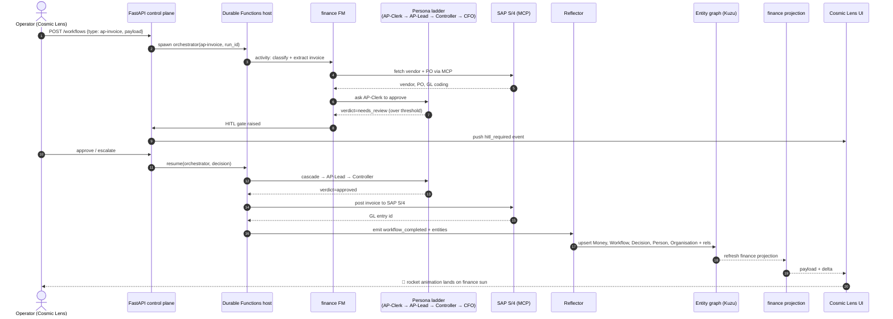
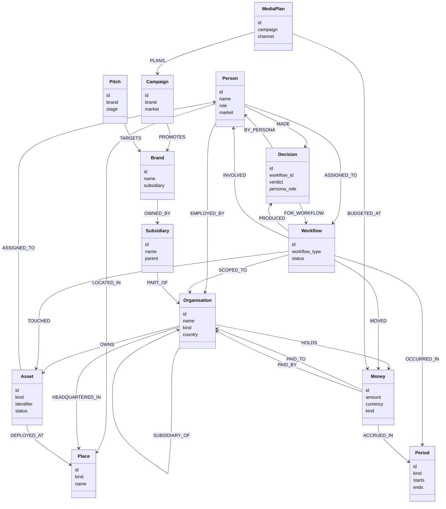
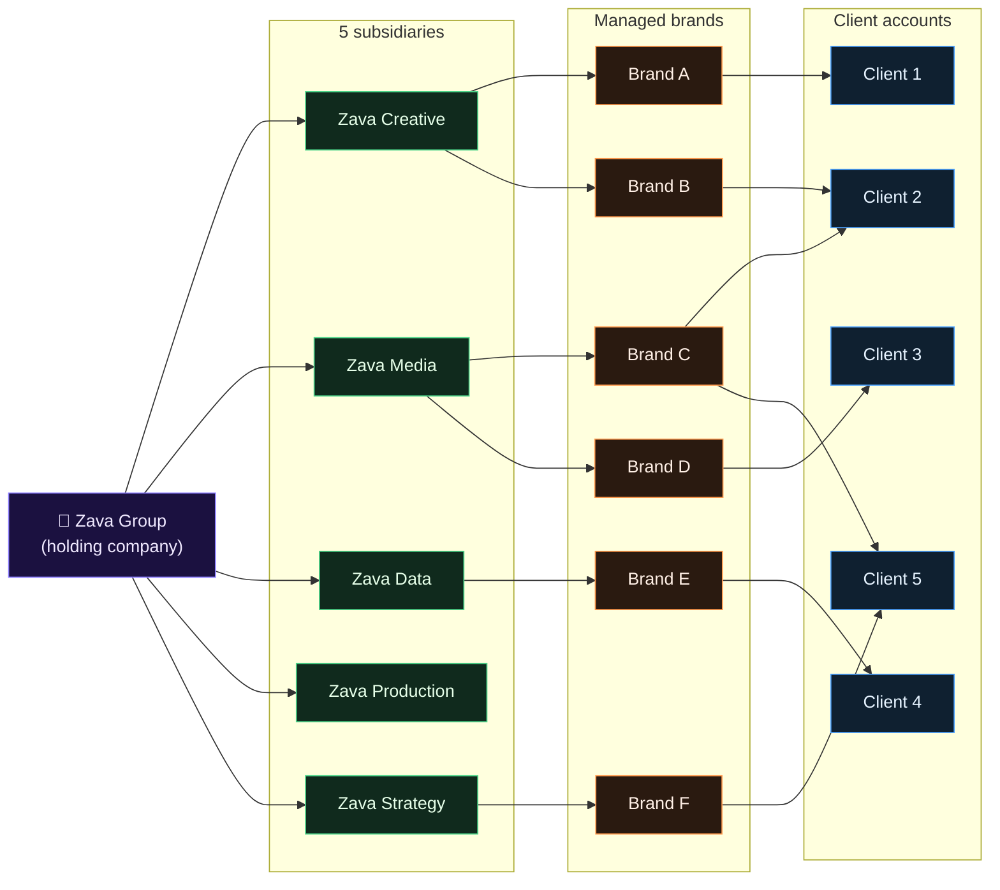

# Zava Architecture — One-Page Reference

This page is the single visual artefact for the enterprise pitch. It shows
how the **substrate** (Cosmic Lens UI, FastAPI control plane, Kuzu entity
graph, Reflector, projections, Durable Functions host) sits underneath the
**11 Function FMs** and how each FM fans out to the **agency stack mocks**
(Salesforce, Mediaocean, Prisma, Kinesso, SAP S/4, Workday HCM, DocuSign)
through MCP edges. Below it: the **78-persona** layer with auto-cascade.

All diagrams are Mermaid — they render natively on GitHub, no PNG export
required.

---

## 1. One-page overview

```mermaid
flowchart TB
    %% =========================================================
    %% TOP: Cosmic Lens UI
    %% =========================================================
    subgraph UI["🌌 Cosmic Lens UI (constellation view)"]
        UI_CONST["Constellation canvas<br/>11 function suns · 78 persona moons"]
        UI_ROCKET["Rocket animation<br/>(workflow → projection)"]
        UI_HITL["HITL inbox<br/>(approve / reject / cascade)"]
    end

    %% =========================================================
    %% MIDDLE: 11 Function FMs
    %% =========================================================
    subgraph FMS["🧠 Function Foundation Models (11)"]
        direction LR
        FM_FIN["finance FM"]
        FM_HR["hr FM"]
        FM_REV["revenue FM"]
        FM_OPS["ops FM"]
        FM_LEG["legal FM"]
        FM_MKT["marketing FM"]
        FM_TECH["tech FM"]
        FM_DATA["data FM"]
        FM_CS["customer-success FM"]
        FM_CEO["ceo FM"]
        FM_LGY["legacy FM"]
    end

    %% =========================================================
    %% SUBSTRATE: control plane + entity graph + reflector
    %% =========================================================
    subgraph SUB["⚙️ Substrate"]
        direction TB
        CP["FastAPI control plane<br/>(spawn · HITL · projections · audit)"]
        REF["Reflector<br/>(events → entities · idempotent)"]
        EG[("Entity graph<br/>Kuzu · 13 kinds · 28 rels")]
        PROJ["Per-domain projections<br/>(finance · hr · revenue · …)"]
        CP -->|spawn / event log| REF
        REF -->|upsert nodes + edges| EG
        EG -->|read views| PROJ
        PROJ -->|cached payloads| CP
    end

    %% =========================================================
    %% Durable Functions host (workflow runtime)
    %% =========================================================
    subgraph DFH["🔁 Durable Functions host"]
        ORCH["Orchestrator<br/>(per workflow_type)"]
        ACT["Activities<br/>(persona calls · projections · MCP I/O)"]
        ORCH --> ACT
    end

    %% =========================================================
    %% Agency stack mocks (right column)
    %% =========================================================
    subgraph STACK["🔌 Agency stack mocks (MCP)"]
        direction TB
        SF["Salesforce<br/>(CRM · pitches · accounts)"]
        MO["Mediaocean<br/>(media plans · IO)"]
        PR["Prisma<br/>(buying · finance ops)"]
        KN["Kinesso<br/>(audience · activation)"]
        SAP["SAP S/4<br/>(GL · AP · AR)"]
        WD["Workday HCM<br/>(employees · onboarding)"]
        DS["DocuSign<br/>(MSAs · SOWs · NDAs)"]
    end

    %% =========================================================
    %% PERSONA LAYER (bottom) — 78 personae across 11 functions
    %% =========================================================
    subgraph PERS["👥 Persona system — 78 personae across 11 functions"]
        P_LIST["L1 staff → L2 leads → L3 directors → L4 C-suite<br/>auto-cascade on escalate · CEO is terminal"]
    end

    %% ----- WIRING -----
    UI -->|spawn / approve| CP
    CP -->|drives| ORCH
    ACT -->|invokes| FMS
    FMS -->|persona decisions| PERS
    PERS -->|cascade ↑| FMS
    ACT -->|writes events| REF
    PROJ -->|payload + projections| UI

    %% MCP edges (dashed) — FM ↔ stack
    FM_REV -. MCP .-> SF
    FM_MKT -. MCP .-> MO
    FM_MKT -. MCP .-> KN
    FM_FIN -. MCP .-> PR
    FM_FIN -. MCP .-> SAP
    FM_OPS -. MCP .-> SAP
    FM_HR  -. MCP .-> WD
    FM_LEG -. MCP .-> DS
    FM_CS  -. MCP .-> SF
    FM_DATA -. MCP .-> KN
    FM_LGY -. MCP .-> SAP

    %% Cosmic-lens visual feedback loop
    REF -->|workflow_completed| UI_ROCKET
    CP -->|hitl_required| UI_HITL

    classDef ui fill:#1b1140,stroke:#8a7bff,color:#f0e9ff
    classDef sub fill:#0f2030,stroke:#4ea3ff,color:#e6f3ff
    classDef fm fill:#102a1d,stroke:#4dd58a,color:#e6ffe9
    classDef stack fill:#2a1a10,stroke:#ff9a4d,color:#fff0e6
    classDef pers fill:#2a1030,stroke:#d96bff,color:#f7e6ff
    class UI,UI_CONST,UI_ROCKET,UI_HITL ui
    class SUB,CP,REF,EG,PROJ,DFH,ORCH,ACT sub
    class FMS,FM_FIN,FM_HR,FM_REV,FM_OPS,FM_LEG,FM_MKT,FM_TECH,FM_DATA,FM_CS,FM_CEO,FM_LGY fm
    class STACK,SF,MO,PR,KN,SAP,WD,DS stack
    class PERS,P_LIST pers
```

**How to present this slide (~100 words).** Open at the top: the
**Cosmic Lens** is what the customer sees — one constellation per business,
one sun per function, one moon per persona. Drop down to the **11 Function
FMs**: each is a domain-tuned brain backed by a persona ladder. Then the
**substrate** — FastAPI control plane, Kuzu entity graph, Reflector,
projections — and the **Durable Functions host** that runs each workflow.
On the right, **MCP** wires each FM to the agency stack mocks (Salesforce,
Mediaocean, Prisma, Kinesso, SAP S/4, Workday HCM, DocuSign). Bottom:
**78 personae** with auto-cascade — escalations climb the ladder, CEO is
terminal. Same substrate, every domain.

---

## 2. Data-flow detail — `ap-invoice` end-to-end

**How to present this slide (~100 words).** This is one workflow's life,
end to end. We **spawn** an `ap-invoice` from the lens. The **orchestrator**
runs activities against the **finance FM**, which pulls vendor + PO from
**SAP S/4 over MCP**. The **persona ladder** decides: AP-Clerk flags it,
**HITL** raises in the lens, the operator approves, and the workflow
**auto-cascades** up the ladder for the higher-threshold sign-off. Once
posted back to SAP, the **Reflector** writes idempotent entities + rels
into the Kuzu **entity graph**, the **finance projection** refreshes, and
the lens fires the **rocket animation** on the finance sun. Same loop for
all 11 domains.

---

## 3. Entity-graph schema (13 kinds · 28 rel kinds)

Grouped by source kind to keep the diagram readable. Edge labels are the
relationship names; arrows point from source to target.

**How to present this slide (~100 words).** This is the **shared
vocabulary** the substrate writes into Kuzu. **13 kinds** — the eight
generic enterprise kinds (Person, Organisation, Asset, Money, Decision,
Place, Period, Workflow) plus five agency-domain kinds (Brand, Campaign,
Pitch, MediaPlan, Subsidiary). **28 relationship kinds** group naturally
around source nodes — Workflow links everything it touched, Money records
who paid whom, Decision records who decided, and the agency block models
how a pitch becomes a campaign becomes a media plan with a budget. Every
projection in the lens is a read view over this graph — there is no
second source of truth.

---

## 4. Network-effect view — Zava holding network

**How to present this slide (~100 words).** This is the **network-effect
panel** in the lens. **Zava Group** is the holding company. It owns
**five subsidiaries** — creative, media, data, production, strategy —
each running its own brands. Brands share clients across subsidiaries
(see Client 2 served by both Zava Creative and Zava Media), so a single
client conversation touches multiple P&Ls. Because every workflow projects
into the **same entity graph**, the lens can show, in one view: which
subsidiary touched which brand, which brand touched which client, and
which workflow moved money where. That cross-subsidiary visibility is the
network effect — and it's free, because the substrate is shared.

---

## Pointers when presenting

| Diagram | Lead with… | Land on… |
|---|---|---|
| 1. Overview | "One substrate, eleven brains, seven stack mocks." | "Same loop everywhere — that's the moat." |
| 2. `ap-invoice` flow | "Watch one workflow live." | "Rocket animation = projection updated in Kuzu." |
| 3. Schema | "Thirteen kinds, twenty-eight rels — that's the vocabulary." | "Every panel in the lens is a read view." |
| 4. Network | "One client, multiple subsidiaries, one graph." | "The network effect is free because the substrate is shared." |
