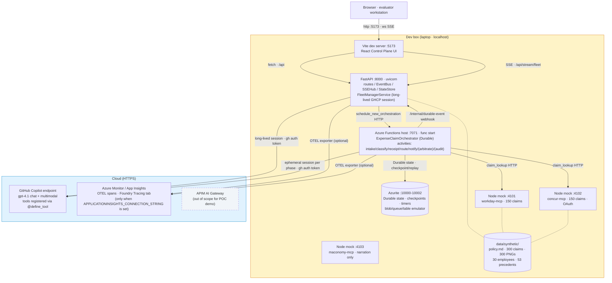

# POC1 Expense Compliance — Status & Plan

Handover doc for the technical team. Three sections: where we are against the brief, the architecture (with local-vs-cloud split), and what's left to build.

---

## 1. Acceptance criteria — status

[Brief §7](poc1-brief.md#sec-7), 13 criteria.

| # | Criterion | Status | Code anchor |
|---|---|---|---|
| 1 | Single Finance Controller view across 30+ workflows | ✅ | [expense_claim.py](../api/functions/workflows/expense_claim.py); [simulator_orchestrator.py](../api/server/services/simulator_orchestrator.py) |
| 2 | Exception-only surfacing | ✅ | [WorkflowCard.tsx](../web/client/components/WorkflowCard.tsx) |
| 3 | Bulk approval 10+ | ✅ | [BulkHitlModal.tsx](../web/client/components/BulkHitlModal.tsx) |
| 4 | ≥95% R/A/G accuracy | 🟡 | Pipeline live; first 300-claim run 64.3%; smoke 5/6 after one prompt iteration; full re-run is post-tag work per [accuracy run-book](poc1-accuracy-runbook.md). [rag-classifier/SKILL.md](../api/server/skills/rag-classifier/SKILL.md), [accuracy_harness_workflow.py](../api/functions/workflows/accuracy_harness_workflow.py) |
| 5 | Receipt cross-validation | ✅ | Live smoke 3/3. [receipt-validator/SKILL.md](../api/server/skills/receipt-validator/SKILL.md), [receipt.py](../api/functions/graphs/receipt.py) |
| 6 | Progressive enforcement | ✅ | [escalation-advisor/SKILL.md](../api/server/skills/escalation-advisor/SKILL.md), [employee_history.py](../api/server/mcp_tools/employee_history.py) |
| 7 | Autonomous learning | ✅ | Phase 5 HITL justification round-trip + FM `fleet.tick` behaviour-change loop. [fleet-manager/SKILL.md](../api/server/skills/fleet-manager/SKILL.md), [query_reviewer_decisions.py](../api/server/mcp_tools/query_reviewer_decisions.py) |
| 8 | SSC Reviewer interface | ✅ | [arbitration/SKILL.md](../api/server/skills/arbitration/SKILL.md), [arbitrate.py](../api/functions/graphs/arbitrate.py), [ReviewerQueue.tsx](../web/client/routes/ReviewerQueue.tsx) |
| 9 | Multi-EMS Control Plane | ✅ | [concur-mcp/](../mocks/concur-mcp/), [maconomy-mcp/](../mocks/maconomy-mcp/), [claim_lookup.py](../api/server/mcp_tools/claim_lookup.py) |
| 10 | EMS extensibility narration | ✅ | Maconomy rebound to expense surface + 2-file diff property. [demo-ems-extensibility.md](demo-ems-extensibility.md) |
| 11 | Region failure recovery | ✅ | [simulator_orchestrator.py::simulate_region_failure](../api/server/services/simulator_orchestrator.py); `/api/simulator/region-failure` route. |
| 12 | Immutable audit + reporting | ✅ | [audit-summariser/SKILL.md](../api/server/skills/audit-summariser/SKILL.md), [audit.py](../api/functions/graphs/audit.py), [audit_query.py](../api/server/mcp_tools/audit_query.py) |
| 13 | Cost-per-task report | ✅ | [query_economics.py](../api/server/mcp_tools/query_economics.py) + FM `report.cost_per_task` skill section |

**12 demoable, 1 partial.** AC #4 (corpus-wide ≥95%) is one ~25-minute model run away; the pipeline is shipped (smoke 5/6 after iteration). Run via [poc1-accuracy-runbook.md](poc1-accuracy-runbook.md) post-tag.

---

## 2. Architecture

Everything below `Dev box` runs on a single laptop. Anything in `Cloud` is reached over HTTPS. There is no Azure deployment for the POC demo — Durable state is in Azurite, FastAPI/Functions/Vite are local processes. Only the model API (GitHub Copilot) and OTEL export (Azure Monitor) are cloud-side.

### Inside the Functions host — per-claim flow

Each `ExpenseClaimOrchestrator` instance walks the seven phases. All seven are wired to MAF Pregel graphs as of `v0.8`.

**Three tiers (unchanged from the spec).** Fleet Manager: always-on session in FastAPI, reads telemetry, owns the exception queue. Workflow Orchestration: Durable Functions, one instance per claim, HITL waits at zero compute. Agentic Loops: ephemeral SDK sessions per phase, `client.create_session(skill_directories=[…], tools=[…])` registers skills + native tools, the model invokes them per `allowed-tools` frontmatter — no Python prompt-stuffing.

---

## 3. What's left

### AC #4 — Corpus-wide accuracy gate

The pipeline is live; one ~25-minute model run captures the number into `docs/poc1-accuracy-baseline.json`. Per the [run-book](poc1-accuracy-runbook.md), iterate prompt + retrieval if < 95% (we're already at smoke 5/6 after one tweak). Run post-tag, not pre-demo.

### Demo dry run

Walk through [DEMO.md](DEMO.md) end-to-end with someone playing WPP evaluator. Capture bugs; record `docs/demo-failover.mp4` as the AC #11 backup.

---

## 4. Repo pointers

| Topic | File |
|---|---|
| Brief verbatim | [poc1-brief.md](poc1-brief.md) |
| Pivot design spec | [superpowers/specs/2026-04-27-...-design.md](superpowers/specs/2026-04-27-poc1-expense-compliance-pivot-design.md) |
| Accuracy run-book | [poc1-accuracy-runbook.md](poc1-accuracy-runbook.md) |
| First baseline (64.3%) | [poc1-accuracy-baseline.json](poc1-accuracy-baseline.json) |
| GHCP SDK skill conventions (global) | `~/.claude/skills/ghcp-sdk-python/SKILL.md` |
| Local dev | [DEVELOPMENT.md](DEVELOPMENT.md) |
| Demo script | [DEMO.md](DEMO.md) |

**Current tag:** `v0.8-poc1-platform-complete`. AC #4 corpus-wide accuracy run is the only remaining work.
