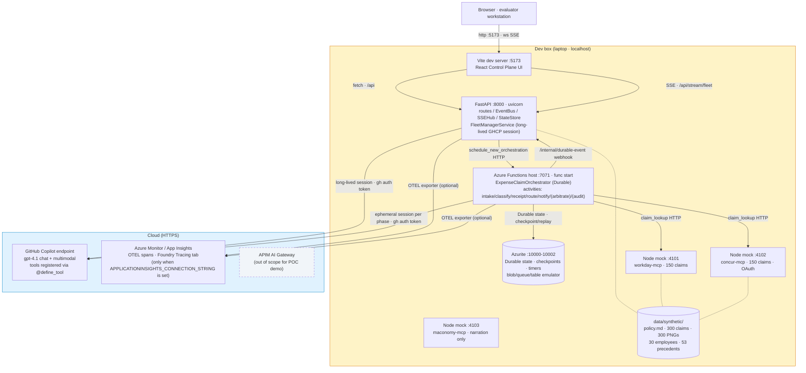
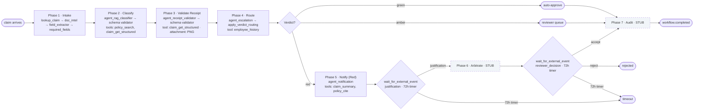

# POC1 Expense Compliance — Status & Plan

Handover doc for the technical team. Three sections: where we are against the brief, the architecture (with local-vs-cloud split), and what's left to build.

---

## 1. Acceptance criteria — status

[Brief §7](poc1-brief.md#sec-7), 13 criteria.

| # | Criterion | Status | Code anchor |
|---|---|---|---|
| 1 | Single Finance Controller view across 30+ workflows | ✅ | [expense_claim.py](../api/functions/workflows/expense_claim.py); [simulator_orchestrator.py](../api/server/services/simulator_orchestrator.py) |
| 2 | Exception-only surfacing | ✅ | [WorkflowCard.tsx](../web/client/components/WorkflowCard.tsx) |
| 3 | Bulk approval 10+ | ✅ | [BulkHitlModal.tsx](../web/client/components/BulkHitlModal.tsx) |
| 4 | ≥95% R/A/G accuracy | 🟡 | Pipeline live; first 300-claim run 64.3%; smoke 5/6 after one prompt iteration; full re-run pending. [rag-classifier/SKILL.md](../api/server/skills/rag-classifier/SKILL.md), [accuracy_harness_workflow.py](../api/functions/workflows/accuracy_harness_workflow.py) |
| 5 | Receipt cross-validation | ✅ | Live smoke 3/3. [receipt-validator/SKILL.md](../api/server/skills/receipt-validator/SKILL.md), [receipt.py](../api/functions/graphs/receipt.py) |
| 6 | Progressive enforcement | ✅ | [escalation-advisor/SKILL.md](../api/server/skills/escalation-advisor/SKILL.md), [employee_history.py](../api/server/mcp_tools/employee_history.py) |
| 7 | Autonomous learning | 🟡 | Phase 5 + HITL justification round-trip wired; Fleet Manager extension still to build |
| 8 | SSC Reviewer interface | ❌ | Not built |
| 9 | Multi-EMS Control Plane | ✅ | [concur-mcp/](../mocks/concur-mcp/), [claim_lookup.py](../api/server/mcp_tools/claim_lookup.py) |
| 10 | EMS extensibility narration | 🟡 | Mock retained; narration script not built |
| 11 | Region failure recovery | ❌ | Not built |
| 12 | Immutable audit + reporting | ❌ | Not built |
| 13 | Cost-per-task report | ❌ | Not built |

**6 demoable, 2 partial, 5 to build.** AC #4 carries 40% of the score per [brief §6](poc1-brief.md#sec-6); pipeline is shipped, corpus-level number is one model run away.

---

## 2. Architecture

Everything below `Dev box` runs on a single laptop. Anything in `Cloud` is reached over HTTPS. There is no Azure deployment for the POC demo — Durable state is in Azurite, FastAPI/Functions/Vite are local processes. Only the model API (GitHub Copilot) and OTEL export (Azure Monitor) are cloud-side.

### Inside the Functions host — per-claim flow

Each `ExpenseClaimOrchestrator` instance walks the seven phases. Phases 1–5 are wired to MAF Pregel graphs; phases 6 + 7 are stubs returning `{"status": "stub"}` until built.

**Three tiers (unchanged from the spec).** Fleet Manager: always-on session in FastAPI, reads telemetry, owns the exception queue. Workflow Orchestration: Durable Functions, one instance per claim, HITL waits at zero compute. Agentic Loops: ephemeral SDK sessions per phase, `client.create_session(skill_directories=[…], tools=[…])` registers skills + native tools, the model invokes them per `allowed-tools` frontmatter — no Python prompt-stuffing.

---

## 3. What's left to build, and how

Each row is one focused day. Files marked `(NEW)` don't exist yet.

### AC #8 — SSC Reviewer interface

| Element | Path | Notes |
|---|---|---|
| `arbitration` skill | `api/server/skills/arbitration/SKILL.md` (NEW) | Given justification text + policy clause, recommend `accept-justification` / `require-repayment` / `issue-warning` / `escalate`. Output schema mirrors `escalation-advisor`. |
| `precedents_search` MCP tool | `api/server/mcp_tools/precedents_search.py` (NEW) | Reads `data/synthetic/precedents.json` (53 records exist). Pydantic params + `@define_tool`. |
| `agent_arbitration` executor | `api/functions/graphs/executors/agents/agent_arbitration.py` (NEW) | Pre-fetches nothing; registers `precedents_search` + `policy_search`. |
| Phase 6 graph | `api/functions/graphs/arbitrate.py` (NEW) | `agent_arbitration → validate_arbitration_schema → terminal`. Replaces `arbitrate_activity` stub. |
| `/reviewer-queue` route | `web/client/routes/ReviewerQueue.tsx` (NEW) | Composes existing `ExceptionItem` + `BulkHitlModal` + a receipt thumbnail. Sort by severity / value / SLA. |
| Demo evidence | UI walkthrough — Amber claim → `/reviewer-queue` → see arbitration recommendation pre-selected → click accept → workflow.resolved → audit drawer | Tests: graph node + Vitest for queue route + smoke against an Amber claim. |

### AC #7 — Autonomous learning curve

| Element | Path | Notes |
|---|---|---|
| Fleet Manager skill prompt extension | `api/server/skills/fleet-manager/SKILL.md` (modify) | One paragraph for `fleet.tick`: when ≥50 reviewer decisions cluster on one policy clause, propose autonomy via the existing `propose_skill_amp` tool. |
| `query_reviewer_decisions` MCP tool | `api/server/mcp_tools/query_reviewer_decisions.py` (NEW) | Queries the audit ledger for accepted/rejected justifications. |
| Demo evidence | Initial state: all Amber routes to SSC. After ~50 simulated reviewer decisions, FleetManager surfaces an autonomy proposal in `SkillAmplificationPanel`. Operator approves → next 10 claims auto-route. | Backed by precedents fixture + simulated reviewer-decision ramp. |

### AC #12 — Audit + reporting · AC #13 — Cost-per-task

| Element | Path | Notes |
|---|---|---|
| `audit_summariser` skill | `api/server/skills/audit-summariser/SKILL.md` (NEW) | Narrative compliance summary from `audit_query` results. |
| `audit_query` MCP tool | `api/server/mcp_tools/audit_query.py` (NEW) | Wraps the existing `AuditLogger` / state store ledger. |
| Phase 7 graph | `api/functions/graphs/audit.py` (NEW) | `agent_audit_summariser → record_decision → terminal`. Replaces `audit_activity` stub. |
| FM extension for cost | `api/server/skills/fleet-manager/SKILL.md` (modify) | `report.cost_per_task` paragraph. |
| `query_economics` MCP tool | `api/server/mcp_tools/query_economics.py` (NEW) | Wraps existing `economics.py` service. |
| Demo evidence | Live `audit_query` from the rail returns the narrative; live `report.cost_per_task` returns weekly summary. Both render in the existing `FleetManagerRail`. | No new UI. |

### AC #11 — Region failure recovery

| Element | Path | Notes |
|---|---|---|
| `simulate-region-failure` simulator command | `api/server/services/simulator_orchestrator.py` (modify) | Stops the Functions host mid-flight; FastAPI marks workflows as paused; restart resumes via Durable replay against Azurite. |
| Recorded backup | `docs/demo-failover.mp4` (NEW) | Screen capture in case the live failover flakes. |
| Demo evidence | 30 in-flight workflows → `docker compose stop functions` → 12 paused at HITL → restart → Durable replays → ledger shows continuity. | Existing Durable runtime handles the replay; only the simulator command is new. |

### AC #10 — EMS extensibility narration

| Element | Path | Notes |
|---|---|---|
| Maconomy mock rebind | `mocks/maconomy-mcp/` (modify) | Mock already exists; rebind to expense surface. |
| Narration script | `docs/demo-ems-extensibility.md` (NEW) | 3-step pattern: register MCP → add to skill manifest → publish. Single skill-manifest diff on screen. |
| Demo evidence | Architecture walkthrough; no new code path needed. | — |

### AC #4 — Corpus-wide accuracy gate

Defer-not-skip. The pipeline is live; one ~25-minute run captures the number into `docs/poc1-accuracy-baseline.json`. Per the [run-book](poc1-accuracy-runbook.md), iterate prompt + retrieval if < 95% (we're already at smoke 5/6 after one tweak). Do this before the demo dry run, not before the build.

### Final dry run

| Element | Notes |
|---|---|
| `docs/DEMO.md` refresh | Update for the 7-phase shape + new routes/scenarios. |
| 30-minute end-to-end dry run | Walk all 13 ACs with someone playing WPP evaluator. Bug fixes. |
| `v0.8-poc1-feature-complete` tag | Final recording. |

---

## 4. Repo pointers

| Topic | File |
|---|---|
| Brief verbatim | [poc1-brief.md](poc1-brief.md) |
| Pivot design spec | [superpowers/specs/2026-04-27-...-design.md](superpowers/specs/2026-04-27-poc1-expense-compliance-pivot-design.md) |
| Accuracy run-book | [poc1-accuracy-runbook.md](poc1-accuracy-runbook.md) |
| First baseline (64.3%) | [poc1-accuracy-baseline.json](poc1-accuracy-baseline.json) |
| GHCP SDK skill conventions (global) | `~/.claude/skills/ghcp-sdk-python/SKILL.md` |
| Local dev | [DEVELOPMENT.md](DEVELOPMENT.md) |
| Demo script | [DEMO.md](DEMO.md) |

**Current tag:** `v0.7-poc1-domain-workflow`. **Target:** `v0.8-poc1-feature-complete` after the work above lands.
