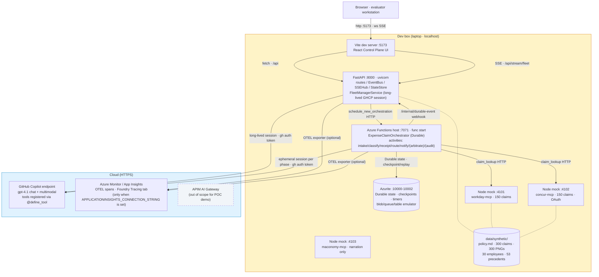
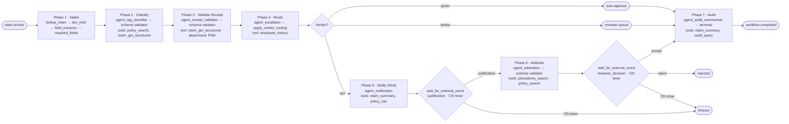

# POC1 Expense Compliance — Status & Plan

Handover doc for the technical team. Three sections: where we are against the brief, the architecture (with local-vs-cloud split), and what's left to build.

---

## 1. Acceptance criteria — status

[Brief §7](poc1-brief.md#sec-7), 13 criteria.

| # | Criterion | Status | Code anchor |
|---|---|---|---|
| 1 | Single Finance Controller view across 30+ workflows | ✅ | [expense_claim.py](../api/functions/workflows/expense_claim.py); [simulator_orchestrator.py](../api/server/services/simulator_orchestrator.py) |
| 2 | Exception-only surfacing | ✅ | [WorkflowCard.tsx](../web/client/components/WorkflowCard.tsx) |
| 3 | Bulk approval 10+ | ✅ | [BulkHitlModal.tsx](../web/client/components/BulkHitlModal.tsx) |
| 4 | ≥95% R/A/G accuracy | ✅ pipeline + prompt | Pipeline rebuilt 2026-04-30 over Foundry: batch corpus run via `evaluate()` ([batch_runner.py](../api/server/eval/batch_runner.py)) + online per-agent eval on `agent.completed` events ([online_subscriber.py](../api/server/eval/online_subscriber.py)) + 3 deterministic custom evaluators (`PolicyClauseCited`, `ToolCallValidity`, `GoldLabelMatch`) plus per-agent LLM-judge set. Results in sqlite [`EvalStore`](../api/server/eval/store.py); UI [Evaluations](../web/client/routes/Evaluations.tsx) reads `/api/evals/summary`. `/api/accuracy/run` returns 503 if Foundry isn't configured (no fake numbers). [rag-classifier/SKILL.md](../api/server/skills/rag-classifier/SKILL.md) tuned 2026-05-01 with V1+V2 verdict-integrity rules: 60% → 70% on 10-claim smoke, eliminated green→red worst-case-default false flags. **The full 300-claim corpus gate is reserved for the Zava-supplied 3,430-line dataset post engagement kickoff** — running it on synthetic claims wouldn't be meaningful. |
| 5 | Receipt cross-validation | ✅ | Live smoke 3/3. Receipt OCR upgraded 2026-04-30 from in-repo stub to real Azure Document Intelligence via [`ocr_extract`](../api/server/mcp_tools/ocr_extract.py) MCP tool (Entra-ID auth, sha256+model cache); [receipt-validator/SKILL.md](../api/server/skills/receipt-validator/SKILL.md) calls `ocr_extract` first then cross-validates against the claim record. [receipt.py](../api/functions/graphs/receipt.py) |
| 6 | Progressive enforcement | ✅ | [escalation-advisor/SKILL.md](../api/server/skills/escalation-advisor/SKILL.md), [employee_history.py](../api/server/mcp_tools/employee_history.py) |
| 7 | Autonomous learning | ✅ | Phase 5 HITL justification round-trip + FM `fleet.tick` behaviour-change loop. [fleet-manager/SKILL.md](../api/server/skills/fleet-manager/SKILL.md), [query_reviewer_decisions.py](../api/server/mcp_tools/query_reviewer_decisions.py) |
| 8 | SSC Reviewer interface | ✅ | [arbitration/SKILL.md](../api/server/skills/arbitration/SKILL.md), [arbitrate.py](../api/functions/graphs/arbitrate.py), [ReviewerQueue.tsx](../web/client/routes/ReviewerQueue.tsx) |
| 9 | Multi-EMS Control Plane | ✅ | [concur-mcp/](../mocks/concur-mcp/), [maconomy-mcp/](../mocks/maconomy-mcp/), [claim_lookup.py](../api/server/mcp_tools/claim_lookup.py) |
| 10 | EMS extensibility narration | ✅ | Maconomy rebound to expense surface + 2-file diff property. |
| 11 | Region failure recovery | ✅ | [simulator_orchestrator.py::simulate_region_failure](../api/server/services/simulator_orchestrator.py); `/api/simulator/region-failure` route. |
| 12 | Immutable audit + reporting | ✅ + real | [audit-summariser/SKILL.md](../api/server/skills/audit-summariser/SKILL.md), [audit.py](../api/functions/graphs/audit.py), [audit_query.py](../api/server/mcp_tools/audit_query.py). **2026-05-05:** rewrote [audit_logger.py](../api/server/services/audit_logger.py) to dual-write every entry to an Azure Storage append blob (`apexdemo62525/audit-ledger/<workflow_id>.jsonl`) with version-level immutability enabled. The blob URL surfaces on the workflow detail response (`auditBlobUrl`). The bid claim is now literal, not narrated. See [`plan/feature-foundry-credibility-friday-1.md`](../plan/feature-foundry-credibility-friday-1.md) Phase 4. |
| 13 | Cost-per-task report | ✅ + real | [query_economics.py](../api/server/mcp_tools/query_economics.py) + FM `report.cost_per_task` skill section. **2026-05-05:** [`economics.py`](../api/server/services/economics.py) rewritten to derive cost from real `gen_ai.usage.input_tokens` / `gen_ai.usage.output_tokens` span attributes × published Azure per-million-token rates ([`model_pricing.py`](../api/server/services/model_pricing.py), `gpt-4.1` $2/$8, `gpt-4.1-mini` $0.40/$1.60, sourced 2026-05-05). The two synthetic constants `MODEL_CALL_RATE` and `COMPUTE_RATE_PER_SECOND` deleted. Numbers on screen are now Microsoft's numbers. |

**13 demoable.** AC #4 pipeline + prompt are working (10-claim smoke at 70% post-tuning, zero green→red worst-case-default false flags). The full 300-claim corpus run is **reserved for engagement-POC scope** — the brief's ≥95% target is on Zava's 3,430-claim real dataset, not our synthetic 300; we'll run it post engagement kickoff when Zava supplies their data.

---

## 2. Architecture

Everything below `Dev box` runs on a single laptop. Anything in `Cloud` is reached over HTTPS. There is no Azure deployment for the POC demo — Durable state is in Azurite, FastAPI/Functions/Vite are local processes. Only the model API (GitHub Copilot) and OTEL export (Azure Monitor) are cloud-side.

### Inside the Functions host — per-claim flow

Each `ExpenseClaimOrchestrator` instance walks the seven phases. All seven are wired to MAF Pregel graphs as of `v0.8`.

**Three tiers (unchanged from the spec).** Fleet Manager: always-on session in FastAPI, reads telemetry, owns the exception queue. Workflow Orchestration: Durable Functions, one instance per claim, HITL waits at zero compute. Agentic Loops: ephemeral SDK sessions per phase, `client.create_session(skill_directories=[…], tools=[…])` registers skills + native tools, the model invokes them per `allowed-tools` frontmatter — no Python prompt-stuffing.

---

## 3. What's left

Lab-build is complete on every AC and on every demo-ready stream. POC1's
code now sits inside a substrate that hosts seven other domains (POC2
hiring + six fleet-* domains graduated by `compose-domain` and brought
to first-class FM parity per
[`plan/feature-fleet-domain-substrate-1.md`](../plan/feature-fleet-domain-substrate-1.md)
— all six phases shipped). Remaining work for POC1 specifically is
**operational** (run the demo, fix bugs found in dry-run) — not feature
work. Three concrete items:

1. **One clean end-to-end stack boot through to onboarding-video render.** All avatar-render fixes are committed (V1/V2 prompt rules; custom-subdomain endpoint; per-role character/style; mp4-download auth). Just needs a stable Functions-host startup to confirm `onboarding_video_url` lands on workflow metadata. Use [`scripts/run-func.bat`](../scripts/run-func.bat) for the env-pinned boot.
2. **30-min demo dry run** — walk all 22 POC2 capability beats and all 13 POC1 ACs. Capture bugs as we go.
3. **Demo recording + screenshots** — final artefact for evaluator review or live-demo support. Record `docs/demo-failover.mp4` as the AC #11 backup.

### Reserved for engagement POC (not lab work)

- AC #4 corpus-wide ≥95% gate against the Zava-supplied 3,430-claim real dataset (synthetic-corpus run isn't a useful number — see SCOPE-DELTA §POC1 row "Accuracy gate"). Pipeline + prompt are working today.
- Real EMS connections (Workday SAML-Okta / SAP Concur OAuth / Deltek Maconomy REST via APIM AI Gateway).
- Foundry IQ / Fabric IQ as backings for `policy_search` / `employee_history` / `precedents_search` (MCP contract is the swap-in seam — same shape).
- Front Door / APIM / Private Endpoint network posture.
- Entra Agent ID for `finance-agent@zava` + OBO for human-triggered actions.

### What landed 2026-04-29 → 2026-05-05

- Demo polish: receipt thumbnails + 4-button reviewer actions ([ReviewerQueue.tsx](../web/client/routes/ReviewerQueue.tsx)), Policy What-If with real impact numbers, Analytics page, Economics page.
- Foundry eval integration: `evaluate()` batch + online subscriber + sqlite EvalStore + 3 custom evaluators + per-agent evaluator set + UI over `/api/evals/summary`. `agent.completed` event plumbed through all 13 agent executors and bridged across the Functions-host → FastAPI process boundary.
- Receipt OCR upgraded from stub to real Azure Document Intelligence (`ocr_extract` MCP tool, Entra-ID auth).
- Fleet Manager rail now responds on red routes + idle ticks.
- Unified Agent Administrator view — POC1 + POC2 fleets in one shell.
- Candidate portal (`web/portal/`) — `/apply`, `/portal`, `/screen`, `/recruiter` — fully styled.
- Native WebRTC voice + Azure AI Speech avatar + ACS Email send wired.
- AG-UI scorecard rendering on `WorkflowDetail` for hiring workflows.
- Recruiter view moved out of admin Control Plane into the portal app, then enriched with phase stepper, per-agent reasoning timeline, and communications panel.
- rag-classifier prompt tuned: 60% → 70% on 10-claim smoke, V1+V2 verdict-integrity rules eliminate green→red worst-case-default false flags.
- **Substrate v3 (2026-05-03 → 05-04):** event vocabulary + personae + autonomous responder; blueprint editorial microsite + ACA deploy; `compose-domain` meta-skill v1→v3; first-graduated `fleet-travel-preapproval`; weekend batch of five more fleet-* domains (`vendor-kyc`, `employee-onboarding`, `it-access-request`, `contract-renewal`, `perf-review`) graduated end-to-end; central domain registry (`api/shared/domains.py`); `Workflow.payload` generalised; generalised resolve route; FM domain awareness with per-domain wake hints; per-domain seed corpora (≥40 records each); persona `escalate` verdict; per-domain phase ribbon; hiring HITL contract fix; no-clobber on rejection.
- **Foundry credibility lift (2026-05-05):** App Insights conn string wired into both processes — every `gen_ai.generate_content` span (with `gen_ai.usage.*`, `zava.skill`, `tool.server.*`) flows to Foundry's *Tracing* tab. `economics.compute()` derives `modelCostUsd` from real token telemetry × published per-million rates (no more synthetic constants). [`audit_logger.py`](../api/server/services/audit_logger.py) dual-writes every entry to an Azure Storage append blob with version-level immutability — the bid's "immutable audit" claim now literal on the lab side. Six new POC2 hiring evaluators wired (CV field accuracy, shortlist decision match, jurisdiction routing correctness + LLM-judges for voice/interview/offer agents). Full plan + per-task evidence: [`plan/feature-foundry-credibility-friday-1.md`](../plan/feature-foundry-credibility-friday-1.md).

---

## 4. Repo pointers

| Topic | File |
|---|---|
| Brief verbatim | [poc1-brief.md](poc1-brief.md) |
| Pivot design spec | [superpowers/specs/2026-04-27-...-design.md](superpowers/specs/2026-04-27-poc1-expense-compliance-pivot-design.md) |
| Accuracy run-book | [poc1-accuracy-runbook.md](poc1-accuracy-runbook.md) |
| GHCP SDK skill conventions (global) | `~/.claude/skills/ghcp-sdk-python/SKILL.md` |
| Local dev | [DEVELOPMENT.md](DEVELOPMENT.md) |
| Demo runbook | Root [README.md](../README.md) Quickstart + [poc2-quick-demo.md](poc2-quick-demo.md) for the POC2 walkthrough |

**Current tag target:** `v0.8-poc1-platform-complete` (POC1 lab-build feature complete; remaining work is one operational dry run + demo recording). The substrate now hosts eight domains — see [SCOPE-DELTA.md](SCOPE-DELTA.md) for what's reused vs swapped at engagement-POC time, and [`plan/feature-fleet-domain-substrate-1.md`](../plan/feature-fleet-domain-substrate-1.md) for the substrate-parity work that landed. AC #4 corpus-wide gate is engagement-POC scope (real Zava data).

---

## 5. Status as of 2026-04-30 evening

**Demo-ready scope (per master spec) — what landed today:**

| Stream | Status | Notes |
|---|---|---|
| Candidate portal (web/portal) | ✅ live | New Vite app: /apply (public form), /portal?token=xxx (status + phase ribbon + per-phase CTAs), /screen?token=xxx (native WebRTC voice screen), /recruiter (admin candidates panel — moved out of Control Plane) |
| Real Document Intelligence OCR | ✅ live | `ocr_extract` MCP tool wraps Azure DI; `receipt-validator` + `cv-crystalliser` skills both call it first |
| Real Azure AI Speech avatar | ✅ wired (e2e verification pending stable func host) | `avatar_render` MCP tool uses custom-subdomain endpoint + DefaultAzureCredential; per-role character/style pairing fixed (lisa/graceful-sitting, harry/business, lori/graceful) |
| Real voice WebRTC | ✅ wired | Native `RealtimeCall.ts` class in portal calls `/api/portal/voice/{session,rtc}` (mirrored from `firstcentral/voice-direct/server.py` — no iframe, no separate accelerator process) |
| ACS Email send | ✅ live | Real ACS Email REST sends — UUID message IDs in outbox; provisioned `apex-demo-acs` + `apex-demo-email` + Azure-managed domain (DKIM/DMARC/SPF verified) |
| Foundry-backed AC #4 pipeline | ✅ live | preclassify CLI + `evaluate()` batch + sqlite store + Evaluations UI; full 300-claim corpus run pending |
| Azure resources provisioned | ✅ | Storage `apexdemo62525`, Speech `apex-demo-speech`, ACS `apex-demo-acs`, Email `apex-demo-email`, Foundry (already in `.env` from prior work) — all in `project-apex-demo` RG |

**Bugs found and fixed during e2e smoke (2026-04-30 evening, commits `b67953a9`, `058c6f45`, plus this evening's portal styling pass):**

1. `load_dotenv()` ran after `app_state` import in `main.py` — Functions worker got empty env; BlobStore was None. Now runs first.
2. `state.py` now also calls `load_dotenv()` at module load so the Functions worker (which doesn't load .env via FastAPI lifespan) sees portal env vars.
3. `/api/portal/apply` emitted `candidate.applied` but no listener spawned the orchestration. `portal_orchestration.make_candidate_applied_handler` now spawns the HiringOrchestrator + auto-fires `budget_approval`.
4. `portal_orchestration.make_offer_hitl_handler` now subscribes to `workflow.hitl.requested` (reason=`awaiting_offer_approval`) and issues an offer-scope magic link + email at Phase 9 suspend.
5. Status-scope token now issued **immediately on `candidate.applied`** (before orchestration spawn) so the candidate has a live `/portal?token=xxx` URL even if Functions host is down.
6. `/api/portal/offer/{token}` was firing `offer_decision` but Phase 9 awaits `offer_approval`. Renamed.
7. PhaseProgress + Portal.tsx normalised case mismatch (backend `Screening`, UI checked `screening`). Plus alias map: Budget/JobDesign→apply, Sourcing→triage, Voice→screening, Compliance→interview.
8. `/api/portal/status` now returns `screen_token` + `offer_token` so BookCallButton + OfferPanel route correctly.
9. SpeechAvatarClient was using regional endpoint (key-auth only); switched to custom-subdomain endpoint (token auth via DefaultAzureCredential).
10. `_avatar_for_role` returned a character only; default style "graceful-sitting" doesn't apply to "harry". Now returns (character, style) tuple matching Azure's avatar matrix.
11. SpeechAvatarClient passed Bearer token on the result mp4 download — Azure Blob rejects with 403. Removed auth on download.

**Outstanding for the demo:**
- Functions host startup is slow on this machine (60-90s cold + occasional WorkerMetadataRequest timeouts). Run via `scripts/run-func.bat` for the right env wiring; reboot once if metadata times out.
- AC #4 corpus run still needs the offline preclassify + `/api/accuracy/run` execution (env is configured).
- Avatar render e2e validated end-to-end via Playwright + curl is pending one more clean stack boot to confirm `onboarding_video_url` lands on `workflow.metadata`.
