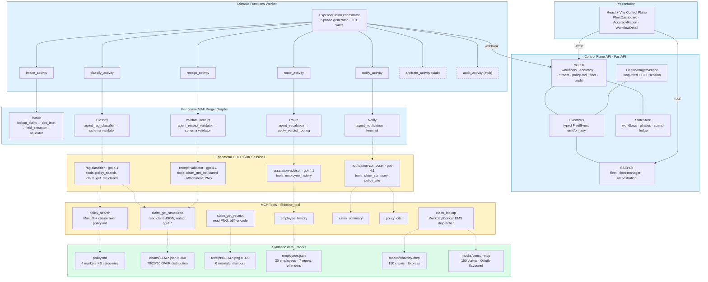

# POC1 Expense Compliance — Solution Status (end of Week 2)

> **Tag:** `v0.7-poc1-domain-workflow`
> **Tests:** 185 backend (pytest) · 18 UI (vitest) · TypeScript clean
> **Live evidence:** 3/3 receipt-validator smoke; 5/6 R/A/G classifier smoke; 300-claim accuracy gate captured at 64.3% on the **first** prompt iteration (deferred full re-run).
> **Audience:** WPP evaluator, internal Microsoft team, future maintainers landing on the repo cold.

This document captures three things: how the implementation aligns with WPP's POC1 brief, what's actually built and how it works, and what's left for Week 3 to land all 13 acceptance criteria.

---

## 1. Executive summary

The brief asks for an **expense-compliance Control Plane**: many agents process employee expense claims across multiple EMSs (Workday, Concur, Chrome River…), classify each line Red/Amber/Green against a T&E policy, run a closed-loop notify→arbitrate→escalate behaviour-change pipeline, and surface everything through one operator view that a Finance Controller governs without ever logging into the EMSs themselves.

End of Week 2, the platform runs:

- A **7-phase Durable Functions orchestrator** (`ExpenseClaimOrchestrator`) per expense claim. **Phases 1–5 are wired** end-to-end; Phases 6 (Arbitrate) and 7 (Audit) are stubbed pending Week 3.
- **Five GHCP SDK skills** (rag-classifier, receipt-validator, escalation-advisor, notification-composer + the existing fleet-manager) that own the *behaviour*; they are loaded by the SDK from `api/server/skills/<name>/SKILL.md` and call native tools registered with `@define_tool`.
- **Eight new MCP tools** under `api/server/mcp_tools/` — `policy_search`, `claim_get_structured`, `claim_get_receipt`, `claim_lookup`, `claim_summary`, `policy_cite`, `employee_history`, plus the existing `query_fleet`/`query_traces`/`compose_exception`/`propose_skill_amp`/`dry_run_policy`.
- **Two EMS mocks** (Workday + new Concur) serving 150 + 150 synthetic expense claims each.
- **Synthetic data**: 8-page T&E policy markdown, 300 deterministic labelled claims, 300 PNG receipts with six controlled mismatch flavours, 30 employees with seeded breach histories, 53 historical SSC reviewer precedents.
- **The accuracy harness** as a parallel-fan-out MAF-shaped workflow streaming progress to the existing SSE bus → React `AccuracyReport` panel.
- A **simulator** that spawns scenario-driven workflows (receipt-mismatch flavours, repeat-offender ramp, breach-justification cycle).

Six of the brief's 13 acceptance criteria are demoable today; one more (#4 ≥95% accuracy) has the entire pipeline live but the corpus-wide gate is deferred to a single ~25-minute model run; the remaining six are scoped to Week 3.

---

## 2. Alignment with the brief — 13 acceptance criteria

[Brief §7](poc1-brief.md#sec-7) lists 13 criteria. Status as of `v0.7`:

| # | WPP criterion | Status | What proves it | Code anchor |
|---|---|---|---|---|
| 1 | Single Finance Controller view across 30+ workflows | ✅ | `ExpenseClaimOrchestrator` + simulator ramp drive 30+ concurrent workflows; `FleetDashboard` renders them | [api/functions/workflows/expense_claim.py](../api/functions/workflows/expense_claim.py); [api/server/services/simulator_orchestrator.py](../api/server/services/simulator_orchestrator.py); [web/client/routes/FleetDashboard.tsx](../web/client/routes/FleetDashboard.tsx) |
| 2 | Exception-only surfacing | ✅ | `WorkflowCard` renders verdict badge; existing default filter shows exceptions only; toggle reveals Green | [web/client/components/WorkflowCard.tsx](../web/client/components/WorkflowCard.tsx) |
| 3 | Bulk approval of 10+ in one action | ✅ | `BulkHitlModal` + `/api/exceptions/bulk-resolve` from Week 1; Amber claims now flow through it | [web/client/components/BulkHitlModal.tsx](../web/client/components/BulkHitlModal.tsx) |
| 4 | ≥95% R/A/G accuracy with per-line reasoning | 🟡 | Pipeline live; `AccuracyReport` renders confusion matrix + drill-down; live policy-edit→re-run path works (AC #4 evidence path); single full-corpus run sits at 64.3% from one prompt iteration; smoke 5/6 after iter-1 fixes | [api/server/skills/rag-classifier/SKILL.md](../api/server/skills/rag-classifier/SKILL.md); [api/functions/workflows/accuracy_harness_workflow.py](../api/functions/workflows/accuracy_harness_workflow.py); [web/client/components/AccuracyReport.tsx](../web/client/components/AccuracyReport.tsx); [docs/poc1-accuracy-runbook.md](poc1-accuracy-runbook.md) |
| 5 | Receipt cross-validation | ✅ | Phase 3 wires `agent_receipt_validator` with a multimodal session attachment; six mismatch flavours (correct, wrong-amount, wrong-date, wrong-vendor, missing-line-item, missing-receipt); live smoke 3/3 on representative cases | [api/server/skills/receipt-validator/SKILL.md](../api/server/skills/receipt-validator/SKILL.md); [api/functions/graphs/receipt.py](../api/functions/graphs/receipt.py) |
| 6 | Progressive enforcement | ✅ | Phase 4 calls `agent_escalation` in line; tier matrix (0/1/2+ priors → warning / escalation / major-violation) with same-category override; `spawn_repeat_offender_ramp(EMP-…, count=3)` shows the live ramp | [api/server/skills/escalation-advisor/SKILL.md](../api/server/skills/escalation-advisor/SKILL.md); [api/server/mcp_tools/employee_history.py](../api/server/mcp_tools/employee_history.py) |
| 7 | Autonomous learning curve | 🟡 | Phase 5 + HITL justification round-trip wired (foundation); Fleet Manager prompt extension that observes reviewer decisions and proposes autonomy is **Week 3** | [api/server/skills/notification-composer/SKILL.md](../api/server/skills/notification-composer/SKILL.md) for the foundation; FM extension TBD |
| 8 | SSC Reviewer operational interface | ❌ | `/reviewer-queue` route + `arbitration` skill + `precedents.search` tool — **Week 3** | TBD |
| 9 | System-agnostic Control Plane (2+ EMS) | ✅ | `mocks/concur-mcp/` (new) + `mocks/workday-mcp/` (extended); 50/50 split of synthetic claims; `claim_lookup` Python adapter normalises both into the same shape; `WorkflowCard` does not render `ems_source` (assert-locked by `tests/web/WorkflowCard.test.tsx`) | [mocks/concur-mcp/server.ts](../mocks/concur-mcp/server.ts); [api/server/mcp_tools/claim_lookup.py](../api/server/mcp_tools/claim_lookup.py) |
| 10 | EMS extensibility narration | 🟡 | `mocks/maconomy-mcp/` retained from Week 1 to narrate the 3-step pattern (register MCP → add tool → publish); narration script — **Week 3** | TBD |
| 11 | Region failure recovery | ❌ | `simulate-region-failure` simulator command + Durable replay walkthrough — **Week 3** | TBD |
| 12 | Immutable audit + reporting | ❌ | `audit_summariser` skill + `audit_query` MCP tool + Phase 7 graph — **Week 3** | TBD |
| 13 | Cost-per-task report | ❌ | Fleet Manager prompt extension for `report.cost_per_task` + `query_economics` MCP tool — **Week 3** | TBD |

**Score so far: 6 of 13 demoable; 2 partial; 5 scoped to Week 3.** AC #4 is the dominant scoring axis (40% per [brief §6](poc1-brief.md#sec-6)) — its pipeline is shipped; the corpus-level number is one model run away.

---

## 3. Solution architecture — three tiers



**Three tiers, unchanged from the design spec:**

- **Fleet Manager** — always-on GHCP SDK session in the FastAPI process. Reads OTEL/event telemetry, composes the exception queue, will surface autonomy + cost reports in Week 3. Frontier model; reasons across many workflows.
- **Workflow Orchestration** — Azure Durable Functions, one `ExpenseClaimOrchestrator` instance per claim. HITL waits at zero compute via `wait_for_external_event`, 72h timer escalation, parallel coordination, checkpoint/replay. No model.
- **Agentic Loops** — ephemeral GHCP SDK sessions, one per phase activity. `client.create_session(skill_directories=[…], tools=[…])` — the SDK auto-discovers `<skill>/SKILL.md` and registers `@define_tool` tools natively; the model invokes them per the skill's `allowed-tools` frontmatter. Each session emits OTEL spans and exits.

---

## 4. The skills-first pattern (how a phase actually runs)

Each phase activity spins up a fresh GHCP SDK session that loads exactly one skill and exactly the tools that skill needs:

```python
# api/functions/graphs/executors/agents/agent_rag_classifier.py
from copilot import CopilotClient                          # SDK
from api.server.mcp_tools.claim_get_structured import claim_get_structured_tool
from api.server.mcp_tools.policy_search import policy_search_tool

_SKILL_DIR = SKILLS_DIR / "rag-classifier"

async def execute(input: dict) -> dict:
    classification = await run_agent_session(
        prompt=f"Classify expense claim `{input['claim_id']}` per your role.",
        tools=[policy_search_tool, claim_get_structured_tool],   # SDK-native
        skill_dir=_SKILL_DIR,                                    # auto-loaded
        skill_label="rag-classifier",
    )
    return {"classification": classification}
```

The **skill markdown** owns role, decision procedure, output schema, and worked examples. The **tool** declarations are 30-line Python modules that wrap state-store / synthetic-data reads with a Pydantic params model and `@define_tool`. The **agent executor** is a 25-line file that says "register these tools, load this skill, call the model" — no prompt-stuffing of tool results, no hand-rolled JSON parsing.

The lessons that took us a session to get right are documented globally in `~/.claude/skills/ghcp-sdk-python/SKILL.md` so the next session starts with the working pattern.

---

## 5. What's running today

### Phase 1 — Intake & Normalise

Pulls the claim from the EMS, normalises it, OCRs the receipt, validates required fields. Runs on every claim.

- Graph: `lookup_claim → doc_intelligence_extract → agent_field_extractor → validate_required_fields → terminal`
- File: [api/functions/graphs/intake_expense.py](../api/functions/graphs/intake_expense.py)
- EMS dispatch: [api/server/mcp_tools/claim_lookup.py](../api/server/mcp_tools/claim_lookup.py) routes to Workday port 4101 or Concur port 4102 based on the claim's `ems_source` field.

### Phase 2 — Classify (R/A/G)

Reads the policy, the claim, computes a verdict + policy clause + reasoning + competing interpretations.

- Graph: `agent_rag_classifier → validate_classification_schema_node → terminal`
- Skill: [api/server/skills/rag-classifier/SKILL.md](../api/server/skills/rag-classifier/SKILL.md) — explicit decision procedure with §3 rule vs §7 example disambiguation, ratio-against-base-cap, hard-rule overrides.
- Live evidence: smoke 5/6 after one prompt iteration.

### Phase 3 — Validate Receipt

Multimodal cross-check. Receipt PNG passes via `attachments=[{type: inline, content_type: image/png, data: b64}]` on the SDK `send_and_wait` call; structured claim fields stay tool-callable.

- Graph: `agent_receipt_validator → validate_receipt_schema → terminal`
- Skill: [api/server/skills/receipt-validator/SKILL.md](../api/server/skills/receipt-validator/SKILL.md) — six flavours from "correct" through "missing-receipt"; verdict/flavour disagreement is a guardrail block.
- Short-circuits on zero-byte missing-receipt markers (no model call needed).

### Phase 4 — Route by Verdict

- Graph: `agent_escalation → apply_verdict_routing → terminal`
- Green → `auto-approve` (workflow closes); Amber → `reviewer-queue`; Red → `notify`.
- Escalation advisor runs in line on Amber/Red only and emits a tier (warning / escalation / major-violation) using a 90-day breach lookup; Green claims skip the model call entirely.
- Optional `route_override` short-circuits the verdict matrix (lets the policy page reroute during a backlog) while preserving the original verdict on the output for audit.

### Phase 5 — Notify (Red path only)

- Graph: `agent_notification → terminal`
- Skill: [api/server/skills/notification-composer/SKILL.md](../api/server/skills/notification-composer/SKILL.md) — composes Adaptive Card (Teams) + plain-text email body for the claimant; tone scales with tier; verbatim policy quote required in both channels.
- Emits a `notification.sent` FleetEvent; the orchestrator then enters its `wait_for_external_event("justification")` HITL gate with a 72-hour timer.

### The HITL spine (Tasks 4 + 22)

The orchestrator's two HITL waits use Durable Functions' native pattern: `wait_for_external_event` against a `create_timer` race. If the user supplies a justification within 72 hours, the workflow resumes to Phase 6; otherwise the timer wins and the workflow completes with `status=timeout`. The simulator's `simulate_justification(workflow_id)` fires the matching external event for demo purposes and emits a `justification.received` FleetEvent.

### The accuracy harness (AC #4)

`accuracy_harness_workflow.run(claim_ids, classifier, concurrency=8)` is a one-shot Pregel-shaped fan-out — `splitter → [N × classifier] → confusion_matrix_aggregator`. It's wired to the existing event bus → SSE so progress streams live to the React `AccuracyReport` panel. Triggered via `POST /api/accuracy/run`; report cached by `run_id` and surfaced via `GET /api/accuracy/last` and `GET /api/accuracy/{run_id}`.

The **policy-driven, not code-driven** demo path works end-to-end: edit `data/synthetic/policy.md` via `POST /api/policy-md/save`, the route invalidates `policy_search`'s cached MiniLM index, the next harness run uses the new policy text. *No classifier code changes between runs.* That's the literal AC #4 evidence hook.

### The simulator (`api/server/services/simulator_orchestrator.py`)

- `spawn_expense_workflow(scenario, claim_id?)` — picks a deterministic claim from the synthetic corpus matching a scenario flavour and starts an `ExpenseClaimOrchestrator` instance.
- Six `receipt-mismatch-*` scenarios cover the receipt-validator flavours.
- `spawn_repeat_offender_ramp(employee_id, count=3)` spawns three consecutive claims from one employee so the escalation tier ramps warning → escalation → major-violation across the demo.
- `simulate_justification(workflow_id, text)` round-trips a Red claim back into the orchestrator.

---

## 6. What's left for Week 3

Per the design spec [§8](superpowers/specs/2026-04-27-poc1-expense-compliance-pivot-design.md#sec-8), Week 3 lands the operator surfaces, the behaviour-change loop, and the polish. Concretely:

| Day | Work | AC unlocked |
|---|---|---|
| 11 | `arbitration` skill + `precedents_search` MCP tool. New `/reviewer-queue` route composing existing `ExceptionItem` / `BulkHitlModal` components. Phase 6 (Arbitrate) graph wired in. | **#8 ✅** |
| 12 | Fleet Manager skill prompt extension (one paragraph for behaviour-change on `fleet.tick`); new `query_reviewer_decisions` MCP tool; seed the existing 53 historical reviewer decisions; observe the autonomy proposal land in `SkillAmplificationPanel`. | **#7 ✅** |
| 13 | `audit_summariser` skill + `audit_query` MCP tool (Phase 7 wired in). Then Fleet Manager extension for `report.cost_per_task` + `query_economics` MCP tool. | **#12 ✅ #13 ✅** |
| 14 | `simulate-region-failure` simulator command (`docker compose stop functions`-style demo). Live failover walkthrough + recorded backup. EMS extensibility narration practice using the retained Maconomy mock. | **#11 ✅ #10 ✅** |
| 15 | End-to-end demo dry run (30 minutes, all 13 ACs); bug fixes; final demo recording; tag `v0.8-poc1-feature-complete`. | All 13 ✅ |

**Plus** the deferred AC #4 corpus-wide gate: ~25 minutes of model spend on the existing pipeline, captured into `docs/poc1-accuracy-baseline.json`.

### Items deferred from Week 2 cleanup (low priority, documented)

The three-reviewer cleanup pass at end of Week 2 surfaced a handful of findings explicitly punted:

- **`httpx.Client` connection pooling for `claim_lookup`** — would force test churn; revisit only if 300-claim concurrency becomes a bottleneck.
- **Legacy `*.skill.md` frontmatter using dotted tool names** — vestigial Week 1 skills, not loaded by the active orchestrator. Cosmetic.
- **Stronger Adaptive Card schema validation** for the notification composer output — downstream Teams render concern; punted.
- **`_normalise_claim` adapter** to enforce the dual-EMS surface contract in code. Today the contract holds because both mocks were hand-shaped to align; an adapter would lock it.
- **Cleanup of the dead invoice path** (`spawn_workflow`, `_seq`) — kept for backwards compatibility with any in-flight Durable history; can delete after one production-grade purge cycle.

---

## 7. Risks and known gaps

| Risk | Mitigation today | Plan |
|---|---|---|
| `rag_classifier` corpus accuracy < 95% | Single full-corpus run sat at 64.3% on the original prompt; smoke 5/6 after one iteration | Iterate prompt + retrieval; final 300-claim gate before demo |
| Region failover demo flakes live | Recorded backup video on Day 14 | — |
| Multimodal receipt validator availability/cost | gpt-4.1 image attachment confirmed working; smoke 3/3 | Day 14 cost telemetry via `query_economics` |
| `arbitration` skill quality (Phase 6) | Not yet implemented | Day 11 |
| `audit_summariser` narrative quality (Phase 7) | Not yet implemented | Day 13 |
| Demo narrative incoherence | — | Day 15 dry run with someone playing WPP evaluator |
| Phase 6/7 stubs return placeholder; if the route accidentally hits an unfilled branch the workflow completes with a stub marker rather than crashing | Stubs return `{"status": "stub", "phase": "..."}` not `NotImplementedError` | Real graphs land Week 3 |

---

## 8. Repo map (what to read after this doc)

| Topic | File |
|---|---|
| Brief verbatim | [docs/poc1-brief.md](poc1-brief.md) |
| Submitted PRD | [docs/poc1-prd-submitted.md](poc1-prd-submitted.md) |
| Pre-pivot inventory | [docs/poc1-inventory.md](poc1-inventory.md) |
| Pivot design spec | [docs/superpowers/specs/2026-04-27-poc1-expense-compliance-pivot-design.md](superpowers/specs/2026-04-27-poc1-expense-compliance-pivot-design.md) |
| Week 1 plan | [docs/superpowers/plans/2026-04-27-poc1-expense-compliance-pivot-week1-accuracy-spine.md](superpowers/plans/2026-04-27-poc1-expense-compliance-pivot-week1-accuracy-spine.md) |
| Week 2 plan | [docs/superpowers/plans/2026-04-28-poc1-expense-compliance-pivot-week2-domain-workflow.md](superpowers/plans/2026-04-28-poc1-expense-compliance-pivot-week2-domain-workflow.md) |
| Accuracy run-book | [docs/poc1-accuracy-runbook.md](poc1-accuracy-runbook.md) |
| First baseline (64.3%) | [docs/poc1-accuracy-baseline.json](poc1-accuracy-baseline.json) |
| Pre-pivot architecture | [docs/ARCHITECTURE.md](ARCHITECTURE.md) — *pre-Week-2; Workflow type and phase names are now extended; treat as historical until replaced* |
| Demo script | [docs/DEMO.md](DEMO.md) |
| Local dev | [docs/DEVELOPMENT.md](DEVELOPMENT.md) |

### Tags

- `v0.5-invoice-poc` — pre-pivot snapshot
- `v0.6-poc1-accuracy-spine` — Week 1 (synthetic data + classifier + harness + AccuracyReport)
- `v0.7-poc1-domain-workflow` — Week 2 (orchestrator reshape + Phases 1–5 + dual EMS) ← **current**
- `v0.8-poc1-feature-complete` — Week 3 target

### Code stats end of Week 2 (since `v0.5-invoice-poc`)

- 42 commits on `main`
- 175 unit tests across `tests/api/unit/` + `tests/web/`
- 5 working skills under `api/server/skills/<name>/SKILL.md`
- 13 MCP tools registered (8 new in this pivot + 5 existing for Fleet Manager)
- 2 EMS Node mocks running (Workday + Concur)
- 1 SSE-driven UI panel (AccuracyReport) plus 5 retargeted existing components

---

*Last updated end of Week 2, 2026-04-28. Generated as part of `v0.7-poc1-domain-workflow` cleanup.*
