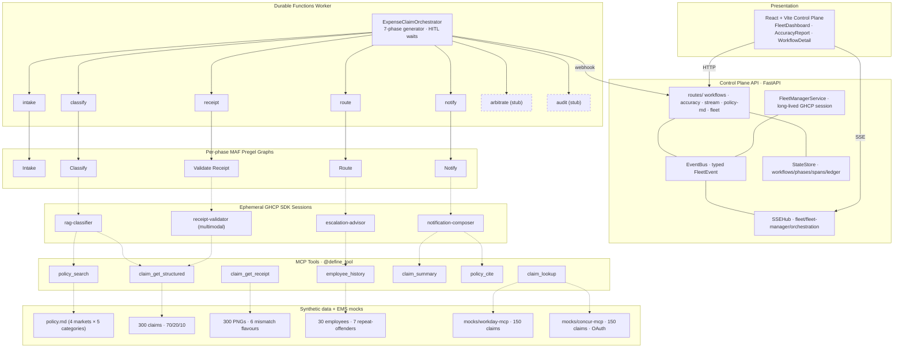

# POC1 Expense Compliance — Status (Week 2)

**Tag:** `v0.7-poc1-domain-workflow` · **Tests:** 185 backend / 18 UI / tsc clean · **42 commits** since `v0.5-invoice-poc`.

This is a handover doc: alignment with the brief, what's built, what's left.

---

## 1. Acceptance criteria — status

[Brief §7](poc1-brief.md#sec-7), 13 criteria. Status as of `v0.7`:

| # | Criterion | Status | Code |
|---|---|---|---|
| 1 | Single Finance Controller view across 30+ workflows | ✅ | [expense_claim.py](../api/functions/workflows/expense_claim.py); [simulator_orchestrator.py](../api/server/services/simulator_orchestrator.py) |
| 2 | Exception-only surfacing | ✅ | [WorkflowCard.tsx](../web/client/components/WorkflowCard.tsx) |
| 3 | Bulk approval 10+ | ✅ | [BulkHitlModal.tsx](../web/client/components/BulkHitlModal.tsx) |
| 4 | ≥95% R/A/G accuracy | 🟡 | Pipeline live; first 300-claim run 64.3%; smoke 5/6 after one prompt iteration; full re-run pending. [rag-classifier/SKILL.md](../api/server/skills/rag-classifier/SKILL.md), [accuracy_harness_workflow.py](../api/functions/workflows/accuracy_harness_workflow.py) |
| 5 | Receipt cross-validation | ✅ | Live smoke 3/3. [receipt-validator/SKILL.md](../api/server/skills/receipt-validator/SKILL.md), [receipt.py](../api/functions/graphs/receipt.py) |
| 6 | Progressive enforcement | ✅ | [escalation-advisor/SKILL.md](../api/server/skills/escalation-advisor/SKILL.md), [employee_history.py](../api/server/mcp_tools/employee_history.py) |
| 7 | Autonomous learning | 🟡 | Foundation laid (Phase 5 + HITL); FM extension is Week 3 |
| 8 | SSC Reviewer interface | ❌ | Week 3 (Day 11) |
| 9 | Multi-EMS Control Plane | ✅ | [concur-mcp/](../mocks/concur-mcp/), [claim_lookup.py](../api/server/mcp_tools/claim_lookup.py) |
| 10 | EMS extensibility narration | 🟡 | Mock retained; narration is Week 3 (Day 14) |
| 11 | Region failure recovery | ❌ | Week 3 (Day 14) |
| 12 | Immutable audit + reporting | ❌ | Week 3 (Day 13) |
| 13 | Cost-per-task report | ❌ | Week 3 (Day 13) |

**6 demoable, 2 partial, 5 scoped to Week 3.**

---

## 2. Architecture

Three tiers: **Fleet Manager** (always-on session; reads telemetry, composes exception queue), **Workflow Orchestration** (Durable Functions, one instance per claim, HITL waits via `wait_for_external_event`), **Agentic Loops** (ephemeral SDK sessions per phase; `client.create_session(skill_directories=[…], tools=[…])` registers skills + tools natively, no prompt-stuffing).

---

## 3. What's wired today

| Phase | Graph | Skill / executor | Tools | AC |
|---|---|---|---|---|
| 1 Intake | `lookup_claim → doc_intel → field_extractor → required_fields` | `agent_field_extractor` (existing) | `claim_lookup` (Workday/Concur) | #1, #9 |
| 2 Classify | `agent_rag_classifier → schema validator` | `rag-classifier` | `policy_search`, `claim_get_structured` | #4 (pipeline) |
| 3 Validate Receipt | `agent_receipt_validator → schema validator` | `receipt-validator` (multimodal — PNG via `attachments=`) | `claim_get_structured` | #5 |
| 4 Route | `agent_escalation → apply_verdict_routing` | `escalation-advisor` (skips on Green) | `employee_history` | #6 |
| 5 Notify (Red only) | `agent_notification` | `notification-composer` | `claim_summary`, `policy_cite` | foundation for #7 |
| 6 Arbitrate | stub | — | — | Week 3 |
| 7 Audit | stub | — | — | Week 3 |

**HITL spine.** Phase 5 emits `notification.sent`, then orchestrator awaits `wait_for_external_event("justification")` against a 72h timer (`JUSTIFICATION_TIMEOUT`). Phase 6 will mirror it for `reviewer_decision`. Simulator: `simulate_justification(workflow_id)` fires the matching event for demos.

**Accuracy harness.** `POST /api/accuracy/run` triggers `accuracy_harness_workflow.run(claim_ids, classifier, concurrency=8)` — splitter / N-parallel-classifier / aggregator. Streams `accuracy.progress` events; AccuracyReport renders confusion matrix + per-cell drill-down. AC #4's "policy edit changes behaviour without code change" path is live: `POST /api/policy-md/save` invalidates the MiniLM index, next run uses the new text.

**Simulator scenarios.** `spawn_expense_workflow(scenario)` covers six receipt-mismatch flavours; `spawn_repeat_offender_ramp(employee_id, count=3)` for AC #6 ramp; `simulate_justification` for AC #7 round-trip.

---

## 4. Week 3 plan

Per [design spec §8](superpowers/specs/2026-04-27-poc1-expense-compliance-pivot-design.md):

| Day | Work | Unlocks |
|---|---|---|
| 11 | `arbitration` skill + `precedents_search` tool + `/reviewer-queue` route + Phase 6 graph | #8 |
| 12 | Fleet Manager skill prompt extension + `query_reviewer_decisions` tool + autonomy proposal in SkillAmplificationPanel | #7 |
| 13 | `audit_summariser` skill + `audit_query` tool + Phase 7 graph + `query_economics` tool + cost-per-task FM extension | #12, #13 |
| 14 | `simulate-region-failure` simulator command + recorded backup video + Maconomy EMS extensibility narration | #11, #10 |
| 15 | End-to-end demo dry run (30 min) + bug fixes + final recording + tag `v0.8-poc1-feature-complete` | All 13 |

**Plus deferred Week 2 work:** the corpus-wide AC #4 gate (~25 min model spend on the existing pipeline), captured into `docs/poc1-accuracy-baseline.json`.

### Cleanup deferred from Week 2

Documented during the Week 2 three-reviewer pass; not blocking Week 3:

- `httpx.Client` connection pooling for `claim_lookup` (would force 8-test churn; defer until 300-claim concurrency matters).
- Legacy pre-pivot `*.skill.md` files use dotted tool names in `allowed-tools` — vestigial, not loaded by the active orchestrator. Cosmetic.
- Stronger Adaptive Card schema validation for the notification composer output. Punted unless Teams render fails.
- `_normalise_claim` adapter to enforce the dual-EMS surface in code (today both mocks happen to align).
- Delete the dead invoice path (`spawn_workflow`, `_seq` in `simulator_orchestrator`) once any in-flight Durable history is purged.

---

## 5. Repo pointers

| Topic | File |
|---|---|
| Brief verbatim | [poc1-brief.md](poc1-brief.md) |
| Pivot design spec | [superpowers/specs/2026-04-27-...-design.md](superpowers/specs/2026-04-27-poc1-expense-compliance-pivot-design.md) |
| Week 1 plan | [superpowers/plans/...week1...](superpowers/plans/2026-04-27-poc1-expense-compliance-pivot-week1-accuracy-spine.md) |
| Week 2 plan | [superpowers/plans/...week2...](superpowers/plans/2026-04-28-poc1-expense-compliance-pivot-week2-domain-workflow.md) |
| Accuracy run-book | [poc1-accuracy-runbook.md](poc1-accuracy-runbook.md) |
| First baseline (64.3%) | [poc1-accuracy-baseline.json](poc1-accuracy-baseline.json) |
| Pre-pivot architecture (historical) | [ARCHITECTURE.md](ARCHITECTURE.md) |
| Local dev | [DEVELOPMENT.md](DEVELOPMENT.md) |
| Demo script | [DEMO.md](DEMO.md) |

**Tags:** `v0.5-invoice-poc` (pre-pivot) · `v0.6-poc1-accuracy-spine` (Week 1) · `v0.7-poc1-domain-workflow` (Week 2, current) · `v0.8-poc1-feature-complete` (Week 3 target).

**Stats:** 5 skills · 13 MCP tools (8 new + 5 retained) · 2 EMS Node mocks · 1 new UI panel (AccuracyReport) · 175 unit tests.

---
*Last updated 2026-04-28 (`v0.7`).*
