# POC2 Talent Lifecycle — Status & Plan

Sister doc to [poc1-status.md](poc1-status.md) — same shape, applied to POC2 (HR Talent Lifecycle, 12-week sprint, the "Frontier POC"). The thesis is **reuse the POC1 platform; swap the domain.** Per [poc1-inventory.md](poc1-inventory.md) ≈ 75% of POC1 source artifacts are domain-agnostic platform; POC2 keeps that and replaces skills, MCP mocks, UI labels, and the per-phase graph set, then adds five genuinely new capabilities (voice, avatar, A2A, jurisdiction switching, Threadlight).

Three sections: capability map against the 22 demos, architecture (with the local-vs-cloud split + what's reused from POC1), and the build plan.

---

## 1. Capability matrix — starting state

22 demos required from [spec.md](../spec.md) §4.1–4.22. Status legend:

- ✅ — POC1 plumbing applies as-is (Control Plane shell, Durable runtime, Fleet Manager, OTEL, audit ledger, validator-as-guardrail edges, bulk HITL modal).
- 🟡 — POC1 has the shape; rebind by swapping skill prompt, MCP endpoint, or label.
- ❌ — net-new for POC2; no analogue in POC1.

| § | Capability | Status | What backs it |
|---|---|---|---|
| 4.1 | Multi-agent orchestration (parallel + sequential) | 🟡 | `ExpenseClaimOrchestrator` (7 phases) → `HiringOrchestrator` (10 phases). Same Durable+MAF pattern. |
| 4.2 | System integration & auth (Greenhouse, LinkedIn, Workday-HR, Graph, ServiceNow) | 🟡 | Replace the three POC1 EMS mocks (Workday, Concur, Maconomy) with the seven POC2 MCP mocks. Same `@define_tool` + Pydantic shape. |
| 4.3 | HITL gates + bulk action across surfaces | ✅ | `BulkHitlModal` + `wait_for_external_event` reusable. New: Adaptive Card path for Finance BP, ServiceNow webhook path for IT Ops. |
| 4.4 | Exception handling & self-healing | ✅ | `exception_factory` + `triage` services unchanged. Action labels rebind. |
| 4.5 | Voice screening + avatar onboarding | ❌ | Net-new: ACS + GPT-Realtime for inbound voice screen; HeyGen avatar for day-1 onboarding. |
| 4.6 | Multi-surface convergence (5 humans, 4 timezones) | ❌ | New surfaces: Hiring Manager via Teams/Copilot, Finance BP via email Adaptive Card, IT Ops via ServiceNow webhook, Candidate via web+voice. POC1 only has Control Plane + reviewer queue. |
| 4.7 | Episodic memory | 🟡 | POC1 has `state_store` + `audit_logger` ledger; POC2 adds Cosmos-style episodic recall ("similar candidate last quarter rejected for X"). |
| 4.8 | Crystallisation pipeline (CV → structured profile) | ❌ | Net-new Triage agent step; multi-modal (PDF + LinkedIn JSON + free-text). |
| 4.9 | Synthetic CV gym for evals | 🟡 | POC1's `data/synthetic/generate.py` pattern reusable. New corpus: ~200 CVs across 10 roles + ground-truth shortlist labels. |
| 4.10 | Compliance & jurisdiction switching (USA vs Germany / BetrVG) | ❌ | Net-new Compliance agent + per-jurisdiction policy corpus. POC1 has one policy doc; POC2 has two with divergent rules. |
| 4.11 | Tiered model usage (cheap screen / frontier reasoning) | ✅ | Already in POC1 via skill `model:` frontmatter. |
| 4.12 | Skill library + APIOps gate | 🟡 | POC1 ships skills locally. POC2 publishes via API Center governance; CI gate is new. |
| 4.13 | Hooks (`onPreToolUse` / `onPostToolUse`) for non-revocable sends | ✅ | POC1 receipt + notification path uses hooks. Same pattern for offer-letter send + ServiceNow JML provisioning. |
| 4.14 | Threadlight — SME interview → SKILL.md | ❌ | Net-new accelerator. Captures domain SME knowledge and emits a SKILL.md the runtime loads on next session. |
| 4.15 | Entra Agent ID for `hiring-agent@wpp` | 🟡 | POC1 narrates this; POC2 demonstrates it (preview API). |
| 4.16 | Audit trail + jurisdiction-partitioned reporting | 🟡 | POC1 ledger reusable; partition by `jurisdiction` is new. |
| 4.17 | Cost-per-hire report | 🟡 | POC1 `economics.py` service maps directly; relabel "per-claim" → "per-hire". |
| 4.18 | Process evolution proposals | 🟡 | POC1 `propose_skill_amp` MCP tool reusable. New proposal types (e.g. "auto-reject candidates failing right-to-work check"). |
| 4.19 | A2A at candidate boundary | ❌ | Net-new. External candidate Personal Agent talks to internal hiring-agent over A2A; APIM polices the boundary. |
| 4.20 | Drift detection + 10% spot-check audit | 🟡 | Fleet Manager skill extension; reuses `query_traces` + `query_fleet`. |
| 4.21 | AG-UI dynamic components | ❌ | Net-new. Agent emits component spec; UI renders it inline. POC1 UI is static. |
| 4.22 | Region failure + jurisdiction-aware model routing | 🟡 | Region failover reuses POC1's Durable replay (AC #11 plan). Jurisdiction-aware APIM routing is new policy. |

**By count:** 7 ✅, 9 🟡, 6 ❌. The six net-news (voice, multi-surface convergence, crystallisation, jurisdiction switching, Threadlight, A2A, AG-UI) are the "Frontier" content that distinguishes POC2 from POC1.

---

## 2. Architecture

Same dev-box-plus-cloud split as POC1. Cloud-target architecture (APIM AI Gateway, Foundry Hosted Agents, Cosmos partitions, ACS, HeyGen) is in [poc2-architecture.svg](poc2-architecture.svg); the demo runs locally with mocks.

```mermaid
flowchart TB
    BROWSER["Browser · HR BP workstation (London)"]
    TEAMS["Teams · Hiring Manager (LA)"]
    EMAIL["Email client · Finance BP (Mumbai)"]
    SNOW["ServiceNow webhook · IT Ops (Chennai)"]
    PHONE["PSTN · Candidate inbound voice"]

    subgraph DEVBOX["Dev box (laptop · localhost)"]
        VITE["Vite dev server :5173<br/>React Control Plane UI · AG-UI host · /reviewer-queue"]
        FASTAPI["FastAPI :8000 · uvicorn<br/>routes / EventBus / SSEHub / StateStore<br/>FleetManagerService (long-lived GHCP session)<br/>ThreadlightService (skill-builder agent)"]
        FUNC["Azure Functions host :7071 · func start<br/>HiringOrchestrator (Durable, weeks-long)<br/>activities: budget/jd/source/triage/screen/interview/compliance/offer/onboard/voice"]
        AZURITE[("Azurite :10000-10002<br/>Durable state · checkpoints · timers")]
        GH["Node mock :4201<br/>greenhouse-mcp · ATS"]
        LI["Node mock :4202<br/>linkedin-mcp · candidate search"]
        WD["Node mock :4203<br/>workday-hr-mcp · positions, JML"]
        GRAPH["Node mock :4204<br/>graph-mcp · calendar, mail, Teams"]
        SN["Node mock :4205<br/>servicenow-mcp · JML provisioning"]
        ACS["Node mock :4206<br/>acs-mcp · voice channel + GPT-Realtime stub"]
        HG["Node mock :4207<br/>heygen-mcp · avatar render stub"]
        SYNTH[("data/synthetic/<br/>~200 CVs · 10 roles · 2 jurisdictions<br/>JD library · interview transcripts · BetrVG corpus")]

        VITE -- "fetch · /api" --> FASTAPI
        VITE -- "SSE · /api/stream/fleet" --> FASTAPI
        FASTAPI -- "schedule_new_orchestration HTTP" --> FUNC
        FUNC -- "Durable state · checkpoint/replay" --> AZURITE
        FUNC -- "/internal/durable-event webhook" --> FASTAPI
        FUNC --> GH & LI & WD & GRAPH & SN & ACS & HG
        FASTAPI -.- SYNTH
    end

    subgraph CLOUD["Cloud (HTTPS)"]
        GHCP["GitHub Copilot endpoint<br/>gpt-4.1 chat + multimodal · GPT-Realtime for voice"]
        APPINSIGHTS["Azure Monitor / App Insights<br/>OTEL spans · per-hire cost"]
        APIM["APIM AI Gateway<br/>jurisdiction-aware model routing<br/>(out of scope for local demo)"]
        A2A["External Candidate PA<br/>(A2A boundary · §4.19)<br/>simulated by ACS-mcp transcripts"]
    end

    BROWSER -- "http :5173 · ws SSE" --> VITE
    TEAMS -.-> GRAPH
    EMAIL -.-> GRAPH
    SNOW -.-> SN
    PHONE -.-> ACS
    FASTAPI -- "long-lived session · gh auth token" --> GHCP
    FUNC -- "ephemeral session per phase · gh auth token" --> GHCP
    A2A -.-> ACS
    FASTAPI -- "OTEL exporter (optional)" --> APPINSIGHTS
    FUNC -- "OTEL exporter (optional)" --> APPINSIGHTS

    classDef cloud fill:#e0f2fe,stroke:#0284c7
    classDef local fill:#fef3c7,stroke:#d97706
    classDef stub stroke-dasharray:5 5,fill:#f1f5f9
    class CLOUD cloud
    class DEVBOX local
    class APIM stub
```

**Reuse line.** The `DEVBOX` row layout is identical to POC1: same Vite, same FastAPI, same Functions host, same Azurite, same OTEL wiring. The only structural change is the Hiring orchestrator class, the seven new mocks (instead of three), and the `ThreadlightService` long-lived session running alongside Fleet Manager in FastAPI.

### Inside the Functions host — per-hire flow

Each `HiringOrchestrator` instance walks ten phases (vs POC1's seven). Phases route through Durable; HITL waits at zero compute via `wait_for_external_event` (same pattern as POC1).

**Three tiers (unchanged from spec).** Fleet Manager: long-lived GHCP session in FastAPI, owns the exception queue across all 15–20 in-flight hires. HiringOrchestrator: Durable Functions, one instance per hire, runs for weeks, HITL waits across timezones and surfaces. Agentic loops: ephemeral SDK sessions per phase, register skills + MCP tools per `allowed-tools` frontmatter, exit. Threadlight runs as a second long-lived session for the SME-interview accelerator (§4.14).

---

## 3. What's left to build, and how

The work clusters into six tracks. Each row is a focused day. Files marked `(NEW)` don't exist yet; `(MOD)` adapts a POC1 file.

### Track A — Domain rebind (the 🟡 column)

| Element | Path | Notes |
|---|---|---|
| `HiringOrchestrator` | `api/functions/workflows/hiring.py` (NEW) | Generator pattern lifted from `expense_claim.py`. 10 phases vs 7. Long-running timers (days, not hours). |
| 10 phase graphs | `api/functions/graphs/{budget,job_design,sourcing,triage,screening,voice,interview,compliance,offer,onboarding}.py` (NEW) | Each follows the POC1 pattern: agent executor → validator → terminal. Reuse `_tracked_executor.py` and `_common.py` unchanged. |
| 10 hiring skills | `api/server/skills/{budget,jd-drafter,cv-crystalliser,auto-shortlister,scoring-rubric,jurisdiction-router,offer-personaliser,onboarding-buddy,...}/SKILL.md` (NEW) | Same SKILL.md frontmatter shape (`model:`, `allowed-tools:`). |
| 7 MCP mocks | `mocks/{greenhouse,linkedin,workday-hr,graph,servicenow,acs,heygen}-mcp/` (NEW) | Node + Express, same shape as POC1's `workday-mcp/`. Each exposes 4–6 endpoints. Discard POC1's `concur-mcp` and `maconomy-mcp` from the running set. |
| Synthetic corpus | `data/synthetic/cvs/`, `data/synthetic/jds/`, `data/synthetic/policies/{usa,de}/` (NEW) | ~200 CVs across 10 roles, JD library, two policy bundles (USA, Germany BetrVG). Reuse `generate.py` pattern. |
| Fleet Manager rebind | `api/server/skills/fleet-manager/SKILL.md` (MOD) | One paragraph: domain becomes "hiring fleet, 15–20 active workflows". |
| UI label rebind | `web/client/components/PhaseTimeline.tsx`, `WorkflowCard.tsx` (MOD) | Phase labels Budget → Onboarding. No layout changes. |
| Demo evidence | 15 in-flight hires on the dashboard, exception queue showing 3 stuck workflows. | Mirrors POC1 AC #1+#2 demo. |

### Track B — Multi-surface convergence (§4.6)

| Element | Path | Notes |
|---|---|---|
| Adaptive Card sender (Finance BP) | `api/server/services/adaptive_card.py` (NEW) | Posts to email mock; accepts callback that resolves the Durable HITL event. Hook-gated to keep LLM out of the send path. |
| ServiceNow webhook receiver (IT Ops) | `api/server/routes/webhooks_servicenow.py` (NEW) | Signed inbound; correlates incident → Durable instance. |
| Teams/Copilot-flavoured surface (Hiring Manager) | `web/client/routes/HiringManager.tsx` (NEW) | Lightweight surface — single-hire view, panel scheduling RSVP, candidate scorecard. Renders inside Teams via deep-link. |
| Demo evidence | One hire walks through all five surfaces in 12 minutes (compressed from 12-week real time). Each HITL lights up the correct human's surface; the HR BP sees the full fleet from London. | Most "wow" moment of the demo. |

### Track C — Voice + Avatar (§4.5)

| Element | Path | Notes |
|---|---|---|
| `voice-screener` skill | `api/server/skills/voice-screener/SKILL.md` (NEW) | System prompt for inbound candidate screen — 4 question rubric, abort on red flags. Tool: `acs_dial`, `transcript_score`. |
| `acs-mcp` mock | `mocks/acs-mcp/` (NEW) | Two endpoints: `dial(number, prompt)` returns mock transcript; `score(transcript, rubric)` returns shortlist signal. Stubs GPT-Realtime locally — real ACS only in cloud target arch. |
| `heygen-mcp` mock | `mocks/heygen-mcp/` (NEW) | One endpoint: `render(script, avatar_id)` returns a pre-recorded mp4 path. Stub for HeyGen API. |
| `onboarding-buddy` skill | `api/server/skills/onboarding-buddy/SKILL.md` (NEW) | Day-1 narrative for the avatar. Tools: `heygen_render`, `graph_invite`, `servicenow_jml`. |
| Demo evidence | Phone rings (simulated), candidate "answers", transcript scores 7.8/10, advances to interview. At onboarding, HeyGen avatar plays a 30-second welcome with the new hire's name + manager. | Live during the demo; falls back to recorded clip if mocks flake. |

### Track D — Compliance + Jurisdiction (§4.10, §4.22)

| Element | Path | Notes |
|---|---|---|
| `jurisdiction-router` skill | `api/server/skills/jurisdiction-router/SKILL.md` (NEW) | Reads `position.country`; routes to USA or DE policy bundle. |
| `betrvg-checker` skill | `api/server/skills/betrvg-checker/SKILL.md` (NEW) | Germany-only works-council notification check. |
| Per-jurisdiction policy corpus | `data/synthetic/policies/usa/`, `policies/de/` (NEW) | Two divergent rule sets — visa thresholds, notice periods, works-council triggers. |
| APIM jurisdiction routing config | `infra/apim/jurisdiction-routing.bicep` (NEW, narrative only) | Documented in walkthrough; not deployed for local demo. |
| Demo evidence | Same hire scenario, switch country flag USA → Germany, watch the workflow add a Compliance step (BetrVG notification) without code changes. | Live UI toggle. |

### Track E — Frontier capabilities

| Element | Path | Notes |
|---|---|---|
| **§4.14 Threadlight** | `api/server/services/threadlight_service.py` (NEW) | Long-lived GHCP session. Conducts SME interview (Q&A loop), emits `SKILL.md` to disk, registers it with the next ephemeral session. |
| Threadlight UI | `web/client/routes/Threadlight.tsx` (NEW) | Chat surface for SME; right rail shows the SKILL.md being assembled live. |
| **§4.19 A2A boundary** | `api/server/routes/a2a.py` (NEW) + APIM policy narrative | External Candidate PA simulated via the `acs-mcp` transcript path; APIM policies described in architecture walkthrough. |
| **§4.21 AG-UI** | `web/client/components/AgentDrivenComponent.tsx` (NEW) | Renders a component spec emitted by the Triage agent (e.g. crystallised CV card with custom fields per role). |
| **§4.8 Crystallisation** | Inside `cv-crystalliser` skill (Track A) | Multimodal: PDF + LinkedIn JSON + free-text → structured profile. Demo highlight: 50 CVs in 3 minutes. |
| **§4.7 Episodic memory** | `api/server/mcp_tools/recall_similar_hires.py` (NEW) | Cosmos-style query against state store — "have we hired for this role at this jurisdiction before; what happened". POC1 has the ledger; this is one query tool. |
| Demo evidence | Threadlight: live SME interview → new skill loaded → next hire uses it. A2A: candidate's PA negotiates schedule with hiring-agent. AG-UI: each role shows a different scorecard layout. Episodic: "we hired three Senior Data Engineers in DE last year, here's what we learnt". | These are the "Frontier" capability demos. |

### Track F — Reuse-from-POC1 (the ✅ column)

These need no new code; just demo scripts and rebound labels.

| Element | Notes |
|---|---|
| Region failover (§4.22) | Same `simulate-region-failure` simulator command from POC1 plan; demonstrate against 15 in-flight hires. |
| Cost-per-hire (§4.17) | `economics.py` already aggregates by workflow; relabel "claim" → "hire" in `FleetManagerRail`. |
| Drift detection (§4.20) | Fleet Manager skill paragraph; uses existing `query_traces` MCP tool. Spot-check 10% of auto-shortlisted candidates. |
| Process evolution (§4.18) | `propose_skill_amp` MCP tool (POC1) + new proposal types. |
| Audit + reporting (§4.16) | POC1 audit ledger + `audit_query` MCP tool; partition key becomes `(jurisdiction, hire_id)`. |
| Bulk HITL (§4.3) | POC1 `BulkHitlModal` reusable verbatim. |
| Hooks for non-revocable sends (§4.13) | POC1 `onPreToolUse` pattern; gates the offer-letter send + ServiceNow JML. |

### Final dry run

| Element | Notes |
|---|---|
| `docs/poc2-DEMO.md` | 30-minute walkthrough script across all 22 capabilities; identifies which are live vs narrated. |
| 30-minute end-to-end dry run | Walk all 22 demos with someone playing the WPP evaluator. Bug fixes. |
| `v1.0-poc2-frontier` tag | Final recording. |

---

## 4. Repo pointers

| Topic | File |
|---|---|
| POC2 brief (verbatim) | TBD — equivalent of [poc1-brief.md](poc1-brief.md), pending the WPP HR addendum doc |
| Capability spec | [spec.md](../spec.md) §4.1–4.22 |
| Architecture (cloud target) | [poc2-architecture.svg](poc2-architecture.svg) |
| POC1 inventory (what reuses) | [poc1-inventory.md](poc1-inventory.md) |
| POC1 status (model for this doc) | [poc1-status.md](poc1-status.md) |
| GHCP SDK skill conventions (global) | `~/.claude/skills/ghcp-sdk-python/SKILL.md` |
| Local dev | [DEVELOPMENT.md](DEVELOPMENT.md) |

**Starting tag:** `v0.8-poc1-feature-complete` (target end-state of POC1). **POC2 target:** `v1.0-poc2-frontier` after Tracks A–F land.

---

## 5. Sequencing

Tracks A and F can start day 1 (rebind work and platform-reuse demos are independent). Track B (multi-surface) waits on A's mocks. Tracks C, D, E build in parallel once A is partially landed (need the basic 10-phase skeleton). Suggested 12-week shape:

- **Weeks 1–3:** Track A (domain rebind) + Track F (reuse demos working under new labels)
- **Weeks 4–6:** Track B (multi-surface) + Track D (jurisdiction)
- **Weeks 7–9:** Track C (voice + avatar) + Track E.1 (Threadlight)
- **Weeks 10–11:** Track E.2 (A2A, AG-UI, episodic) + accuracy gym + region-failover dry run
- **Week 12:** Demo dry run, bug fixes, recording.
