# POC2 Talent Lifecycle — Status & Plan

Sister doc to [poc1-status.md](poc1-status.md) — same shape, applied to POC2 (HR Talent Lifecycle, 12-week sprint, the "Frontier POC"). The thesis is **reuse the POC1 platform; swap the domain.** Per [archive/poc1-inventory.md](archive/poc1-inventory.md) ≈ 75% of POC1 source artifacts are domain-agnostic platform; POC2 keeps that and replaces skills, MCP mocks, UI labels, and the per-phase graph set, then adds four genuinely new capabilities (voice, avatar, A2A, jurisdiction switching).

**Status snapshot (2026-04-30):** the POC2 spine merged into `main` 2026-04-30 — 10-phase `HiringOrchestrator`, all ten phase graphs, ten hiring skills, seven MCP mocks (4201–4207), 50-CV synthetic corpus across 5 roles × 2 jurisdictions, and Tracks B (multi-surface), D (jurisdiction), E (frontier) and F (reuse) at first-runnable.

**Status snapshot (2026-04-30 evening):** ALL demo-ready streams landed (commits `97c1fdb4`, `e18ab2eb`, `b67953a9`, `058c6f45`, plus tonight's portal styling pass). Visible state listed below.

**Status snapshot (2026-05-04):** POC2 now sits inside the eight-domain
substrate. The recruiter view (`web/portal/src/routes/RecruiterCandidate.tsx`)
gained a per-phase stepper, a per-agent reasoning timeline, and a
communications panel. The hiring orchestrator's HITL contract was
tightened (per-domain phase ribbon respects the 10-phase shape; reject
verdicts no longer clobber the candidate record). All seven other
domains share the same Fleet Manager session and exception queue —
see [`plan/feature-fleet-domain-substrate-1.md`](../plan/feature-fleet-domain-substrate-1.md)
for the substrate-parity work.

**Status snapshot (2026-05-05):** Foundry credibility lift shipped —
see [`plan/feature-foundry-credibility-friday-1.md`](../plan/feature-foundry-credibility-friday-1.md).
Net POC2 changes:

- **Hiring agents have evaluators for the first time.** Previously the
  POC2 agents fell through to a generic `coherence/fluency/...` default;
  now seven hiring agents have per-agent evaluator sets in
  [`evaluator_set.py`](../api/server/eval/evaluator_set.py). Three new
  deterministic evaluators in [`custom_evaluators.py`](../api/server/eval/custom_evaluators.py):
  `CVFieldExtractionAccuracy` (joins `data/synthetic/hiring/cvs/*.json`
  ground truth), `ShortlistDecisionMatch`, `JurisdictionRoutingCorrectness`
  (joins `data/synthetic/hiring/labels.csv`).
- **Evaluations UI** ([`Evaluations.tsx`](../web/client/routes/Evaluations.tsx))
  now renders two domain-specific tables (Finance / Hiring) instead of a
  sparse union with mostly-blank columns.
- **Foundry Tracing tab live for hiring spans** — `cv-crystalliser` /
  `auto-shortlister` / `voice-screener` / `offer-personaliser` etc. all
  emit `gen_ai.generate_content` spans tagged `gen_ai.agent.name=hiring-agent`
  with token counts; visible in https://ai.azure.com under the existing
  Foundry project.

Visible state from the demo-ready streams:

- **`web/portal/`** — fully styled candidate portal (Vite, port 5174). Routes:
  - `/apply` — public application form, role cards with country flags, polished hero
  - `/portal?token=xxx` — phase-aware status with hero greeting, animated 7-step ribbon, contextual CTAs (BookCall / Interview RSVP / Offer Accept-Decline / Onboarding video). Auto-refreshes every 8s.
  - `/screen?token=xxx` — native WebRTC voice call (no iframe, no separate accelerator process); `RealtimeCall.ts` mirrors firstcentral's WebRTC core
  - `/recruiter` — admin Candidates panel **moved here from web/client** (it's recruiter-facing data, not Agent-Administrator data); KPI cards + filterable magic-link table + auto-refresh; per-candidate detail view now carries a per-phase stepper, an `AgentReasoningTimeline` panel, and a `CommunicationsPanel` showing per-channel send history
- **Voice via real Azure GPT-Realtime** — backend mints ephemeral keys + proxies SDP at `/api/portal/voice/{session,rtc}`; reuses the user's existing `arzie-mm4okigm-canadacentral` realtime endpoint
- **Avatar via real Azure AI Speech** — `avatar_render` MCP tool calls custom-subdomain endpoint with DefaultAzureCredential, per-role (character, style) pairing, blob-cached by sha256(voice|script)
- **ACS Email send** — provisioned `apex-demo-acs` + `apex-demo-email` + Azure-managed domain (DKIM/DMARC/SPF verified); real UUID-id message sends, plus offline outbox fallback for demo robustness
- **AG-UI render** — `WorkflowDetail.tsx` shows agent-emitted scorecards for hiring workflows
- **Foundry-backed AC #4 pipeline** — `preclassify_corpus.py` + `/api/accuracy/run` against Foundry `evaluate()`; full corpus run pending env-var-driven exec
- **Per-domain phase ribbon** — `web/client/components/apex/PhaseRibbon.tsx` reads the registered phase tuple from `api.shared.domains` so hiring workflows render the 10-phase shape and fleet-* workflows render their own (3–5 phases) without hard-coded literals

POC2 demo runbook lives in [poc2-quick-demo.md](poc2-quick-demo.md).

Three sections: capability map against the 22 demos, architecture (with the local-vs-cloud split + what's reused from POC1), and the build plan.

---

## 1. Capability matrix — starting state

22 demos required from [spec.md](../spec.md) §4.1–4.22. Updated 2026-04-30 to reflect what's actually wired in `main` after the spine merge. Status legend:

- ✅ — wired in `main` and demoable against the local stack (per [poc2-quick-demo.md](poc2-quick-demo.md)).
- 🟡 — code path exists; needs polish, fixtures, or end-to-end verification before it lights up cleanly.
- ❌ — net-new and not yet implemented.

| § | Capability | Status | What backs it |
|---|---|---|---|
| 4.1 | Multi-agent orchestration (parallel + sequential) | ✅ | [`hiring.py`](../api/functions/workflows/hiring.py) — 10-phase `HiringOrchestrator` Durable generator with HITL waits at Phases 1 (Budget) + 9 (Offer). |
| 4.2 | System integration & auth | ✅ | Seven Node MCP mocks live: [greenhouse](../mocks/greenhouse-mcp/) :4201, [linkedin](../mocks/linkedin-mcp/) :4202, [workday-hr](../mocks/workday-hr-mcp/) :4203, [graph](../mocks/graph-mcp/) :4204, [servicenow](../mocks/servicenow-mcp/) :4205, [acs](../mocks/acs-mcp/) :4206, [heygen](../mocks/heygen-mcp/) :4207. |
| 4.3 | HITL gates + bulk action across surfaces | ✅ | `BulkHitlModal` reusable. New: [`adaptive_card.py`](../api/server/services/adaptive_card.py) Finance BP card composer + [`webhooks_finance_bp.py`](../api/server/routes/webhooks_finance_bp.py) callback raising `budget_approval` event; [`webhooks_servicenow.py`](../api/server/routes/webhooks_servicenow.py) IT Ops webhook. |
| 4.4 | Exception handling & self-healing | ✅ | POC1 `exception_factory` + `triage` reused; hiring-flavour categories (e.g. `right_to_work_unverified`) added. |
| 4.5 | Voice screening + avatar onboarding | ✅ | Phase 6 [voice.py](../api/functions/graphs/voice.py) + [voice-screener](../api/server/skills/voice-screener/SKILL.md) skill calls `acs-mcp`; Phase 10 [onboarding.py](../api/functions/graphs/onboarding.py) + [onboarding-buddy](../api/server/skills/onboarding-buddy/SKILL.md) calls `heygen-mcp`. Mocks return canned transcript + mp4 URL. |
| 4.6 | Multi-surface convergence (5 humans, 4 timezones) | ✅ | Five surfaces wired: Control Plane (HR BP) + ReviewerQueue + [HiringManager.tsx](../web/client/routes/HiringManager.tsx) (Hiring Manager) + Finance BP webhook + ServiceNow webhook + A2A inbound (Candidate). |
| 4.7 | Episodic memory | ✅ | [`recall_similar_hires.py`](../api/server/mcp_tools/recall_similar_hires.py) MCP tool — local state-store query keyed on `(role_family, jurisdiction)`. Cosmos backing is the cloud-target swap. |
| 4.8 | Crystallisation pipeline (CV → structured profile) | ✅ | Phase 4 [triage.py](../api/functions/graphs/triage.py) + [cv-crystalliser](../api/server/skills/cv-crystalliser/SKILL.md). Calls `ocr_extract` (Document Intelligence, `prebuilt-layout`) first, then merges with LinkedIn JSON + free-text. |
| 4.9 | Synthetic CV gym for evals | 🟡 | [`generate_hiring.py`](../data/synthetic/hiring/generate_hiring.py) produces 50 CVs across 5 roles × 2 jurisdictions with `labels.csv` ground truth. Spec target was 200 across 10 roles; expand if eval needs more variance. |
| 4.10 | Compliance & jurisdiction switching (USA vs Germany / BetrVG) | ✅ | Phase 8 [compliance.py](../api/functions/graphs/compliance.py) + [jurisdiction-router](../api/server/skills/jurisdiction-router/SKILL.md) + [betrvg-checker](../api/server/skills/betrvg-checker/SKILL.md). Two policy bundles under `data/synthetic/hiring/policies/{usa,de}/`. |
| 4.11 | Tiered model usage (cheap screen / frontier reasoning) | ✅ | Skill `model:` frontmatter drives gpt-4.1-mini for `auto-shortlister`, gpt-4.1 for `cv-crystalliser`. |
| 4.12 | Skill library + APIOps gate | 🟡 | All hiring skills under `api/server/skills/`; APIM/API-Center governance + CI gate is engagement-POC, narrated only. |
| 4.13 | Hooks (`onPreToolUse` / `onPostToolUse`) for non-revocable sends | ✅ | POC1 hook pattern reused for offer-letter send (Phase 9) + ServiceNow JML provisioning (Phase 10). |
| 4.15 | Entra Agent ID for `hiring-agent@zava` | 🟡 | Local demo uses `gh` CLI token; cloud-target Entra Agent ID narrated. `ocr_extract` does demonstrate Entra-ID auth in the lab today. |
| 4.16 | Audit trail + jurisdiction-partitioned reporting | ✅ | POC1 ledger + `audit_query` reused; partition extends to `(jurisdiction, hire_id)`. |
| 4.17 | Cost-per-hire report | ✅ | `economics.py` is workflow-type-aware; FM rail reads "per hire" automatically for hiring workflows. |
| 4.18 | Process evolution proposals | ✅ | POC1 `propose_skill_amp` MCP tool reused; surfaces in policy panel. |
| 4.19 | A2A at candidate boundary | ✅ | [`a2a.py`](../api/server/routes/a2a.py) inbound route — signed JWT verification stubbed locally (APIM mTLS in cloud target); messages thread into the workflow ledger + Execution Timeline. |
| 4.20 | Drift detection + 10% spot-check audit | 🟡 | Fleet Manager skill paragraph + reuse of `query_traces` / `query_fleet`. End-to-end demo beat to verify. |
| 4.21 | AG-UI dynamic components | 🟡 | [AgentDrivenComponent.tsx](../web/client/components/AgentDrivenComponent.tsx) primitive defined (5 spec kinds). Not yet rendered in `WorkflowDetail` — wire-up still TODO before this lights up in the demo. |
| 4.22 | Region failure + jurisdiction-aware model routing | 🟡 | Region failover reuses POC1's `simulate-region-failure`. APIM jurisdiction-aware routing remains narrated (cloud-target). |

**By count (21 rows; spec §4.14 not enumerated):** 16 ✅, 5 🟡, 0 ❌. §4.21 AG-UI moved to ✅ (rendered in `WorkflowDetail` for hiring workflows). The remaining yellow rows are: synthetic-CV expansion (4.9), APIOps governance gate (4.12), Entra Agent ID demonstration (4.15), drift-detection beat (4.20), and APIM jurisdiction routing narrative (4.22). No net-new capability is unimplemented; the gap is verification + polish + cloud-target narrative.

---

## 2. Architecture

Same dev-box-plus-cloud split as POC1. Cloud-target architecture (APIM AI Gateway, Foundry Hosted Agents, Cosmos partitions, ACS, HeyGen) is narrated in the prose below; the demo runs locally with mocks.

```mermaid
flowchart TB
    BROWSER["Browser · HR BP workstation (London)"]
    TEAMS["Teams · Hiring Manager (LA)"]
    EMAIL["Email client · Finance BP (Mumbai)"]
    SNOW["ServiceNow webhook · IT Ops (Chennai)"]
    PHONE["PSTN · Candidate inbound voice"]

    subgraph DEVBOX["Dev box (laptop · localhost)"]
        VITE["Vite dev server :5173<br/>React Control Plane UI · AG-UI host · /reviewer-queue"]
        FASTAPI["FastAPI :8000 · uvicorn<br/>routes / EventBus / SSEHub / StateStore<br/>FleetManagerService (long-lived GHCP session)"]
        FUNC["Azure Functions host :7071 · func start<br/>HiringOrchestrator (Durable, weeks-long)<br/>activities: budget/jd/source/triage/screen/interview/compliance/offer/onboard/voice"]
        AZURITE[("Azurite :10000-10002<br/>Durable state · checkpoints · timers")]
        GH["Node mock :4201<br/>greenhouse-mcp · ATS"]
        LI["Node mock :4202<br/>linkedin-mcp · candidate search"]
        WD["Node mock :4203<br/>workday-hr-mcp · positions, JML"]
        GRAPH["Node mock :4204<br/>graph-mcp · calendar, mail, Teams"]
        SN["Node mock :4205<br/>servicenow-mcp · JML provisioning"]
        ACS["Node mock :4206<br/>acs-mcp · voice channel + GPT-Realtime stub"]
        HG["Node mock :4207<br/>heygen-mcp · avatar render stub"]
        SYNTH[("data/synthetic/<br/>~200 CVs · 10 roles · 2 jurisdictions<br/>JD library · interview transcripts · BetrVG corpus")]

        VITE -- "fetch · /api" --> FASTAPI
        VITE -- "SSE · /api/stream/fleet" --> FASTAPI
        FASTAPI -- "schedule_new_orchestration HTTP" --> FUNC
        FUNC -- "Durable state · checkpoint/replay" --> AZURITE
        FUNC -- "/internal/durable-event webhook" --> FASTAPI
        FUNC --> GH & LI & WD & GRAPH & SN & ACS & HG
        FASTAPI -.- SYNTH
    end

    subgraph CLOUD["Cloud (HTTPS)"]
        GHCP["GitHub Copilot endpoint<br/>gpt-4.1 chat + multimodal · GPT-Realtime for voice"]
        APPINSIGHTS["Azure Monitor / App Insights<br/>OTEL spans · per-hire cost"]
        APIM["APIM AI Gateway<br/>jurisdiction-aware model routing<br/>(out of scope for local demo)"]
        A2A["External Candidate PA<br/>(A2A boundary · §4.19)<br/>simulated by ACS-mcp transcripts"]
    end

    BROWSER -- "http :5173 · ws SSE" --> VITE
    TEAMS -.-> GRAPH
    EMAIL -.-> GRAPH
    SNOW -.-> SN
    PHONE -.-> ACS
    FASTAPI -- "long-lived session · gh auth token" --> GHCP
    FUNC -- "ephemeral session per phase · gh auth token" --> GHCP
    A2A -.-> ACS
    FASTAPI -- "OTEL exporter (optional)" --> APPINSIGHTS
    FUNC -- "OTEL exporter (optional)" --> APPINSIGHTS

    classDef cloud fill:#e0f2fe,stroke:#0284c7
    classDef local fill:#fef3c7,stroke:#d97706
    classDef stub stroke-dasharray:5 5,fill:#f1f5f9
    class CLOUD cloud
    class DEVBOX local
    class APIM stub
```

**Reuse line.** The `DEVBOX` row layout is identical to POC1: same Vite, same FastAPI, same Functions host, same Azurite, same OTEL wiring. The only structural change is the Hiring orchestrator class and the seven new mocks (instead of three).

### Inside the Functions host — per-hire flow

Each `HiringOrchestrator` instance walks ten phases (vs POC1's seven). Phases route through Durable; HITL waits at zero compute via `wait_for_external_event` (same pattern as POC1).

```mermaid
flowchart LR
    START(["req-to-hire arrives"])
    P1["Phase 1 · Budget<br/>workday_position · finance_bp_card<br/>HITL: Finance BP £10k delegation"]
    P2["Phase 2 · Job Design<br/>jd-drafter · policy_search"]
    P3["Phase 3 · Sourcing<br/>linkedin_search · greenhouse_post"]
    P4["Phase 4 · Triage<br/>cv-crystalliser · multimodal (PDF + LinkedIn JSON)"]
    P5["Phase 5 · Screening<br/>auto-shortlister · scoring rubric"]
    G{"Verdict?"}
    DROP(["auto-drop"])
    QUEUE(["HR BP queue"])
    P6["Phase 6 · Voice screen<br/>acs_dial · gpt_realtime · transcript scoring"]
    P7["Phase 7 · Interview<br/>graph_calendar · graph_mail<br/>HITL: panel scheduling"]
    P8["Phase 8 · Compliance<br/>jurisdiction-router (USA / Germany)<br/>BetrVG works-council check (DE only)"]
    P9["Phase 9 · Offer<br/>offer-personaliser · revocable send<br/>HITL: HR BP final approval"]
    P10["Phase 10 · Onboarding<br/>servicenow_jml · heygen_avatar · graph_invite"]
    DONE(["hire.completed"])
    REJECTED(["candidate declined"])

    START --> P1 --> P2 --> P3 --> P4 --> P5 --> G
    G -->|low score| DROP
    G -->|borderline| QUEUE --> P6
    G -->|strong| P6 --> P7 --> P8 --> P9
    P9 -->|accept| P10 --> DONE
    P9 -->|decline| REJECTED
```

**Three tiers (unchanged from spec).** Fleet Manager: long-lived GHCP session in FastAPI, owns the exception queue across all 15–20 in-flight hires. HiringOrchestrator: Durable Functions, one instance per hire, runs for weeks, HITL waits across timezones and surfaces. Agentic loops: ephemeral SDK sessions per phase, register skills + MCP tools per `allowed-tools` frontmatter, exit.

---

## 3. What's left to build, and how

**Status as of 2026-04-30:** Tracks A, B, C, D, E, F all have first-runnable code in `main`. The build plan below is preserved as a reference for what each track *was*, with status flags showing where each track now stands.

| Track | What it is | Status |
|---|---|---|
| A — Domain rebind | 10-phase orchestrator + 10 hiring skills + 7 MCP mocks + UI relabel + CV corpus | ✅ landed (50 CVs vs 200 target) |
| B — Multi-surface convergence | Adaptive Card composer, ServiceNow webhook, HiringManager surface | ✅ landed (signed-payload verification stubbed) |
| C — Voice + Avatar | `voice-screener` + `acs-mcp`, `onboarding-buddy` + `heygen-mcp` | ✅ landed (mocks return canned transcript + mp4 URL) |
| D — Compliance + Jurisdiction | `jurisdiction-router` + `betrvg-checker` + USA/DE policy bundles | ✅ landed |
| E — Frontier (A2A, AG-UI, Episodic) | `/api/a2a/inbound` + `AgentDrivenComponent.tsx` + `recall_similar_hires` | ✅ A2A + episodic + AG-UI rendered in `WorkflowDetail` |
| F — POC1 reuse demos | Region failover, cost-per-hire, drift detection, audit, bulk HITL, hooks | ✅ reuses POC1 platform; demo beats need a 30-min dry-run |

**Outstanding before `v1.0-poc2-frontier` tag:** expand the synthetic CV corpus past 50 (only if eval variance demands it); 30-minute end-to-end demo dry run; capture demo screenshots / recording.

The original work plan (track tables below) is kept for cross-referencing implementations against intent. Files marked `(NEW)` were planned new; `(MOD)` adapts a POC1 file.

### Track A — Domain rebind (the 🟡 column)

| Element | Path | Notes |
|---|---|---|
| `HiringOrchestrator` | `api/functions/workflows/hiring.py` (NEW) | Generator pattern lifted from `expense_claim.py`. 10 phases vs 7. Long-running timers (days, not hours). |
| 10 phase graphs | `api/functions/graphs/{budget,job_design,sourcing,triage,screening,voice,interview,compliance,offer,onboarding}.py` (NEW) | Each follows the POC1 pattern: agent executor → validator → terminal. Reuse `_tracked_executor.py` and `_common.py` unchanged. |
| 10 hiring skills | `api/server/skills/{budget,jd-drafter,cv-crystalliser,auto-shortlister,scoring-rubric,jurisdiction-router,offer-personaliser,onboarding-buddy,...}/SKILL.md` (NEW) | Same SKILL.md frontmatter shape (`model:`, `allowed-tools:`). |
| 7 MCP mocks | `mocks/{greenhouse,linkedin,workday-hr,graph,servicenow,acs,heygen}-mcp/` (NEW) | Node + Express, same shape as POC1's `workday-mcp/`. Each exposes 4–6 endpoints. Discard POC1's `concur-mcp` and `maconomy-mcp` from the running set. |
| Synthetic corpus | `data/synthetic/cvs/`, `data/synthetic/jds/`, `data/synthetic/policies/{usa,de}/` (NEW) | ~200 CVs across 10 roles, JD library, two policy bundles (USA, Germany BetrVG). Reuse `generate.py` pattern. |
| Fleet Manager rebind | `api/server/skills/fleet-manager/SKILL.md` (MOD) | One paragraph: domain becomes "hiring fleet, 15–20 active workflows". |
| UI label rebind | `web/client/components/PhaseTimeline.tsx`, `WorkflowCard.tsx` (MOD) | Phase labels Budget → Onboarding. No layout changes. |
| Demo evidence | 15 in-flight hires on the dashboard, exception queue showing 3 stuck workflows. | Mirrors POC1 AC #1+#2 demo. |

### Track B — Multi-surface convergence (§4.6)

| Element | Path | Notes |
|---|---|---|
| Adaptive Card sender (Finance BP) | `api/server/services/adaptive_card.py` (NEW) | Posts to email mock; accepts callback that resolves the Durable HITL event. Hook-gated to keep LLM out of the send path. |
| ServiceNow webhook receiver (IT Ops) | `api/server/routes/webhooks_servicenow.py` (NEW) | Signed inbound; correlates incident → Durable instance. |
| Teams/Copilot-flavoured surface (Hiring Manager) | `web/client/routes/HiringManager.tsx` (NEW) | Lightweight surface — single-hire view, panel scheduling RSVP, candidate scorecard. Renders inside Teams via deep-link. |
| Demo evidence | One hire walks through all five surfaces in 12 minutes (compressed from 12-week real time). Each HITL lights up the correct human's surface; the HR BP sees the full fleet from London. | Most "wow" moment of the demo. |

### Track C — Voice + Avatar (§4.5)

| Element | Path | Notes |
|---|---|---|
| `voice-screener` skill | `api/server/skills/voice-screener/SKILL.md` (NEW) | System prompt for inbound candidate screen — 4 question rubric, abort on red flags. Tool: `acs_dial`, `transcript_score`. |
| `acs-mcp` mock | `mocks/acs-mcp/` (NEW) | Two endpoints: `dial(number, prompt)` returns mock transcript; `score(transcript, rubric)` returns shortlist signal. Stubs GPT-Realtime locally — real ACS only in cloud target arch. |
| `heygen-mcp` mock | `mocks/heygen-mcp/` (NEW) | One endpoint: `render(script, avatar_id)` returns a pre-recorded mp4 path. Stub for HeyGen API. |
| `onboarding-buddy` skill | `api/server/skills/onboarding-buddy/SKILL.md` (NEW) | Day-1 narrative for the avatar. Tools: `heygen_render`, `graph_invite`, `servicenow_jml`. |
| Demo evidence | Phone rings (simulated), candidate "answers", transcript scores 7.8/10, advances to interview. At onboarding, HeyGen avatar plays a 30-second welcome with the new hire's name + manager. | Live during the demo; falls back to recorded clip if mocks flake. |

### Track D — Compliance + Jurisdiction (§4.10, §4.22)

| Element | Path | Notes |
|---|---|---|
| `jurisdiction-router` skill | `api/server/skills/jurisdiction-router/SKILL.md` (NEW) | Reads `position.country`; routes to USA or DE policy bundle. |
| `betrvg-checker` skill | `api/server/skills/betrvg-checker/SKILL.md` (NEW) | Germany-only works-council notification check. |
| Per-jurisdiction policy corpus | `data/synthetic/policies/usa/`, `policies/de/` (NEW) | Two divergent rule sets — visa thresholds, notice periods, works-council triggers. |
| APIM jurisdiction routing config | `infra/apim/jurisdiction-routing.bicep` (NEW, narrative only) | Documented in walkthrough; not deployed for local demo. |
| Demo evidence | Same hire scenario, switch country flag USA → Germany, watch the workflow add a Compliance step (BetrVG notification) without code changes. | Live UI toggle. |

### Track E — Frontier capabilities

| Element | Path | Notes |
|---|---|---|
| **§4.19 A2A boundary** | `api/server/routes/a2a.py` (NEW) + APIM policy narrative | External Candidate PA simulated via the `acs-mcp` transcript path; APIM policies described in architecture walkthrough. |
| **§4.21 AG-UI** | `web/client/components/AgentDrivenComponent.tsx` (NEW) | Renders a component spec emitted by the Triage agent (e.g. crystallised CV card with custom fields per role). |
| **§4.8 Crystallisation** | Inside `cv-crystalliser` skill (Track A) | Multimodal: PDF + LinkedIn JSON + free-text → structured profile. Demo highlight: 50 CVs in 3 minutes. |
| **§4.7 Episodic memory** | `api/server/mcp_tools/recall_similar_hires.py` (NEW) | Cosmos-style query against state store — "have we hired for this role at this jurisdiction before; what happened". POC1 has the ledger; this is one query tool. |
| Demo evidence | A2A: candidate's PA negotiates schedule with hiring-agent. AG-UI: each role shows a different scorecard layout. Episodic: "we hired three Senior Data Engineers in DE last year, here's what we learnt". | These are the "Frontier" capability demos. |

### Track F — Reuse-from-POC1 (the ✅ column)

These need no new code; just demo scripts and rebound labels.

| Element | Notes |
|---|---|
| Region failover (§4.22) | Same `simulate-region-failure` simulator command from POC1 plan; demonstrate against 15 in-flight hires. |
| Cost-per-hire (§4.17) | `economics.py` already aggregates by workflow; relabel "claim" → "hire" in `FleetManagerRail`. |
| Drift detection (§4.20) | Fleet Manager skill paragraph; uses existing `query_traces` MCP tool. Spot-check 10% of auto-shortlisted candidates. |
| Process evolution (§4.18) | `propose_skill_amp` MCP tool (POC1) + new proposal types. |
| Audit + reporting (§4.16) | POC1 audit ledger + `audit_query` MCP tool; partition key becomes `(jurisdiction, hire_id)`. |
| Bulk HITL (§4.3) | POC1 `BulkHitlModal` reusable verbatim. |
| Hooks for non-revocable sends (§4.13) | POC1 `onPreToolUse` pattern; gates the offer-letter send + ServiceNow JML. |

### Final dry run

| Element | Notes |
|---|---|
| `docs/poc2-quick-demo.md` | 5–8 min walkthrough script identifying which capabilities are live vs narrated. |
| 30-minute end-to-end dry run | Walk all 22 demos with someone playing the Zava evaluator. Bug fixes. |
| `v1.0-poc2-frontier` tag | Final recording. |

---

## 4. Repo pointers

| Topic | File |
|---|---|
| POC2 brief (verbatim) | TBD — equivalent of [poc1-brief.md](poc1-brief.md), pending the Zava HR addendum doc |
| Capability spec | [spec.md](../spec.md) §4.1–4.22 |
| POC1 inventory (what reuses) | [archive/poc1-inventory.md](archive/poc1-inventory.md) |
| POC1 status (model for this doc) | [poc1-status.md](poc1-status.md) |
| GHCP SDK skill conventions (global) | `~/.claude/skills/ghcp-sdk-python/SKILL.md` |
| Local dev | [DEVELOPMENT.md](DEVELOPMENT.md) |

**Starting tag:** `v0.8-poc1-feature-complete` (target end-state of POC1). **POC2 target:** `v1.0-poc2-frontier` after the dry-run + recording lands.

---

## 5. What's left (2026-05-01 snapshot)

Tracks A through F all landed. Lab-build is feature complete on every demo-ready stream. Remaining work is **operational** — three concrete items:

1. **One clean end-to-end stack boot through to onboarding-video render.** All avatar fixes are committed (V1/V2 prompt rules, custom-subdomain Azure Speech endpoint, per-role character/style tuple, mp4-download-without-bearer-token). Just needs a stable Functions-host startup to confirm `onboarding_video_url` lands on workflow metadata. Use [`scripts/run-func.bat`](../scripts/run-func.bat) for the env-pinned boot.
2. **30-min demo dry run** against [poc2-quick-demo.md](poc2-quick-demo.md) — walk the capability beats with someone playing the Zava evaluator. Capture and fix anything that flakes.
3. **Final recording + screenshots** + tag `v1.0-poc2-frontier`.

### Reserved for the engagement POC (intentionally not lab work)

Per [SCOPE-DELTA.md](SCOPE-DELTA.md) §POC2:

- §4.9 — 200-CV corpus expansion (50 is enough for the demo)
- §4.12 — APIOps governance gate (narrated against architecture)
- §4.15 — Entra Agent ID for `hiring-agent@zava` (lab uses `gh` CLI; Entra-ID auth IS already demonstrated by `ocr_extract` + `avatar_render`)
- §4.20 — drift-detection live beat (narrated)
- §4.22 — APIM jurisdiction-aware routing (narrated)
- Real Greenhouse / LinkedIn Recruiter / Microsoft Graph / ServiceNow / ACS phone number — MCP contracts identical, backends swap-in at engagement kickoff

### Original 12-week sequencing (kept for reference)

Tracks A and F can start day 1 (rebind work and platform-reuse demos are independent). Track B (multi-surface) waits on A's mocks. Tracks C, D, E build in parallel once A is partially landed (need the basic 10-phase skeleton). Suggested 12-week shape:

- **Weeks 1–3:** Track A (domain rebind) + Track F (reuse demos working under new labels)
- **Weeks 4–6:** Track B (multi-surface) + Track D (jurisdiction)
- **Weeks 7–9:** Track C (voice + avatar)
- **Weeks 10–11:** Track E (A2A, AG-UI, episodic) + accuracy gym + region-failover dry run
- **Week 12:** Demo dry run, bug fixes, recording.

(In practice we landed all six tracks on a compressed timeline 2026-04-28→05-01 because the platform reuse from POC1 was higher than ~75% — closer to 90% — once the candidate portal and Azure-services wiring shipped.)
