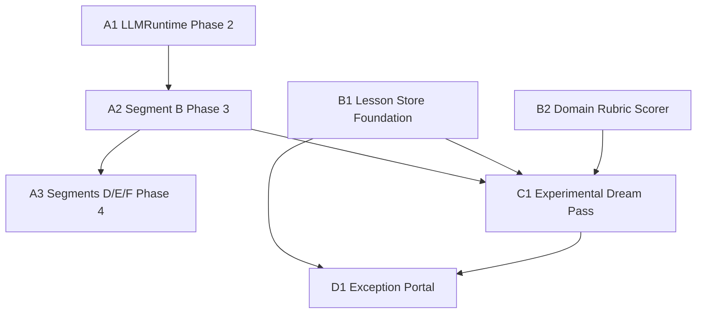

# Dream-Pass — Plan Overview & Pickup Order

> **For agentic workers:** This file is an **index**, not a task list. Read it first to know which plan file to open next. Each linked plan is self-contained and follows the `superpowers:writing-plans` checkbox format — execute them with `superpowers:subagent-driven-development` (recommended) or `superpowers:executing-plans`.

**Scope:** The end-to-end "experimental dream-pass" loop — agents that learn from real runs, propose lessons, A/B-test them against synthetic personas via a real LLM, and auto-promote winners under AGT policy. Plus the substrate work that makes the hiring workflow LLM-driven enough for the dream pass to have anything interesting to optimise.

**Specs (the "what & why"):**
- [2026-05-19-substrate-agentic-segments-design.md](../specs/2026-05-19-substrate-agentic-segments-design.md) — why hiring moves from per-phase MAF graphs to per-segment agentic loops, and what the `LLMRuntime` protocol looks like.
- (Dream-pass design is folded into the plan headers; no separate spec.)

---

## Pickup order

Two parallel tracks land before the dream-pass loop itself. Track A (substrate) makes the hiring workflow LLM-driven; Track B (memory + scoring) is the foundation the dream pass reads from and writes to. Both feed into Track C (the loop) and Track D (the exception portal).

```
Track A: Substrate (hiring → LLM-driven)
  A1. substrate-agentic-segments-phase-2-llmruntime
  A2. substrate-agentic-segments-phase-3-segment-b      (depends: A1)
  A3. substrate-agentic-segments-phase-4-segments-def   (depends: A2)

Track B: Dream-pass substrate (memory + scoring)
  B1. lesson-store-foundation
  B2. domain-rubric-scorer                              (independent of B1)

Track C: The loop
  C1. experimental-dream-pass                           (depends: A2, B1, B2)

Track D: Exception surface
  D1. dream-pass-exception-portal                       (depends: B1, C1)
```

**Recommended single-CLI order** (one ready-to-merge slice at a time):

1. [2026-05-19-substrate-agentic-segments-phase-2-llmruntime.md](2026-05-19-substrate-agentic-segments-phase-2-llmruntime.md) — `LLMRuntime` Protocol + `GHCPRuntime` + `FakeRuntime`. No behaviour change at default env. Unblocks every later plan that needs deterministic LLM tests.
2. [2026-05-19-substrate-agentic-segments-phase-3-segment-b.md](2026-05-19-substrate-agentic-segments-phase-3-segment-b.md) — Hiring Segment B: one `CopilotSession` for the four non-HITL phases between Budget and Voice. First real per-segment agentic loop. Behind `HIRING_SEGMENT_MODE`.
3. [2026-05-19-lesson-store-foundation.md](2026-05-19-lesson-store-foundation.md) — `LessonStore` + `WorkingMemoryStore` (both Mem0-backed, both AGT-gated), Kuzu provenance for lessons. Can run in parallel with step 4.
4. [2026-05-19-domain-rubric-scorer.md](2026-05-19-domain-rubric-scorer.md) — `RunScorer` + `data/rubrics/hiring.yaml`. Pure read, no AGT. Independent of step 3.
5. [2026-05-19-substrate-agentic-segments-phase-4-segments-def.md](2026-05-19-substrate-agentic-segments-phase-4-segments-def.md) — Roll the Segment B pattern out to Segments D, E, F. Not strictly required by the dream-pass loop, but every additional LLM-driven segment is more material for the dream pass to chew on.
6. [2026-05-19-experimental-dream-pass.md](2026-05-19-experimental-dream-pass.md) — `DreamPassOrchestrator`: proposer → A/B sandbox → scorer → policy → governor. Requires steps 1–4. Steps 2 and 5 give it real workload to optimise; minimum viable demo only strictly needs step 2.
7. [2026-05-19-dream-pass-exception-portal.md](2026-05-19-dream-pass-exception-portal.md) — Backend route + React page for the `status='candidate'` lessons that the policy flagged. Last because it exists only to handle the slice the autonomous loop refuses to auto-promote.

---

## Dependency graph



---

## What "done" looks like, per plan

| # | Plan | Done = |
|---|------|--------|
| 1 | A1 LLMRuntime | `LLM_RUNTIME=fake` makes every agent test deterministic; default unset preserves GHCP behaviour. |
| 2 | A2 Segment B | `HIRING_SEGMENT_MODE=b` runs the four phases as one segment; `replay_hiring_compare.py` shows the A/B against the per-phase baseline. |
| 3 | B1 Lesson Store | `scripts/lessons_smoke.py` writes → searches → prunes a lesson; every step lands an AGT-signed ledger entry; lesson body in Mem0, provenance in Kuzu. |
| 4 | B2 Rubric Scorer | `scripts/score_run.py --workflow-id WF-x --rubric hiring` prints a `RunScore` with per-check breakdown. |
| 5 | A3 Segments D/E/F | `HIRING_SEGMENT_MODE=b,d,e,f` runs the whole hiring workflow with HITL only at Budget and Voice; F is retry-guarded. |
| 6 | C1 Dream Pass | `scripts/dream_pass.py --domain hiring` runs one pass, prints proposed/rejected/promoted/flagged counts, and every promotion has an `Experiment` node in Kuzu linked to its `Lesson`. |
| 7 | D1 Exception Portal | `/dream-pass-exceptions` lists flagged candidates with their experiment evidence; approve/reject are AGT-gated and ledger'd. |

---

## Conventions

- The numbered list above is the **default pickup order**. Skipping a step is fine only if the "Depends on" header of the target plan is already satisfied by what's merged on `main`.
- Each plan begins with its own dependency note. Trust that note over this overview if they ever disagree — overview drift is a known failure mode.
- All plan files follow the `superpowers:writing-plans` skill: TDD checkbox steps, real code in every step, exact commands, no placeholders.
- Plans are listed under [README.md](README.md) too; this overview adds the **ordering** the README intentionally doesn't prescribe.
