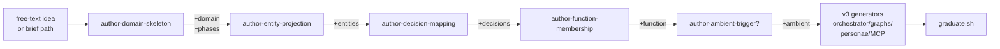

# compose-domain

You are the orchestrator for a five-step procedure that turns a domain brief
into a complete sandboxed Durable-fidelity domain. You do not improvise. You
follow this skill literally. When you are uncertain, you stop and ask the
operator — you do not invent.

> **Forbidden.** This skill, and any sub-skill it invokes, **MUST NOT**
> write to any path outside `tools/scratch/compose-domain/<run-id>/` and
> `docs/superpowers/specs/`. In particular: never edit
> `api/server/`, `api/functions/`, `function_app.py`,
> `api/server/services/blueprint_inventory.py`,
> `api/server/services/simulator_orchestrator.py`, or any other live tree.
> Graduation is a separate, manual step.

## Inputs

You are invoked one of two ways:

1. **With a brief path.** "Run compose-domain against
   `docs/superpowers/specs/<domain>-brief.yaml`." Skip step 1.
2. **With a free-text idea.** "Compose a new domain for X." Run step 1 to
   produce the brief, then continue.

## How v4 works (sequential enrichment pipeline)

v4 reshapes the meta-skill into a **sequential enrichment pipeline**:
a shared YAML brief grows through five new authoring sub-skills, each
adding one new top-level section, validating, and handing off to the
next. The four existing v3 generators run last, unchanged, and are
joined by two new codegens for entity-projections and decision Cypher.



The five enrichment sub-skills live under
`docs/superpowers/skills/compose-domain/sub-skills/<name>/` and each
package contains:

* `SKILL.md` — the prompt the sub-skill is invoked with
* `validator.py` — pure function `validate(brief, ...) -> None` raising
  `SchemaError(path, reason)` on failure
* `codegen.py` (when applicable) — pure function returning the
  rendered file body / append block

The brief schema is authoritative at
`docs/superpowers/skills/compose-domain/brief.schema.yaml`. The
sandbox layout is documented at
`docs/superpowers/skills/compose-domain/SANDBOX.md`.

## The five steps

### Step 1 — Brief intake (only if no YAML brief was supplied)

Hand off to the existing `brainstorming` skill. It will elicit the brief
through one-question-at-a-time dialogue with the operator. When it returns
the design, transcribe it into the YAML schema below and write it to
`docs/superpowers/specs/<domain.name>-brief.yaml`. Read it back to the
operator. Wait for explicit approval. Then continue to step 2.

If the operator gives you a YAML brief path on entry, skip this step.

#### Brief schema (authoritative pointer)

The authoritative schema lives at
[`docs/superpowers/skills/compose-domain/brief.schema.yaml`](brief.schema.yaml)
(JSON-Schema 2020-12). The brief is **one YAML file** that grows
through five conceptual passes (v0..v5):

```
v0  (skeleton)                  : domain + phases [+ personae + external_systems for v3 back-compat]
v1  (entity-projection)         : + entities[]
v2  (decision-mapping)          : + decisions[]
v3  (function-membership)       : + function
v4  (ambient-trigger, optional) : + ambient
v5  (sealed)                    : ready for codegen + graduate.sh
```

Top-level shape (see `brief.schema.yaml` for the full grammar and
the `fleet-purchase-card-brief.yaml` example for a fully-populated
v4 brief):

```yaml
domain:
  workflow_type: <kebab-case, ^[a-z][a-z0-9-]*$ — must NOT collide with api.shared.domains.DOMAINS>
  prefix: <snake_case file-name prefix, almost always "fleet">
  display_name: <human label>
  description: |
    One paragraph at the level a senior engineer would write on a whiteboard.
  # Optional v3 back-compat keys: name, owner_role.

phases:
  - name: <snake_case>
    kind: deterministic | agent | hitl | sub_orchestrator
    intent: <one sentence>
    external_systems: [<id>, ...]    # optional; ids from the top-level external_systems list
    # only when kind == agent:
    agent_skill_name: <kebab-case>
    # only when kind == hitl:
    persona: <role from personae below>
    external_event: <snake_case>     # convention: <phase_name>_decision
    # only when kind == sub_orchestrator (Phase 4 IP4 / TASK-019):
    target_workflow_type: <kebab-case; must already exist in DOMAINS>
    target_orchestrator: <PascalCase override; defaults to <Prefix><WorkflowType>Orchestrator>
    payload_from: <Cypher template OR python:<dict-builder expr>>
    parallel_group: <snake_case; sub_orch phases sharing this label fan out via task_all>

# v3 back-compat blocks (still tolerated):
personae:
  - role: <snake_case>
    decision_policy: |
      One paragraph stating the rule the persona uses to decide.
    decision_code: |
      # Sandboxed Python the persona_responder compiles. Reads `context`,
      # assigns `decision` ∈ {approve, reject, escalate} and `reason`.
      # See api/server/services/persona_responder.py:_DECISION_BUILTINS for
      # the allowed builtins. No `import`, `open`, `os`, `subprocess`,
      # `eval`, `__import__`.
      pass
    workflow_label: <human label>   # OPTIONAL; defaults to domain.display_name
external_systems:
  - id: <snake_case>
    mcp_tool: <snake_case Python module name, no .py>
    operations: [<snake_case function name>, ...]

# v4 enrichment blocks:
entities:
  - kind: <member of api.server.services.entity_graph._VALID_KINDS>
    ref_field: payload.<dotted_path>
    source: <free-form sub-kind label>
    attributes: { <kuzu_col>: payload.<dotted_path>, ... }
    relations:
      - kind: <member of _VALID_RELS>
        target_ref: <another entity's ref_field OR an entity_id literal>

decisions:
  - phase: <name of a hitl phase>
    persona: <role from personae>
    source_event: workflow.hitl.requested
    decided_on_entities: [payload.<dotted_path>, ...]
    attributes_from_context: { <key>: payload.<dotted_path>, ... }

function: finance | hr | revenue | ops | legal | marketing | tech | data | customer-success | legacy

ambient:                              # OPTIONAL
  name: <PascalCase>
  function: <same as top-level function>
  reasoning_skill: <kebab-case OR null>
  spawnable_workflow_types: [<workflow_type>, ...]
  triggers:
    - kind: bus|cypher|cadence
      # bus:     event_type, filter
      # cypher:  pattern, sweep_seconds
      # cadence: cron
```

Validate the brief before you continue:

- `domain.workflow_type` matches `^[a-z][a-z0-9-]*$` and is **not** already in `api.shared.domains.DOMAINS` (grep `api/shared/domains.py`).
- `domain.prefix` matches `^[a-z][a-z0-9_]*$`.
- Every phase referenced under `external_systems` exists in the top-level `external_systems` list.
- Every persona referenced in a HITL phase exists in `personae` (or already as a folder under `api/server/personae/`).
- Every persona has a `decision_code` block.
- At least one phase has `kind: agent`.
- At least one phase has `kind: hitl`.
- `function:` is one of the 10 canonical keys above.
- Every entity `kind` is in `_VALID_KINDS`; every relation `kind` is in `_VALID_RELS`.
- If `ambient:` is present, `ambient.function == function` and every `spawnable_workflow_types[]` is either in `DOMAINS` or equals the brief's own `workflow_type`.

If validation fails, stop and tell the operator what's wrong. Do not
proceed to step 2.

### Step 2 — Plan

From the brief, produce the artefact list. **Print this list back to the
operator before you write a single file.** Wait for "go".

> **v4 path placeholders.** Older copies of this SKILL used `<domain.name>`
> as a single placeholder. Under v4 the brief splits the kebab identifier
> from the file-name prefix, so the conventions below use:
>
> - `<wt>`        = `domain.workflow_type` (kebab-case, e.g. `purchase-card`)
> - `<wt_snake>`  = `wt.replace("-", "_")`  (e.g. `purchase_card`)
> - `<prefix>`    = `domain.prefix`          (snake_case, almost always `fleet`)
>
> Where v3 said `<domain.name>` (e.g. `fleet-travel-preapproval`),
> read it as `<prefix>-<wt>` for skills/folders and
> `<prefix>_<wt_snake>` for orchestrator/activities/graph file names.
> The 12 backfill briefs and `fleet-purchase-card-brief.yaml` are the
> canonical worked examples.

For each phase:
- `kind: deterministic` → 1 MAF graph file with a single deterministic
  executor. No agent skill. May still have a validator.
- `kind: agent` → 1 MAF graph file with `agent → validator → terminal`.
  1 runtime SKILL.md at `api/server/skills/<wt>-<agent_skill_name>/`.
  1 agent executor at `api/functions/graphs/executors/agents/agent_<prefix>_<wt_snake>_<phase>.py`.
  1 validator at `api/functions/graphs/executors/validators/validate_<prefix>_<wt_snake>_<phase>_schema.py`.
- `kind: hitl` → no graph (the orchestrator does the wait directly).
  1 persona SKILL.md at `api/server/personae/<role>/SKILL.md` (only if
  the role doesn't already exist under `api/server/personae/`).

For each `external_systems[]` entry whose `mcp_tool` does not already
exist in `api/server/mcp_tools/` (check this against the live filesystem):
- 1 MCP tool stub at `api/server/mcp_tools/<mcp_tool>.py`.

Always:
- 1 orchestrator at `api/functions/workflows/<prefix>_<wt_snake>.py`.
- 1 activities module at `api/functions/workflows/<prefix>_<wt_snake>_activities.py`.
- 1 entity projection at `api/server/services/entity_projections/<wt_snake>.py` (v4).
- 1 Cypher precedent file per HITL phase at
  `api/server/services/precedent_queries/<wt>_<phase>.cypher` (v4).
- 1 ambient-agent block appended to
  `api/server/services/ambient_agents/<function>.py` if the brief
  carries an `ambient:` block (v4).
- 1 `GRADUATION.md` at the sandbox root — human-readable description of
  what the graduation script will do.
- 1 `graduate.sh` at the sandbox root — the **executable** graduation
  script. Mechanically copies files + edits the live trees described in
  step 4.7.

### Conventions (codified for determinism)

These were free choices in earlier drafts; codifying them removes
improvisation from the procedure.

- **`workflow_type` stamping.** Every `checkpoint_activity_trigger`
  payload carries `workflow_type: workflow_type` (the variable read
  once at the top of the orchestrator from `input_dict.get("type")`).
  Without this, recordings are filename `unknown-...` and FleetEvents
  arrive with `domain: null`. (Substrate-fix v2 contract.)
- **HITL `persona`/`external_event`/`context`.** Every `kind: "suspended"`
  payload stamps the persona-responder contract:
  - `persona`: brief.phases[].persona
  - `external_event`: brief.phases[].external_event (or default
    `<phase_name>_decision`)
  - `context`: a dict whose keys are brief.phases[].context_keys (or
    default just the previous phase's name), each pulling from
    `enriched.get(<key>)`.
  Without this, the persona responder ignores the gate and the
  workflow stalls forever.
- **HITL external event name.** For every phase whose `kind: hitl`, the
  orchestrator's `wait_for_external_event(...)` name and the persona
  SKILL.md's `external_event` frontmatter MUST match byte-for-byte.
- **Activity-trigger names.** `<domain.name with - replaced by _>_<phase_name>_activity_trigger`.
  E.g. `fleet_travel_preapproval_employee_lookup_activity_trigger`.
- **Graph builder names.** `build_<domain.name with - replaced by _>_<phase_name>_workflow`.
- **Agent skill folder name.** `<domain.name>-<agent_skill_name>`. E.g.
  `fleet-travel-preapproval-policy-fit-checker`.
- **Tool registration name.** From the brief's `external_systems[].mcp_tool` and
  each `operations[].name`: `<mcp_tool>_<operation>`. E.g.
  `concur_travel_policy_get_policy`. The agent skill's `allowed-tools`
  CSV uses these names verbatim.
- **Validator file name.** `validate_<domain.name with - replaced by _>_<phase_name>_schema.py`.
  E.g. `validate_fleet_employee_onboarding_access_drafter_schema.py`.
  The full domain prefix is **required** — without it, two domains with
  same-named agent phases (e.g. multiple "drafter" phases) will collide
  in `api/functions/graphs/executors/validators/`.
- **Validator class / executor name.** `validate_<domain.name with - replaced by _>_<phase_name>` (the file's name minus `_schema.py`). Same prefix-required reason.
- **Run id.** `<YYYYMMDD-HHMMSS>-<domain.name>` from current UTC time.
  Compute once at the top of step 4; use the literal value everywhere
  downstream.

### Step 3 — Inventory and isomorphism

Before invoking any sub-skill, read **exactly these 9 files** end-to-end
in this session. They are the canonical examples sub-skills mirror. Do
not read more (you don't need them) and do not read fewer (you'll
improvise the parts you didn't load). Drift in any of these files means
downstream sub-skills will generate stale-shaped code — stop and update
this SKILL.

| # | Canonical example | Used by sub-skill |
|---|---|---|
| 1 | `api/server/skills/receipt-validator/SKILL.md` | `author-runtime-skill` (phase_agent mode) |
| 2 | `api/server/personae/line_manager/SKILL.md` | `author-persona` (NEW v3) |
| 3 | `api/server/services/persona_responder.py` | `author-persona` (decision_code shape + sandbox builtins) |
| 4 | `api/server/mcp_tools/claim_lookup.py` | `author-mcp-tool` |
| 5 | `api/functions/workflows/expense_claim.py` | `author-durable-domain` (orchestrator + HITL contract; v2-stamped) |
| 6 | `api/functions/workflows/activities.py` | `author-durable-domain` (activities module — reuses `_run_workflow` from here) |
| 7 | `api/functions/graphs/classify.py` | `author-durable-domain` (per-phase agent graph) |
| 8 | `api/functions/graphs/executors/agents/agent_rag_classifier.py` | `author-durable-domain` (agent executor) |
| 9 | `api/functions/graphs/executors/validators/validate_classification_schema_node.py` | `author-durable-domain` (validator) |

**For deterministic phases**, also note: `api/functions/graphs/_tracked_executor.py`
for the `TrackedExecutor` constructor signature (used directly with
`executor_type="deterministic"` and an inline `_<phase>_execute` async
fn — there is no canonical deterministic-graph example to mirror, so
follow the v1 graduated example at `api/functions/graphs/fleet_travel_preapproval_employee_lookup.py`).

**For the substrate-fix contract** (workflow_type stamping +
persona/external_event/context on suspended payloads), the live
`expense_claim.py` and `hiring.py` are the canonical implementation;
the new orchestrator MUST mirror their stamping shape exactly. The
generated `fleet_travel_preapproval.py` is also a worked example.

### Step 4 — Generate into sandbox

Compute `RUN_ID = <YYYYMMDD-HHMMSS>-<domain.name>` from the current UTC
time (one shell call: `date -u +"%Y%m%d-%H%M%S"`). Create
`tools/scratch/compose-domain/<RUN_ID>/` with the layout from the spec
doc §6.

For each artefact in the plan, invoke the matching sub-skill exactly
once, passing the **structured arguments** below. Do not pass the brief
as a whole — pass only the relevant slice. This is the boundary that
keeps sub-skills deterministic.

#### When invoking `author-runtime-skill` (phase_agent only)

v3 note: persona authoring is now `author-persona`, not
`author-runtime-skill`. `author-runtime-skill` only writes phase-agent
SKILL.md files now.

```
mode: phase_agent
output_path: <RUN_ROOT>/api/server/skills/<domain.name>-<phase.agent_skill_name>/SKILL.md
brief: <the phase entry from brief.phases[]>
canonical_example_path: api/server/skills/receipt-validator/SKILL.md
available_mcp_tools:
  - { name: "<mcp_tool>_<operation>", description: "<from the tool's @define_tool description>" }
  - ... (one per (mcp_tool, operation) pair the phase's external_systems[] resolves to)
```

#### When invoking `author-persona` (NEW v3)

```
output_path: <RUN_ROOT>/api/server/personae/<role>/SKILL.md
brief: <the persona entry from brief.personae[]>
domain_display_name: <brief.domain.display_name>
default_external_event: <hitl_phase_name>_decision   # convention
canonical_example_path: api/server/personae/line_manager/SKILL.md
responder_path: api/server/services/persona_responder.py  # for builtins reference
```

#### When invoking `author-mcp-tool`

```
output_path: <RUN_ROOT>/api/server/mcp_tools/<external_systems[].mcp_tool>.py
tool_brief: <the external_systems[] entry>
canonical_example_path: api/server/mcp_tools/claim_lookup.py
```

#### When invoking `author-durable-domain`

```
output_root: <RUN_ROOT>
brief: <the entire brief>
canonical_paths:
  orchestrator: api/functions/workflows/expense_claim.py
  activities: api/functions/workflows/activities.py
  agent_graph: api/functions/graphs/classify.py
  deterministic_graph: api/functions/graphs/fleet_travel_preapproval_employee_lookup.py  # v1 graduated
  agent_executor: api/functions/graphs/executors/agents/agent_rag_classifier.py
  validator: api/functions/graphs/executors/validators/validate_classification_schema_node.py
  tracked_executor: api/functions/graphs/_tracked_executor.py
```

Each sub-skill writes its files to the sandbox path under the mirrored
real-tree layout. **No sub-skill writes to a real path.** When a
sub-skill returns, you continue with the next.

After all sub-skills have run, two more files remain for `compose-domain`
itself to write:

- `<RUN_ROOT>/GRADUATION.md` — human-readable description of what
  graduate.sh does. Use the template at
  `docs/superpowers/skills/compose-domain/templates/GRADUATION.md.tmpl`.
  This file is reference, not action.
- `<RUN_ROOT>/graduate.sh` — the **executable** script that mechanically
  performs all the live-tree edits. Use the template at
  `docs/superpowers/skills/compose-domain/templates/graduate.sh.tmpl`.
  `author-durable-domain` returns the structured fragments (orchestrator-
  import block, activity-trigger block, ramp-loop spawner entry,
  inventory DOMAIN entry, etc.) for you to splice into the template.
  Mark the file executable (`chmod +x`).

  The graduate.sh script must:
  1. Validate prereqs (live tree is a clean checkout of repo root).
  2. Copy sandbox files to their real-tree paths.
  3. Patch `function_app.py` (imports + orchestrator decorator + activity
     decorators).
  4. Patch `api/functions/graphs/__init__.py` (build_* exports).
  5. Patch `api/server/services/simulator_orchestrator.py` (spawn helper
     + add to `ramp_loop`'s `spawners` dict).
  6. Patch `api/server/routes/simulator.py` (POST /api/simulator/<x> route).
  7. Patch `api/server/services/blueprint_inventory.py` (DOMAINS entry
     with workflow_type + phase_aliases).
  8. Patch `api/shared/constants.py` (lift `<PHASE>_TIMEOUT` constants).
  9. Print smoke commands + expected event sequence.

  Each patch step is idempotent: if the same domain has already been
  graduated (entry/import already present), the step is a no-op.

  **Note v3:** generated domains DO NOT add a `Workflow` record to
  `app_state.store` (the existing `Workflow` / `ClaimData` / `HiringData`
  types are domain-specific). The spawn helper omits the
  `app_state.store.upsert_workflow(w)` call that `spawn_hiring_workflow`
  uses. State lives in Durable + the FleetEvent stream + the bus's
  `_workflow_types` cache.

### Step 5 — Self-check

Run the checklist at `compose-domain/CHECKLIST.md` against the sandbox.
Produce a one-page report at `<run-id>/REPORT.md` with one row per
checklist item (PASS / FAIL / N/A). Print the same report inline to the
operator.

If any item FAILs, **do not** silently fix it. Tell the operator and stop.
The right move when something fails is almost always to fix the SKILL.md
that produced it, then delete the sandbox and re-run.

If everything passes, end with:

> Sandbox at `tools/scratch/compose-domain/<RUN_ID>/`. CHECKLIST passed.
> Graduate by running `bash <RUN_ID>/graduate.sh` from repo root.
> Then proceed to Step 7 (recorder verification).

Do not graduate. Do not start the demo stack. Do not run any tests against
the real trees. The skill ends here — the operator runs graduate.sh.

### Step 6 — Determinism check (operator-invoked, optional)

The operator may, after a clean self-check, re-invoke this skill against
the same brief and run the determinism check at
`compose-domain/CHECKLIST.md` §6.1. The two sandboxes must `diff -r` to
nothing meaningful. Divergence points are exactly the parts of these
SKILLs that gave the author freedom — the fix is to codify that part
here or in the matching sub-skill, then re-run.

The HITL event-name convention, the activity-trigger naming convention,
the structured sub-skill input contracts in step 4 above, and the v3
workflow_type / persona-contract stamping rules are the specific fixes
that emerged from the v1 → v2 → v3 iteration of this SKILL. Future
iterations follow the same loop: improvise once, codify, re-run, diff.

### Step 7 — Recorder verification (post-graduation, NEW v3)

After the operator runs `graduate.sh` and confirms the smoke output is
green, prompt them to record real walks for the new domain so the
deployed page replays them. Print these commands verbatim:

```bash
# 1. Boot the autonomous stack so the new domain spawns automatically.
#    Functions host + azurite already running.
./scripts/profile-autonomous.sh &
sleep 30

# 2. Start the recorder.
curl -X POST http://localhost:3101/api/blueprint/_recorder/start

# 3. Let it run ~5 minutes so each domain completes ≥3 walks.
sleep 300

# 4. Stop the recorder; flush.
curl -X POST http://localhost:3101/api/blueprint/_recorder/stop

# 5. Inspect; prune any partial / single-event noise files; commit.
ls -la data/blueprint-recordings/<domain.name>-*.jsonl
find data/blueprint-recordings -name '*.jsonl' -size -200c -delete
git add data/blueprint-recordings/<domain.name>-*.jsonl
git commit -m "record(blueprint): real walks for <domain.display_name>"

# 6. Redeploy the container app so the deployed page picks up the
#    new recordings.
./scripts/deploy-blueprint.sh
```

With this step, the new domain becomes visible on the deployed page
within minutes of graduation. No synthetic templates needed.

## How to author a new domain brief (v4 worked example)

The 13 briefs at `docs/superpowers/specs/*-brief.yaml` are the
authoritative spec for every generated domain. To author a new one:

1. **Pick a workflow_type** — kebab-case, lowercase, e.g.
   `purchase-card`. This name is stamped on every payload, every
   FleetEvent, and every Cypher file the codegens emit.
2. **Copy the worked example.** The freshest brief —
   `docs/superpowers/specs/fleet-purchase-card-brief.yaml` — was
   authored top-down without a hand-written projection module. It
   exercises every section the v4 schema cares about (domain,
   phases, entities, decisions, function, ambient) at the smallest
   plausible size. Use it as the template.
3. **Fill in the entity/decision shape.** Each `entities[]` entry
   declares one node the projection will write per workflow; each
   `decisions[]` entry declares one Decision node per HITL gate. The
   codegens at `sub-skills/author-entity-projection/codegen.py` and
   `sub-skills/author-decision-mapping/codegen.py` consume these.
4. **Validate.** Run the brief through
   `_shared.brief_validator.validate_brief(...)` (the smoke test at
   `tests/docs/superpowers/skills/compose_domain/test_fleet_purchase_card_smoke.py`
   shows the import path). The validator surfaces schema errors with
   stable `path` field for assertions.
5. **Hand off to graduate.** The compose-domain orchestrator above
   handles the rest — the brief is the only operator-authored file.

The 12 backfill briefs (everything matching `docs/superpowers/specs/*-brief.yaml`
that is NOT `fleet-purchase-card`) document the entity/decision shape
of the corresponding hand-written Phase 1 projection module at
`api/server/services/entity_projections/<wt_snake>.py`. The
hand-written modules carry domain-specific helper logic (period
derivation, conditional asset emission, JSON-blob attribute
serialisation, risk-band heuristics) that no schema-driven codegen
can synthesise from a brief alone — the briefs are documentation of
intent, not a regenerable source for those modules.

## Anti-patterns (things you must not do)

- Inventing fields not present in the brief.
- Inventing the HITL external event name. Convention is
  `<phase_name>_decision`. The orchestrator's
  `wait_for_external_event(...)` and the persona SKILL.md both write
  this exact string.
- Inventing tool names in an agent skill's `allowed-tools`. The
  `author-runtime-skill` step 4 list is authoritative — if a tool you
  want isn't there, it's the caller's bug, not yours. Stop.
- Copying a runtime SKILL.md verbatim from `api/server/skills/` and just
  renaming things — the result must be an *authored* skill, not a
  rebadged one.
- Skipping the validator on agent phases ("it's a stub, the validator is
  trivial"). Validators are the bounded-probabilism edge; the harness
  expects them.
- Writing the orchestrator before reading the 8 canonical examples in
  step 3 once in this session.
- Editing `function_app.py` "just to make the smoke test work". That's
  graduation. It happens by hand. By an engineer. After this skill ends.
- Graduating "while you're at it" because the sandbox looks fine. Stop.
- Pretending you finished when you didn't. If you got blocked, say so. If
  you skipped a step, say so. If a sub-skill returned something the
  CHECKLIST won't pass, say so.

## Operator-facing prompts

When you ask the operator a question, you are explicit about what you
need:

- "Brief at `docs/superpowers/specs/<x>-brief.yaml` validates. Plan
  follows. Confirm before I generate."
- "Step 3 noted that `api/functions/graphs/classify.py` has changed shape
  since this skill was last revised. Stopping. Please update
  `compose-domain/SKILL.md` step 3 with the new canonical paths and
  re-invoke."
- "CHECKLIST item §3.4 FAIL: agent skill `<x>` references MCP tool `<y>`
  in `allowed-tools` but no such tool exists in the sandbox or
  `api/server/mcp_tools/`. The bug is probably in
  `author-runtime-skill/SKILL.md` step 4 (allow-list resolution).
  Stopping."
