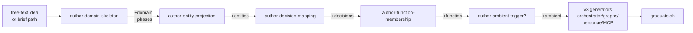

# compose-domain

## Authority

This skill implements the code-first
[Vertical Build Contract](../../contracts/VERTICAL-BUILD-CONTRACT.md).
The brief and generators own repeatable workflow scaffolding; they do not
replace bespoke pack code when a novel capability does not fit the current
artifact plan.

You are the orchestrator for a five-step procedure that turns a domain brief
into a complete sandboxed Durable-fidelity domain. You do not improvise. You
follow this skill literally. When you are uncertain, you stop and ask the
operator — you do not invent.

> **Forbidden.** This skill, and any sub-skill it invokes, **MUST NOT**
> write to any path outside `tools/scratch/compose-domain/<run-id>/` and
> `docs/superpowers/specs/`. In particular: never edit
> `api/server/`, `api/functions/`, `function_app.py`,
> `api/server/services/blueprint_inventory.py`,
> `api/server/services/simulator_orchestrator.py`, or any other live tree.
> Graduation is a separate, manual step.

## Inputs

You are invoked one of two ways:

1. **With a brief path.** "Run compose-domain against
   `docs/superpowers/specs/<domain>-brief.yaml`." Skip step 1.
2. **With a free-text idea.** "Compose a new domain for X." Run step 1 to
   produce the brief, then continue.

### Vertical target

Every run targets one vertical: explicit `vertical=<name>`, otherwise the
active `ZAVA_VERTICAL`, otherwise `agency`. Sandbox paths retain their legacy
shape for generator compatibility, but graduation maps business assets to:

```text
verticals/<vertical>/skills/
verticals/<vertical>/personae/
verticals/<vertical>/mcp_tools/
verticals/<vertical>/entity_projections/
verticals/<vertical>/domains.py
verticals/<vertical>/functions.py
```

Workflow implementation modules may remain under `api/functions/`; only the
selected pack's Durable module registers them. Never graduate a Telco asset
into an Agency-owned legacy root.

## Fast-path read budget (NEW — 2026-05-21)

**Goal: start emitting files within 3 minutes, not 7.** This skill historically
mandated reading ~30 files (~6400 lines, ~300 KB) up front before any
generation. That ate 5–7 minutes of every run. The new policy is **read on
demand**:

1. **Read upfront (must) — ~700 lines total:**
   - this SKILL.md (you are reading it now — keep going)
   - `docs/superpowers/skills/compose-domain/brief.schema.yaml` (232 lines)
   - `docs/superpowers/skills/compose-domain/CHECKLIST.md`
   - the input brief itself
2. **Read just-in-time (read only when about to invoke that sub-skill):**
   - each sub-skill `SKILL.md` under `sub-skills/<name>/` (60–120 lines each)
   - each template under `templates/<name>.tmpl` (15–100 lines each)
3. **Read on demand (only when you need to verify a byte-shape):**
   - the 9 canonical examples in [Step 3](#step-3--inventory-and-isomorphism). Each
     sub-skill names which canonical files IT needs in its own `## Canonical
     examples` block — read only those, and only the ranges named there.
     **Do not read all 9 upfront.** Use the [Shape cheat-sheet](#shape-cheat-sheet)
     below for the most common cases; canonical reads are the fallback when the
     cheat-sheet doesn't cover your case.
4. **Always batch reads in a single tool-call response when reading multiple
   files.** view tool calls are parallel-safe. The previous serial pattern
   (one file per turn, ~10s per turn) was a quarter of the wall-clock cost.

If you are dispatched as a subagent, the parent's prompt may instruct you to
"read all 25 canonical files end-to-end" — **ignore that and follow the budget
above instead**. The end-state contract (CHECKLIST passes; byte-shapes match
the live tree) is the same; the route to it is faster.

## Shape cheat-sheet

For the common cases the codegen has to produce, here are the byte-shapes
you need so you do **not** need to re-read the canonical examples every run:

### Orchestrator (sync generator)
```python
def fleet_<wt_snake>_orchestration(
    context: df.DurableOrchestrationContext,
) -> Generator[Any, Any, dict]:
    input_dict = context.get_input() or {}
    workflow_type = input_dict.get("type")
    workflow_id   = input_dict.get("workflow_id")
    # ... per-phase yield context.call_activity(<phase>_activity, payload)
    # ... for HITL: yield context.wait_for_external_event(<external_event>)
```
- Every `checkpoint_activity_trigger` payload MUST carry
  `workflow_type=workflow_type` (substrate-fix v2 contract).
- Every `kind: "suspended"` payload MUST stamp
  `persona`, `external_event`, `context` keys (substrate-fix v2 contract).
- Per-phase timeouts: declare locally as
  `<PHASE>_TIMEOUT = timedelta(hours=...)`.

### Spawn helper (in the pack's `spawners.py`)
The generated block appended by graduate.sh step 5:
```python
async def spawn_<wt_snake>_workflow(...) -> str:
    global _<seq>_seq; _<seq>_seq += 1
    wid = f"<PREFIX>-{_<seq>_seq:04d}"
    record = _pick_record("<wt>", scenario=scenario) or {}
    payload = {"workflow_id": wid, "type": "<wt>", "<entity>": record.get("<entity>")}
    try:
        result = await schedule_new_orchestration(payload, function_name="Fleet<Wt>Orchestrator")
    except Exception as ex:
        print(f"[orchestrator] failed to schedule {wid}: {ex}")
    return wid
```
This block is written inside the selected pack's `spawners.py`, not into any
global service module.

### HITL `external_event` byte-match
Whenever a HITL phase reuses an existing persona under `api/server/personae/<role>/`,
the brief's `external_event` MUST byte-match the persona's SKILL.md frontmatter
`external_event:` line. Grep it once, copy it verbatim. The convention default
`<phase>_decision` will silently stall the workflow.

### Ambient agent block
Module-level constant (NOT `ambient_registry.append`):
```python
<Name>Watcher = AmbientAgent(
    name="<kebab-case>-watcher",
    function="<function>",
    triggers=(BusTrigger(event_type="<event>"),),
    reasoning_skill=None,
    spawnable_workflow_types=("<wt>",),
)
```

### Persona decision_code sandbox builtins
The persona responder's sandbox does NOT include `import`, `open`, `os`,
`subprocess`, `eval`, `__import__`, or `sorted()`. Use `list.sort()` (in-place,
returns None — assign separately). Read `(context or {}).get("<phase>")` to
pull prior-phase outputs.

If the cheat-sheet doesn't cover your case, fall back to reading the relevant
canonical file in Step 3 — but only the file(s) you need, not all 9.

## Current sequential enrichment pipeline

v4 reshapes the meta-skill into a **sequential enrichment pipeline**:
a shared YAML brief grows through five new authoring sub-skills, each
adding one new top-level section, validating, and handing off to the
next. The four existing v3 generators run last, unchanged, and are
joined by two new codegens for entity-projections and decision Cypher.



The five enrichment sub-skills live under
`docs/superpowers/skills/compose-domain/sub-skills/<name>/` and each
package contains:

* `SKILL.md` — the prompt the sub-skill is invoked with
* `validator.py` — pure function `validate(brief, ...) -> None` raising
  `SchemaError(path, reason)` on failure
* `codegen.py` (when applicable) — pure function returning the
  rendered file body / append block

The brief schema is authoritative at
`docs/superpowers/skills/compose-domain/brief.schema.yaml`. The
sandbox layout is documented at
`docs/superpowers/skills/compose-domain/SANDBOX.md`.

## The seven-step procedure

### Step 1 — Brief intake (only if no YAML brief was supplied)

Hand off to the existing `brainstorming` skill. It will elicit the brief
through one-question-at-a-time dialogue with the operator. When it returns
the design, transcribe it into the YAML schema below and write it to
`docs/superpowers/specs/<domain.name>-brief.yaml`. Read it back to the
operator. Wait for explicit approval. Then continue to step 2.

If the operator gives you a YAML brief path on entry, skip this step.

#### Brief schema (authoritative pointer)

The authoritative schema lives at
[`docs/superpowers/skills/compose-domain/brief.schema.yaml`](brief.schema.yaml)
(JSON-Schema 2020-12). The brief is **one YAML file** that grows
through five conceptual passes (v0..v5):

```
v0  (skeleton)                  : domain + phases [+ personae + external_systems for v3 back-compat]
v1  (entity-projection)         : + entities[]
v2  (decision-mapping)          : + decisions[]
v3  (function-membership)       : + function
v4  (ambient-trigger, optional) : + ambient
v5  (sealed)                    : ready for codegen + graduate.sh
```

Top-level shape (see `brief.schema.yaml` for the full grammar and
the `fleet-purchase-card-brief.yaml` example for a fully-populated
v4 brief):

```yaml
domain:
  workflow_type: <kebab-case, ^[a-z][a-z0-9-]*$ — must NOT collide with the selected pack's domains (active_runtime().pack.domains)>
  prefix: <snake_case file-name prefix, almost always "fleet">
  display_name: <human label>
  description: |
    One paragraph at the level a senior engineer would write on a whiteboard.
  # Optional v3 back-compat keys: name, owner_role.

phases:
  - name: <snake_case>
    kind: deterministic | agent | hitl | sub_orchestrator | graph
    intent: <one sentence>
    external_systems: [<id>, ...]    # optional; ids from the top-level external_systems list
    # only when kind == agent (default) or kind == graph (legacy):
    agent_skill_name: <kebab-case>
    # only when kind == hitl:
    persona: <role from personae below>
    external_event: <snake_case>     # convention: <phase_name>_decision
    # only when kind == sub_orchestrator (Phase 4 IP4 / TASK-019):
    target_workflow_type: <kebab-case; must already exist in DOMAINS>
    target_orchestrator: <PascalCase override; defaults to <Prefix><WorkflowType>Orchestrator>
    payload_from: <Cypher template OR python:<dict-builder expr>>
    parallel_group: <snake_case; sub_orch phases sharing this label fan out via task_all>

# v3 back-compat blocks (still tolerated):
personae:
  - role: <snake_case>
    decision_policy: |
      One paragraph stating the rule the persona uses to decide.
    decision_code: |
      # Sandboxed Python the persona_responder compiles. Reads `context`,
      # assigns `decision` ∈ {approve, reject, escalate} and `reason`.
      # See api/server/services/persona_responder.py:_DECISION_BUILTINS for
      # the allowed builtins. No `import`, `open`, `os`, `subprocess`,
      # `eval`, `__import__`.
      pass
    workflow_label: <human label>   # OPTIONAL; defaults to domain.display_name
external_systems:
  - id: <snake_case>
    mcp_tool: <snake_case Python module name, no .py>
    operations: [<snake_case function name>, ...]

# v4 enrichment blocks:
entities:
  - kind: <member of api.server.services.entity_graph._VALID_KINDS>
    ref_field: payload.<dotted_path>
    source: <free-form sub-kind label>
    attributes: { <kuzu_col>: payload.<dotted_path>, ... }
    relations:
      - kind: <member of _VALID_RELS>
        target_ref: <another entity's ref_field OR an entity_id literal>

decisions:
  - phase: <name of a hitl phase>
    persona: <role from personae>
    source_event: workflow.hitl.requested
    decided_on_entities: [payload.<dotted_path>, ...]
    attributes_from_context: { <key>: payload.<dotted_path>, ... }

function: finance | hr | revenue | ops | legal | marketing | tech | data | customer-success | legacy

ambient:                              # OPTIONAL
  name: <PascalCase>
  function: <same as top-level function>
  reasoning_skill: <kebab-case OR null>
  spawnable_workflow_types: [<workflow_type>, ...]
  triggers:
    - kind: bus|cypher|cadence
      # bus:     event_type, filter
      # cypher:  pattern, sweep_seconds
      # cadence: cron
```

Validate the brief before you continue:

- `domain.workflow_type` matches `^[a-z][a-z0-9-]*$` and is **not** already in the selected pack's domains (check `active_runtime().pack.domains`; the pack is determined by `vertical=<name>` or `ZAVA_VERTICAL`).
- `domain.prefix` matches `^[a-z][a-z0-9_]*$`.
- Every phase referenced under `external_systems` exists in the top-level `external_systems` list.
- Every persona referenced in a HITL phase exists in `personae` (or already as a folder under `api/server/personae/`).
- Every persona has a `decision_code` block.
- At least one phase has `kind: agent`.
- At least one phase has `kind: hitl`.
- `function:` is one of the 10 canonical keys above.
- Every entity `kind` is in `_VALID_KINDS`; every relation `kind` is in `_VALID_RELS`.
- If `ambient:` is present, `ambient.function == function` and every `spawnable_workflow_types[]` is either already in the selected pack's domains or equals the brief's own `workflow_type` (forward-declared self-spawn).

If validation fails, stop and tell the operator what's wrong. Do not
proceed to step 2.

### Step 2 — Plan

From the brief, produce the artefact list. **Print this list back to the
operator before you write a single file.** Wait for "go".

> **v4 path placeholders.** Older copies of this SKILL used `<domain.name>`
> as a single placeholder. Under v4 the brief splits the kebab identifier
> from the file-name prefix, so the conventions below use:
>
> - `<wt>`        = `domain.workflow_type` (kebab-case, e.g. `purchase-card`)
> - `<wt_snake>`  = `wt.replace("-", "_")`  (e.g. `purchase_card`)
> - `<prefix>`    = `domain.prefix`          (snake_case, almost always `fleet`)
>
> Where v3 said `<domain.name>` (e.g. `fleet-travel-preapproval`),
> read it as `<prefix>-<wt>` for skills/folders and
> `<prefix>_<wt_snake>` for orchestrator/activities/graph file names.
> The 12 backfill briefs and `fleet-purchase-card-brief.yaml` are the
> canonical worked examples.

For each phase, the default output shape is **segments-by-default**
(Phase 5 of `plan/refactor-substrate-agentic-segments-1.md`). The legacy
per-phase MAF graph shape is now opt-in via `kind: graph` — see
"When to use kind:graph" below for the three criteria.

- `kind: deterministic` → 1 MAF graph file with a single deterministic
  executor. No agent skill. May still have a validator.
- `kind: agent` (default agentic shape) → 1 **segment activity** at
  `api/functions/segments/<wt_snake>_<segment_letter>.py` with a
  Pydantic `Segment<Letter>Output` model and a matching
  `validate_<wt_snake>_segment_<letter>_output_activity_trigger`
  registered in the pack's `durable.py`. The orchestrator wraps the segment
  in a retry loop driven by the validator (see
  `api/functions/workflows/hiring.py:120-162` for the canonical loop;
  `SEGMENT_MAX_RETRIES` defaults to 2). One runtime SKILL.md per
  participating skill at `api/server/skills/<wt>-<skill_name>/`. No
  per-phase MAF graph, no in-graph agent_executor, no in-graph
  validator file.
- `kind: graph` (legacy / opt-in) → 1 MAF graph file with
  `agent → validator → terminal`.
  1 runtime SKILL.md at `api/server/skills/<wt>-<agent_skill_name>/`.
  1 agent executor at `api/functions/graphs/executors/agents/agent_<prefix>_<wt_snake>_<phase>.py`.
  1 validator at `api/functions/graphs/executors/validators/validate_<prefix>_<wt_snake>_<phase>_schema.py`.
  Only use when the three criteria in "When to use kind:graph" apply.
- `kind: hitl` → no graph (the orchestrator does the wait directly).
  1 persona SKILL.md at `api/server/personae/<role>/SKILL.md` (only if
  the role doesn't already exist under `api/server/personae/`).
- `kind: sub_orchestrator` → no per-phase file; the orchestrator calls
  `context.call_sub_orchestrator` against an already-graduated domain.

#### Path table (segment-default vs. legacy graph)

The following table is authoritative. The right-hand column flags rows
that exist only under the legacy `kind: graph` path.

| Artefact | Path | When |
|---|---|---|
| orchestrator | `api/functions/workflows/<prefix>_<wt_snake>.py` | always |
| activities module | `api/functions/workflows/<prefix>_<wt_snake>_activities.py` | always |
| **segment activity** | `api/functions/segments/<wt_snake>_<segment_letter>.py` | `kind: agent` (default) |
| **segment output Pydantic model** | inline in the segment file as `Segment<Letter>Output(BaseModel)` | `kind: agent` (default) |
| **segment validator activity** | `validate_<wt_snake>_segment_<letter>_output_activity_trigger` registered in the pack's `durable.py` | `kind: agent` (default) |
| phase agent runtime SKILL.md | `api/server/skills/<wt>-<skill_name>/SKILL.md` | per-skill (both paths) |
| persona SKILL.md | `api/server/personae/<role>/SKILL.md` | per HITL role |
| synthetic MCP adapter | `api/server/mcp_tools/<mcp_tool>.py` | per `external_systems[]` |
| entity projection | `api/server/services/entity_projections/<wt_snake>.py` | always (v4) |
| Cypher precedent | `api/server/services/precedent_queries/<wt>_<phase>.cypher` | per HITL phase (v4) |
| ambient block | append to `api/server/services/ambient_agents/<function>.py` | if brief carries `ambient:` |
| deterministic phase graph | `api/functions/graphs/<prefix>_<wt_snake>_<phase>.py` | `kind: deterministic` |
| per-phase MAF graph file | `api/functions/graphs/<prefix>_<wt_snake>_<phase>.py` | **legacy / `kind: graph` only** |
| in-graph agent executor | `api/functions/graphs/executors/agents/agent_<prefix>_<wt_snake>_<phase>.py` | **legacy / `kind: graph` only** |
| in-graph validator | `api/functions/graphs/executors/validators/validate_<prefix>_<wt_snake>_<phase>_schema.py` | **legacy / `kind: graph` only** |
| GRADUATION.md | `<RUN_ROOT>/GRADUATION.md` | always |
| graduate.sh | `<RUN_ROOT>/graduate.sh` | always |

Template references (under `docs/superpowers/skills/compose-domain/templates/`):

| Template | Purpose | Path |
|---|---|---|
| `segment.py.tmpl` | segment activity + Pydantic output model | `kind: agent` (default) |
| `segment_activity_trigger.py.tmpl` | pack `durable.py` activity-trigger pair (run + validate) | `kind: agent` (default) |
| `activity.py.tmpl` | per-phase Durable activity wrappers for graph phases | deterministic + legacy graph |
| `phase_graph.py.tmpl` | per-phase MAF graph (WorkflowBuilder) | **deterministic + legacy `kind: graph` only** |
| `validator.py.tmpl` | in-graph validator returning `{ok: bool}` | **deterministic + legacy `kind: graph` only** |
| `agent_executor.py.tmpl` | per-phase agent executor calling `run_agent_session` | **legacy / `kind: graph` only** |
| `orchestrator.py.tmpl` | the orchestrator | always |
| `mcp_tool.py.tmpl` | synthetic MCP adapter | per `external_systems[]` |
| `persona_SKILL.md.tmpl` | persona runtime SKILL.md | per HITL role |
| `SKILL.md.tmpl` | phase-agent runtime SKILL.md | per skill (both paths) |
| `GRADUATION.md.tmpl` / `graduate.sh.tmpl` | graduation artefacts | always |

For each `external_systems[]` entry whose `mcp_tool` does not already
exist in `api/server/mcp_tools/` (check this against the live filesystem):
- 1 synthetic MCP adapter at `api/server/mcp_tools/<mcp_tool>.py`.

#### When to use `kind: graph`

The default for an agentic phase is `kind: agent`, which generates a
**segment activity** (one CopilotSession loaded with all the skills
that segment needs; the model picks invocation order). Only opt into
the legacy MAF-graph shape via `kind: graph` when one of these three
criteria is genuinely true:

1. **Parallel fan-out with blind merge.** The phase needs to fan out
   into N parallel executors and join them with a merge node that does
   not coordinate with the spawning agent. The segment loop is
   sequential within one CopilotSession; parallel fan-out belongs in
   a graph.
2. **Agent → validator → agent inside one activity.** The phase needs
   a *bounded* retry where the second agent invocation reads the
   validator's structured response in-process (no Durable round-trip
   between agent calls). Segment retry crosses Durable activity
   boundaries; if the round-trip cost is unacceptable, use a graph.
3. **Saga / compensation chains where Durable round-trips per node
   are unacceptable.** The phase composes ≥ 3 executors with
   compensating actions that must execute atomically with respect to
   each other; the orchestrator-level retry granularity is too coarse.

Everything else — including the common "one agentic skill produces a
structured output that the orchestrator hands to the next phase" case
— is **`kind: agent` (default segment)**. When in doubt, default to
segment.

Mechanically, `kind: agent` writes a segment file from
`segment.py.tmpl` + a durable registration snippet from
`segment_activity_trigger.py.tmpl`. `kind: graph` writes a per-phase
MAF graph from `phase_graph.py.tmpl` + an in-graph validator from
`validator.py.tmpl` + an agent executor from `agent_executor.py.tmpl`,
and is registered in the pack's `durable.py` as a single
`<wt_snake>_<phase>_activity_trigger` (no separate validator-trigger
— validation happens inside the graph).

Always:
- 1 orchestrator at `api/functions/workflows/<prefix>_<wt_snake>.py`.
- 1 activities module at `api/functions/workflows/<prefix>_<wt_snake>_activities.py`.
- 1 entity projection at `api/server/services/entity_projections/<wt_snake>.py` (v4).
- 1 Cypher precedent file per HITL phase at
  `api/server/services/precedent_queries/<wt>_<phase>.cypher` (v4).
- 1 ambient-agent block appended to
  `api/server/services/ambient_agents/<function>.py` if the brief
  carries an `ambient:` block (v4).
- 1 `GRADUATION.md` at the sandbox root — human-readable description of
  what the graduation script will do.
- 1 `graduate.sh` at the sandbox root — the **executable** graduation
  script. Mechanically copies files + edits the live trees described in
  step 4.7.

Before declaring the graduated domain demo-ready, run the runtime gates in
`CHECKLIST.md` §12. Static generation checks do not prove persona completion,
Durable resume latency, or browser recovery after a backend journal reset.

The **blocking execution-visibility gate** in `CHECKLIST.md` §13 applies to
every active non-stub workflow type. Actual execution evidence must be visible
and self-consistent; validate observed evidence rather than predicting
conditional branches. Generated agent paths use `run_agent_session`. Use the
live/replay `tools/workflow_visibility_proof.py` commands in `CHECKLIST.md`
§13.

### Conventions (codified for determinism)

These were free choices in earlier drafts; codifying them removes
improvisation from the procedure.

- **`workflow_type` stamping.** Every `checkpoint_activity_trigger`
  payload carries `workflow_type: workflow_type` (the variable read
  once at the top of the orchestrator from `input_dict.get("type")`).
  Without this, recordings are filename `unknown-...` and FleetEvents
  arrive with `domain: null`. (Substrate-fix v2 contract.)
- **HITL `persona`/`external_event`/`context`.** Every `kind: "suspended"`
  payload stamps the persona-responder contract:
  - `persona`: brief.phases[].persona
  - `external_event`: brief.phases[].external_event (or default
    `<phase_name>_decision`)
  - `context`: a dict whose keys are brief.phases[].context_keys (or
    default just the previous phase's name), each pulling from
    `enriched.get(<key>)`.
  Without this, the persona responder ignores the gate and the
  workflow stalls forever.
- **HITL external event name.** For every phase whose `kind: hitl`, the
  orchestrator's `wait_for_external_event(...)` name and the persona
  SKILL.md's `external_event` frontmatter MUST match byte-for-byte.
- **HITL authority closure.** The governance authority matrix used by
  `api.server.services.governance.kernel` MUST contain a rule matching each
  HITL persona's emitted `action`, representative `category`, and value band.
  A persona folder or pack `AuthorityRow` alone does not prove the runtime
  kernel will approve it. Run `kernel().check_authority(...)` with a real
  generated gate context and require `allowed=True`.
- **HITL recovery metadata.** After a live suspend, the Workflow API payload
  MUST contain `hitl_context` with `persona`, `external_event`, `phase`, and
  the decision context. This is what `sweep_pending_hitl()` uses after a missed
  bus event or server restart.
- **Activity-trigger names.** `<domain.name with - replaced by _>_<phase_name>_activity_trigger`.
  E.g. `fleet_travel_preapproval_employee_lookup_activity_trigger`.
- **Graph builder names.** `build_<domain.name with - replaced by _>_<phase_name>_workflow`.
- **Agent skill folder name.** `<domain.name>-<agent_skill_name>`. E.g.
  `fleet-travel-preapproval-policy-fit-checker`.
- **Tool registration name.** From the brief's `external_systems[].mcp_tool` and
  each `operations[].name`: `<mcp_tool>_<operation>`. E.g.
  `concur_travel_policy_get_policy`. The agent skill's `allowed-tools`
  CSV uses these names verbatim.
- **Validator file name.** `validate_<domain.name with - replaced by _>_<phase_name>_schema.py`.
  E.g. `validate_fleet_employee_onboarding_access_drafter_schema.py`.
  The full domain prefix is **required** — without it, two domains with
  same-named agent phases (e.g. multiple "drafter" phases) will collide
  in `api/functions/graphs/executors/validators/`.
- **Validator class / executor name.** `validate_<domain.name with - replaced by _>_<phase_name>` (the file's name minus `_schema.py`). Same prefix-required reason.
- **Run id.** `<YYYYMMDD-HHMMSS>-<domain.name>` from current UTC time.
  Compute once at the top of step 4; use the literal value everywhere
  downstream.

### Step 3 — Inventory and isomorphism

**Read-on-demand policy (NEW — 2026-05-21).** The 9 canonical examples below
are the **fallback** when the [Shape cheat-sheet](#shape-cheat-sheet) at the
top of this file doesn't answer a byte-shape question. Do NOT read them
upfront. Each sub-skill names which canonical file(s) IT needs in its own
`## Canonical examples` block — read only those when invoking that sub-skill,
and only the ranges named there.

For the orchestrator + spawn helper + factory + ambient block (the four
shapes that account for ~95% of generation), the cheat-sheet is sufficient.
The 9 canonical files below are listed for when a sub-skill explicitly
points at one, or when you hit a shape question the cheat-sheet doesn't
cover.

| # | Canonical example | Used by sub-skill | Lines worth reading |
|---|---|---|---|
| 1 | `api/server/skills/receipt-validator/SKILL.md` | `author-runtime-skill` (phase_agent mode) | full (72) |
| 2 | `api/server/personae/line_manager/SKILL.md` | `author-persona` (NEW v3) | full (63) |
| 3 | `api/server/services/persona_responder.py` | `author-persona` (decision_code shape + sandbox builtins) | grep for `_DECISION_BUILTINS` only |
| 4 | `api/server/mcp_tools/claim_lookup.py` | `author-mcp-tool` | full (107) |
| 5 | `api/functions/workflows/expense_claim.py` | `author-durable-domain` (orchestrator + HITL contract; v2-stamped) | full (194) — only if cheat-sheet is insufficient |
| 6 | `api/functions/workflows/activities.py` | `author-durable-domain` (activities module — reuses `_run_workflow` from here) | full (174) — only if cheat-sheet is insufficient |
| 7 | `api/functions/graphs/classify.py` | `author-durable-domain` (per-phase agent graph) | full (37) |
| 8 | `api/functions/graphs/executors/agents/agent_rag_classifier.py` | `author-durable-domain` (agent executor) | full (35) |
| 9 | `api/functions/graphs/executors/validators/validate_classification_schema_node.py` | `author-durable-domain` (validator) | full (31) |

**For deterministic phases**, also note: `api/functions/graphs/_tracked_executor.py`
for the `TrackedExecutor` constructor signature (used directly with
`executor_type="deterministic"` and an inline `_<phase>_execute` async
fn — there is no canonical deterministic-graph example to mirror, so
follow the v1 graduated example at `api/functions/graphs/fleet_travel_preapproval_employee_lookup.py`).

**For the substrate-fix contract** (workflow_type stamping +
persona/external_event/context on suspended payloads), the live
`expense_claim.py` and `hiring.py` are the canonical implementation;
the new orchestrator MUST mirror their stamping shape exactly. The
generated `fleet_travel_preapproval.py` is also a worked example.

### Step 4 — Generate into sandbox

Compute `RUN_ID = <YYYYMMDD-HHMMSS>-<domain.name>` from the current UTC
time (one shell call: `date -u +"%Y%m%d-%H%M%S"`). Create
`tools/scratch/compose-domain/<RUN_ID>/` with the layout from the spec
doc §6.

For each artefact in the plan, invoke the matching sub-skill exactly
once, passing the **structured arguments** below. Do not pass the brief
as a whole — pass only the relevant slice. This is the boundary that
keeps sub-skills deterministic.

#### When invoking `author-runtime-skill` (phase_agent only)

v3 note: persona authoring is now `author-persona`, not
`author-runtime-skill`. `author-runtime-skill` only writes phase-agent
SKILL.md files now.

```
mode: phase_agent
output_path: <RUN_ROOT>/api/server/skills/<domain.name>-<phase.agent_skill_name>/SKILL.md
brief: <the phase entry from brief.phases[]>
canonical_example_path: api/server/skills/receipt-validator/SKILL.md
available_mcp_tools:
  - { name: "<mcp_tool>_<operation>", description: "<from the tool's @define_tool description>" }
  - ... (one per (mcp_tool, operation) pair the phase's external_systems[] resolves to)
```

#### When invoking `author-persona` (NEW v3)

```
output_path: <RUN_ROOT>/api/server/personae/<role>/SKILL.md
brief: <the persona entry from brief.personae[]>
domain_display_name: <brief.domain.display_name>
default_external_event: <hitl_phase_name>_decision   # convention
canonical_example_path: api/server/personae/line_manager/SKILL.md
responder_path: api/server/services/persona_responder.py  # for builtins reference
```

#### When invoking `author-mcp-tool`

```
output_path: <RUN_ROOT>/api/server/mcp_tools/<external_systems[].mcp_tool>.py
tool_brief: <the external_systems[] entry>
canonical_example_path: api/server/mcp_tools/claim_lookup.py
```

#### When invoking `author-durable-domain`

```
output_root: <RUN_ROOT>
vertical: <selected vertical>
artifact_plan: <the approved Step 2 artifact list>
brief: <the entire brief>
canonical_paths:
  orchestrator: api/functions/workflows/expense_claim.py
  activities: api/functions/workflows/activities.py
  agent_graph: api/functions/graphs/classify.py
  deterministic_graph: api/functions/graphs/fleet_travel_preapproval_employee_lookup.py  # v1 graduated
  agent_executor: api/functions/graphs/executors/agents/agent_rag_classifier.py
  validator: api/functions/graphs/executors/validators/validate_classification_schema_node.py
  tracked_executor: api/functions/graphs/_tracked_executor.py
```

Each sub-skill writes its files to the sandbox path under the mirrored
real-tree layout. **No sub-skill writes to a real path.** When a
sub-skill returns, you continue with the next.

After all sub-skills have run, two more files remain for `compose-domain`
itself to write:

- `<RUN_ROOT>/GRADUATION.md` — human-readable description of what
  graduate.sh does. Use the template at
  `docs/superpowers/skills/compose-domain/templates/GRADUATION.md.tmpl`.
  This file is reference, not action.
- `<RUN_ROOT>/graduate.sh` — the **executable** script that mechanically
  performs all the live-tree edits. Use the template at
  `docs/superpowers/skills/compose-domain/templates/graduate.sh.tmpl`.
  `author-durable-domain` returns the structured fragments (orchestrator-
  import block, activity-trigger block, ramp-loop spawner entry,
  inventory DOMAIN entry, etc.) for you to splice into the template.
  Supply `VERTICAL_NAME`, `SPAWNER_REGISTRATION_BLOCK`,
  `DOMAIN_DECLARATION_BLOCK`, and `FUNCTION_MEMBERSHIP_BLOCK`. These
  blocks must append to the selected pack's modules; they must not patch
  `function_app.py`, `api/shared/*`, Blueprint inventory, or another
  vertical.
  Mark the file executable (`chmod +x`).

  The graduate.sh script performs six idempotent pack-scoped steps:
  1. Validate the selected pack and sandbox layout.
  2. Copy generated files (`skills/`, `personae/`, `mcp_tools/`,
     `entity_projections/`) into `verticals/<vertical>/`.
  3. Register the orchestrator and activities on the pack's `durable.py`
     (sentinel-guarded append).
  4. Export graph builders into `api/functions/graphs/__init__.py`
     (implementation modules may remain under `api/functions/`).
  5. Register the spawner, domain declaration, and function membership on
     the pack's `spawners.py` / `domains.py` / `functions.py`
     (sentinel-guarded appends). Never patches global compatibility
     adapters or another vertical's modules.
  6. Validate the active pack (`active_runtime().pack.domains` must
     include the new `workflow_type`) and print smoke commands.

  Each step is idempotent: if the domain has already been graduated
  (sentinel already present), the step is a no-op.

### Step 5 — Self-check

Run the checklist at `compose-domain/CHECKLIST.md` against the sandbox.
Produce a one-page report at `<run-id>/REPORT.md` with one row per
checklist item (PASS / FAIL / N/A). Print the same report inline to the
operator.

If any item FAILs, **do not** silently fix it. Tell the operator and stop.
The right move when something fails is almost always to fix the SKILL.md
that produced it, then delete the sandbox and re-run.

If everything passes, end with:

> Sandbox at `tools/scratch/compose-domain/<RUN_ID>/`. CHECKLIST passed.
> Graduate by running `bash <RUN_ID>/graduate.sh` from repo root.
> Then proceed to Step 7 (recorder verification).

Do not graduate. Do not start the demo stack. Do not run any tests against
the real trees. The skill ends here — the operator runs graduate.sh.

### Step 6 — Determinism check (operator-invoked, optional)

The operator may, after a clean self-check, re-invoke this skill against
the same brief and run the determinism check at
`compose-domain/CHECKLIST.md` §6.1. The two sandboxes must `diff -r` to
nothing meaningful. Divergence points are exactly the parts of these
SKILLs that gave the author freedom — the fix is to codify that part
here or in the matching sub-skill, then re-run.

The HITL event-name convention, the activity-trigger naming convention,
the structured sub-skill input contracts in step 4 above, and the v3
workflow_type / persona-contract stamping rules are the specific fixes
that emerged from the v1 → v2 → v3 iteration of this SKILL. Future
iterations follow the same loop: improvise once, codify, re-run, diff.

### Step 7 — Recorder verification (post-graduation, NEW v3)

After the operator runs `graduate.sh` and confirms the smoke output is
green, prompt them to record real walks for the new domain so the
deployed page replays them. Print these commands verbatim:

```bash
# 1. Boot the autonomous stack so the new domain spawns automatically.
#    Functions host + azurite already running.
./scripts/profile-autonomous.sh &
sleep 30

# 2. Start the recorder.
curl -X POST http://localhost:3101/api/blueprint/_recorder/start

# 3. Let it run ~5 minutes so each domain completes ≥3 walks.
sleep 300

# 4. Stop the recorder; flush.
curl -X POST http://localhost:3101/api/blueprint/_recorder/stop

# 5. Inspect; prune any partial / single-event noise files; commit.
ls -la data/blueprint-recordings/<domain.name>-*.jsonl
find data/blueprint-recordings -name '*.jsonl' -size -200c -delete
git add data/blueprint-recordings/<domain.name>-*.jsonl
git commit -m "record(blueprint): real walks for <domain.display_name>"

# 6. Redeploy the container app so the deployed page picks up the
#    new recordings (proof-gated — requires ZAVA_MODE=replay and proof artefacts).
ZAVA_MODE=replay EXPECTED_TENANT_ID=<your-tenant-id> ./scripts/deploy-blueprint.sh
```

With this step, the new domain becomes visible on the deployed page
within minutes of graduation. No synthetic templates needed.

## How to author a new domain brief (v4 worked example)

The 19 briefs at `docs/superpowers/specs/archive/*-brief.yaml` are the
authoritative spec for every generated domain (they live under
`archive/` because they have already been graduated; new briefs are
authored under `docs/superpowers/specs/` and archived after
`graduate.sh` succeeds). To author a new one:

1. **Pick a workflow_type** — kebab-case, lowercase, e.g.
   `purchase-card`. This name is stamped on every payload, every
   FleetEvent, and every Cypher file the codegens emit.
2. **Copy the worked example.** The freshest brief —
   `docs/superpowers/specs/archive/fleet-purchase-card-brief.yaml` — was
   authored top-down without a hand-written projection module. It
   exercises every section the v4 schema cares about (domain,
   phases, entities, decisions, function, ambient) at the smallest
   plausible size. Use it as the template.
3. **Fill in the entity/decision shape.** Each `entities[]` entry
   declares one node the projection will write per workflow; each
   `decisions[]` entry declares one Decision node per HITL gate. The
   codegens at `sub-skills/author-entity-projection/codegen.py` and
   `sub-skills/author-decision-mapping/codegen.py` consume these.
4. **Validate.** Run the brief through
   `_shared.brief_validator.validate_brief(...)` (the smoke test at
   `tests/docs/superpowers/skills/compose_domain/test_fleet_purchase_card_smoke.py`
   shows the import path). The validator surfaces schema errors with
   stable `path` field for assertions.
5. **Hand off to graduate.** The compose-domain orchestrator above
   handles the rest — the brief is the only operator-authored file.

### Walking through a segment-default agent phase

Concrete example for an agentic phase generated under the default
`kind: agent` (segment-by-default) path. Assume the brief contains:

```yaml
domain: { workflow_type: vendor-kyc, prefix: fleet, display_name: "Vendor KYC" }
phases:
  - { name: vendor_intake, kind: deterministic, intent: "Capture vendor name + country." }
  - name: kyc_diligence            # ← agentic phase, default segment shape
    kind: agent
    agent_skill_name: kyc-diligence-checker
    intent: "Resolve UBOs, sanctions, adverse-media."
    external_systems: [companies_house, sanctions_api]
  - { name: finance_signoff, kind: hitl, persona: vendor_kyc_finance_bp,
      external_event: finance_signoff_decision }
```

For the `kyc_diligence` phase, `compose-domain` generates **a segment
activity, not a MAF graph**:

1. **Pick the segment letter.** Segments are letter-indexed within a
   workflow_type (A for the first segment, B for the second, …). For
   a single-segment workflow the letter is `b` by convention (mirrors
   `hiring_b`); for multi-segment workflows allocate in order.
   Example: `kyc_diligence` becomes Segment **B** of vendor-kyc →
   `api/functions/segments/vendor_kyc_b.py`.
2. **Render `segment.py.tmpl`.** Fill in:
   - `SKILL_LIST_LINES` — every `<wt>-<skill>` SKILL.md the segment
     should auto-load (the phase's own `agent_skill_name` plus any
     adjacent agentic skills the operator decides belong in the same
     CopilotSession).
   - `MCP_LIST_LINES` — the MCP tools resolved from the phase's
     `external_systems[]`.
   - `OUTPUT_MODEL_BODY` — the Pydantic `SegmentBOutput(BaseModel)`
     class. One field per structured output the orchestrator reads
     downstream (see `enriched.get(...)` references in the
     orchestrator + HITL payloads). Custom validators go on the
     model, not in a separate file.
   - `SEGMENT_GOAL_SENTENCE` — one sentence describing the deliverable,
     matching the phase's `intent`.
3. **Render `segment_activity_trigger.py.tmpl`** to produce the
   `durable.py` registration snippet. This emits **two** activity triggers:
   - `vendor_kyc_segment_b_activity_trigger` — calls
     `run_segment_b(input)`.
   - `validate_vendor_kyc_segment_b_output_activity_trigger` — Pydantic-
     validates and returns `{ok, output|errors}`. The Pydantic errors
     are JSON-serialised via `json.loads(e.json())` so Durable does not
     reject them.
4. **Wire the orchestrator retry loop.** The orchestrator generated
   from `orchestrator.py.tmpl` MUST call the pair inside a
   `for attempt in range(segment_max_retries + 1)` loop, feeding
   `validator["errors"]` back as `prior_validator_error` on retry, and
   breaking when `validator["ok"]`. Copy the loop shape from
   `api/functions/workflows/hiring.py:120-162`. Keep the canonical
   control-plane and Durable identities separate in `enriched` as
   `"workflow_id": workflow_id` and
   `"instance_id": context.instance_id`; never replace the former with
   the latter. Add `"covered_phases"` to `segment_input`, listing every
   declared phase handled by that one CopilotSession, and forward it to
   `run_agent_session`.
5. **Graduate.** `graduate.sh` copies the segment file under
   `api/functions/segments/` and appends the triggers to the pack's
   `durable.py` between sentinel markers. No new file under
   `api/functions/graphs/` is created for this phase; no entry in
   `api/functions/graphs/__init__.py` is added.

The runtime SKILL.md for `vendor-kyc-kyc-diligence-checker` is still
generated the same way it was for `kind: graph` (via
`author-runtime-skill` in `phase_agent` mode). The only thing that
changes between segment and legacy graph paths is the *carrier* of
the agent — segment activity vs. MAF graph.

### Appendix — legacy `kind: graph` walkthrough

When the brief explicitly sets `kind: graph` (because one of the three
criteria in "When to use kind:graph" applies), the per-phase output
shape reverts to the v3 MAF-graph form. For the same `kyc_diligence`
phase:

```yaml
  - name: kyc_diligence
    kind: graph                     # explicit opt-in
    agent_skill_name: kyc-diligence-checker
    intent: "Resolve UBOs, sanctions, adverse-media."
    external_systems: [companies_house, sanctions_api]
```

`compose-domain` then generates three files (none of which are written
under the segment path):

1. `api/functions/graphs/fleet_vendor_kyc_kyc_diligence.py` from
   `phase_graph.py.tmpl` — `WorkflowBuilder` wiring
   `agent → validator → terminal`.
2. `api/functions/graphs/executors/agents/agent_fleet_vendor_kyc_kyc_diligence.py`
   from `agent_executor.py.tmpl` — single-skill `run_agent_session` call.
3. `api/functions/graphs/executors/validators/validate_fleet_vendor_kyc_kyc_diligence_schema.py`
   from `validator.py.tmpl` — in-graph validator returning
   `{"ok": bool, ...}` (NOT a Pydantic model; the graph terminal
   handles the `ok=False` branch).

The pack's `durable.py` gets ONE activity trigger
(`vendor_kyc_kyc_diligence_activity_trigger`) instead of the pair, and
the graph builder is exported from `api/functions/graphs/__init__.py`.
The orchestrator calls the trigger once per attempt (no in-orchestrator
retry loop — retry, if any, is the graph's responsibility).

Prefer the segment-default path. Reach for this appendix only when one
of the three "When to use kind:graph" criteria genuinely applies.

The 12 backfill briefs (everything matching `docs/superpowers/specs/*-brief.yaml`
that is NOT `fleet-purchase-card`) document the entity/decision shape
of the corresponding hand-written Phase 1 projection module at
`api/server/services/entity_projections/<wt_snake>.py`. The
hand-written modules carry domain-specific helper logic (period
derivation, conditional asset emission, JSON-blob attribute
serialisation, risk-band heuristics) that no schema-driven codegen
can synthesise from a brief alone — the briefs are documentation of
intent, not a regenerable source for those modules.

## Anti-patterns (things you must not do)

- Inventing fields not present in the brief.
- Inventing the HITL external event name. Convention is
  `<phase_name>_decision`. The orchestrator's
  `wait_for_external_event(...)` and the persona SKILL.md both write
  this exact string.
- Inventing tool names in an agent skill's `allowed-tools`. The
  `author-runtime-skill` step 4 list is authoritative — if a tool you
  want isn't there, it's the caller's bug, not yours. Stop.
- Copying a runtime SKILL.md verbatim from `api/server/skills/` and just
  renaming things — the result must be an *authored* skill, not a
  rebadged one.
- Skipping the validator on agent phases ("it's a stub, the validator is
  trivial"). Validators are the bounded-probabilism edge; the harness
  expects them.
- Ignoring the read-on-demand policy by reading every canonical example
  upfront, or generating a byte-shape without reading the specific fallback
  example when the cheat-sheet is insufficient.
- Directly editing live-tree pack files (`durable.py`, `domains.py`,
  `spawners.py`, `functions.py`) "just to make the smoke test work". That's
  graduation. It happens by hand. By an engineer. After this skill ends.
- Graduating "while you're at it" because the sandbox looks fine. Stop.
- Pretending you finished when you didn't. If you got blocked, say so. If
  you skipped a step, say so. If a sub-skill returned something the
  CHECKLIST won't pass, say so.

## Operator-facing prompts

When you ask the operator a question, you are explicit about what you
need:

- "Brief at `docs/superpowers/specs/<x>-brief.yaml` validates. Plan
  follows. Confirm before I generate."
- "Step 3 noted that `api/functions/graphs/classify.py` has changed shape
  since this skill was last revised. Stopping. Please update
  `compose-domain/SKILL.md` step 3 with the new canonical paths and
  re-invoke."
- "CHECKLIST item §3.4 FAIL: agent skill `<x>` references MCP tool `<y>`
  in `allowed-tools` but no such tool exists in the sandbox or
  `api/server/mcp_tools/`. The bug is probably in
  `author-runtime-skill/SKILL.md` step 4 (allow-list resolution).
  Stopping."
