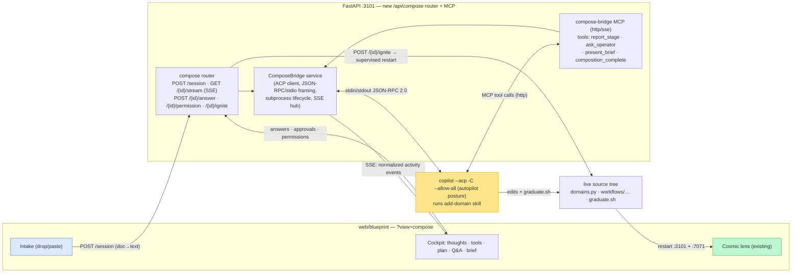

# Visual Domain Composer — Design Spec

**Date:** 2026-07-07
**Status:** Approved design (spine). Ready for the remaining detail review, then implementation planning.
**Source of truth for:** a new `?view=compose` surface in the blueprint microsite that turns a process document into a **live, running Zava domain** by driving the real `copilot` agent (running the `add-domain` skill) end-to-end, while visualising the agent's thinking, tool calls, and code as it works — culminating in the new domain igniting in the cosmic lens.

**Read this first** in any session that picks up this work. It builds directly on:

- [`docs/ADD-A-DOMAIN.md`](../../ADD-A-DOMAIN.md) + [`.github/skills/add-domain/SKILL.md`](../../../.github/skills/add-domain/SKILL.md) — the pipeline we are wrapping, not replacing.
- [`docs/superpowers/skills/compose-domain/SKILL.md`](../skills/compose-domain/SKILL.md) + [`brief.schema.yaml`](../skills/compose-domain/brief.schema.yaml) — the real codegen the agent invokes.
- [`docs/superpowers/specs/2026-05-10-cosmic-lens-v2-design.md`](2026-05-10-cosmic-lens-v2-design.md) — the surface the new domain is born into.

---

## 0. Why this exists (one paragraph)

Today the substrate's beautiful visual surfaces (the cosmic lens, the feed, the phase ribbons) only ever show what **already exists** — while the act of *creating* a new domain happens invisibly, in a terminal, driven by an agent running the `add-domain`/`compose-domain` skills. That is the substrate's single most impressive capability (an agent authoring a whole new business process end-to-end) and it is the one thing you cannot see. The Visual Domain Composer closes that loop: drop a process document, watch a **real agent** read it, ask you clarifying questions, draft the brief for your review, write the orchestrator + personae + projections, run `graduate.sh`, and test its own work — rendered as cinematic "agent at work" theatre — and then watch the finished domain **ignite as a new constellation in the cosmic lens**. It is a genuinely usable self-service authoring tool that also happens to be the best demo the substrate has.

---

## 1. The picture (60 seconds)

> You open `http://localhost:5275/?view=compose`. A calm intake panel invites you to **drop a document** (a process spec, a policy PDF, a meeting transcript) or paste text. You drop "Capital Expenditure Approval — process note.pdf" and hit **Compose**.
>
> The surface transforms into a **glass cockpit**. On the left, the agent's **thought-stream** scrolls — its actual reasoning, softly typed as it thinks. In the centre, a **live activity timeline** shows tool calls as they happen: *"Reading `api/shared/domains.py`"*, *"Reading 3 reference briefs"*, each a card that animates from pending → running → done, some expanding to show a **diff** of a file being born. On the right, a **plan checklist** ticks off the skill's phases: capture intent → author brief → compose → graduate → verify.
>
> Partway through, the agent **turns to you**: a question card slides in — *"The doc says 'senior leaders approve above £50k' — should the second gate be the CFO persona or a new `capex_committee` persona?"* — with two suggested answers and a free-text box. You answer; the agent thanks you and continues. Moments later it presents the **drafted brief** in an editable panel — *"Here's what I understood; fix anything and hit Approve."* You tweak a phase name and approve.
>
> The agent composes. Files stream into being. `graduate.sh` runs, its output scrolling in a terminal card. The agent runs a Python import check and a smoke test, catches one issue, fixes it. Then a single glowing button: **Ignite**. You press it; the stack re-arms, the view pans to the **cosmic lens**, and a brand-new **function planet with its moons** fades up and starts spawning workflows — a business process that did not exist ninety seconds ago, now live.

That narrative is the spec. The rest is detail.

---

## 2. Scope & non-goals

**In scope (v1):**

- New `?view=compose` surface in `web/blueprint`.
- **Document is the hero** input (PDF / docx / markdown / plaintext / transcript), with **paste** as the reliable fallback.
- A backend **ComposeBridge**: FastAPI ↔ `copilot --acp` (Agent Client Protocol) ↔ browser (SSE + REST).
- **Pure-agent end-to-end** (Approach A): the agent runs the real `add-domain` skill; we do not reimplement codegen.
- **Agent-initiated HITL**: clarifying questions + brief/spec review, surfaced structurally in the UI (not a forced gate).
- Cinematic visualisation of the agent's **thoughts, tool calls, diffs, and plan**.
- **Ignite**: a supervised restart of the API + Functions host that brings the new domain live, then hands off to the cosmic lens.

**Non-goals (deferred / out of scope):**

- **Voice input** — deferred to a later pass; reuse the portal's Azure GPT-Realtime + WebRTC pipeline (`api/server/routes/portal_voice.py`) then. (ACP `promptCapabilities.audio` is currently `false`, so voice will be transcribed to text upstream anyway.)
- **Public deployment** — this feature spawns a coding agent with broad permissions and **must remain localhost-only** behind the existing `.poc-safety` posture (see §6). It is explicitly excluded from any public/replay build.
- **Editing an existing domain** — the composer creates new `workflow_type`s only. Editing stays a manual skill invocation.
- **Reimplementing `compose-domain`** — rejected (Approach B). The agent runs the maintained skill; there is one source of truth.

---

## 3. Architecture — the ACP bridge

**The bridge is the whole trick.** `compose-domain` remains the single source of truth; we give the real agent a glass cockpit. The bridge does two translations:

1. **Inbound** ACP `session/update` notifications → **normalized SSE "activity" events** the UI renders (§4.4).
2. **Outbound** UI answers/approvals/permissions → ACP responses and follow-up `session/prompt`s, *and* MCP tool results (§4.6).

### 3.1 Grounded ACP facts (verified against `copilot` 1.0.69 on this host)

`copilot --acp` is a working ACP server (JSON-RPC 2.0, **newline-delimited**, over stdio). Confirmed by live probe:

- `initialize` → `{ protocolVersion: 1, agentCapabilities: { loadSession, mcpCapabilities: {http, sse}, promptCapabilities: {image:true, audio:false, embeddedContext:true}, sessionCapabilities:{list} } }`.
- `session/new { cwd, mcpServers }` → `{ sessionId, models:{availableModels:[…]} }`. **We can attach MCP servers here** and **pick the model**.
- `session/prompt { sessionId, prompt:[{type:text,text}] }` → streams `session/update` notifications, then returns `{ stopReason }`.
- Observed `session/update.update.sessionUpdate` kinds: **`agent_message_chunk`** (`content:{type:text,text}`), **`tool_call`** (`toolCallId`, `title` e.g. *"Creating …"*, `kind` e.g. `edit`, `status`, `rawInput`, `locations`, `content:[{type:diff,oldText,newText}]`), **`tool_call_update`** (`toolCallId`, `status`, `content`, `rawOutput:{content,detailedContent}`), **`available_commands_update`**, **`config_option_update`** (includes a **`mode`** selector: `agent` / `plan` / `autopilot`). ACP also defines **`agent_thought_chunk`** and **`plan`** updates, emitted when the model surfaces reasoning / a plan.
- Server→client requests: **`session/request_permission`** (`options:[{optionId,kind,name}]`) is the permission hook.
- **Mode = `agent`** (default) is what we use — conversational, so agent-initiated questions are natural. `autopilot` (no user interaction) is explicitly *not* what we want.

---

## 4. Backend components

New package: `api/server/services/compose/` (bridge + MCP) and `api/server/routes/compose.py` (router). Mounted in `api/server/main.py` alongside the existing 47 routers.

### 4.1 `api/server/routes/compose.py` — the router

| Method + path | Purpose |
|---|---|
| `POST /api/compose/session` | Body: `multipart` (file) or `{ text }`. Extracts document→text (§4.3), spawns a ComposeBridge session, returns `{ compose_id }`. |
| `GET /api/compose/{id}/stream` | **SSE** stream of normalized activity events (§4.4). The cockpit's live feed. |
| `POST /api/compose/{id}/answer` | Body: `{ request_id, answer }`. Resolves an outstanding `ask_operator` question (§4.6). |
| `POST /api/compose/{id}/brief` | Body: `{ request_id, approved: bool, yaml? }`. Resolves an outstanding `present_brief` review (edited YAML optional). |
| `POST /api/compose/{id}/permission` | Body: `{ request_id, option_id }`. Resolves an ACP `session/request_permission` surfaced to the operator (§6). |
| `POST /api/compose/{id}/ignite` | Triggers the supervised restart (§4.7). Returns once the new domain resolves in `/api/blueprint/composition`. |
| `GET /api/compose/{id}` | Poll fallback: current stage + last N events (for reconnect / no-SSE). |

**Localhost guard** (§6) wraps the whole router: refuses unless bound to loopback and `.poc-safety` present.

### 4.2 `ComposeBridge` service

Owns one agent run. Responsibilities:

- **Subprocess lifecycle.** Spawn `copilot --acp -C <repo_root> --allow-all --log-level none` — the chosen **full-autopilot permission posture** (auto-approve all tools, paths, and URLs) for the smoothest run, gated by the localhost + throwaway-machine controls in §6. **ACP `mode` stays `agent`** (not `autopilot`) so the agent can still ask clarifying questions via the MCP tools — `--allow-all` only removes *permission prompts*, it does not disable conversational HITL. One subprocess per `compose_id`. Clean teardown on completion / disconnect / error.
- **JSON-RPC framing.** Newline-delimited read/write loop over stdio; correlate request ids; a reader task fanning notifications to the SSE hub and dispatching server→client requests.
- **ACP handshake.** `initialize` → `session/new` (attach the compose-bridge MCP at §4.5; choose model, default a strong codegen model, e.g. `claude-sonnet-*`) → `session/prompt` with the composition prompt (§4.5) carrying the document as embedded context.
- **Translation.** ACP `session/update` → normalized SSE (§4.4). ACP `session/request_permission` → hold + emit `permission` SSE (or auto-resolve per policy, §6).
- **HITL correlation.** Maintain a map of outstanding `request_id`s (questions, brief reviews, permissions) → asyncio Futures resolved by the REST endpoints.
- **State.** A small in-memory `ComposeSession` (stage, event ring buffer, outstanding requests, subprocess handle). No DB; sessions are ephemeral.

### 4.3 Document intake → text

- **Paste** → passthrough.
- **Markdown / plaintext / transcript** → passthrough.
- **PDF** → text via a lightweight extractor (**add `pypdf`** — not currently a dep; the present `weasyprint` is generation-only, not extraction). **docx** → **add `python-docx`**. Fail soft: on extractor failure, hand the raw file path to the agent and let it extract with its own shell tools.
- Output: a normalized `document_text` (+ original filename) embedded in the composition prompt. Keeping extraction in the backend keeps the agent focused on composition, not parsing.

### 4.4 Normalized SSE event schema (the UI contract)

Every SSE `data:` is one JSON object `{ type, ... }`. This is the **stable contract** between bridge and cockpit (decouples the UI from ACP wire details):

| `type` | Fields | Source |
|---|---|---|
| `stage` | `stage` (`intake`\|`understanding`\|`brief`\|`composing`\|`graduating`\|`verifying`\|`ready`\|`error`), `label` | `report_stage` MCP tool / inferred |
| `thought` | `text`, `partial` | ACP `agent_thought_chunk` |
| `narration` | `text`, `partial` | ACP `agent_message_chunk` |
| `tool` | `id`, `title`, `kind` (`read`\|`edit`\|`execute`\|`search`\|`other`), `status` (`pending`\|`running`\|`completed`\|`failed`), `path?`, `diff?` `{old,new}`, `output?` | ACP `tool_call` / `tool_call_update` |
| `plan` | `entries:[{title,status}]` | ACP `plan` |
| `question` | `request_id`, `text`, `options?:[string]` | `ask_operator` MCP tool |
| `brief` | `request_id`, `yaml` | `present_brief` MCP tool |
| `permission` | `request_id`, `title`, `options:[{option_id,kind,name}]` | ACP `session/request_permission` |
| `done` | `workflow_type`, `display_name` | `composition_complete` MCP tool |
| `error` | `message`, `fatal` | bridge |

### 4.5 The agent invocation — compose-bridge MCP + prompt

To make the UI **deterministic** and the HITL loop **reliable** (rather than parsing prose to guess "is it asking or finishing?"), the bridge hosts a tiny **MCP server** (FastAPI-mounted, http transport — `mcpCapabilities.http:true` confirmed) attached at `session/new`. It exposes four tools the agent calls at the natural seams of the `add-domain` skill:

| MCP tool | Behaviour |
|---|---|
| `report_stage(stage, label)` | Emits a `stage` SSE. Non-blocking. |
| `ask_operator(question, options?)` | Emits a `question` SSE and **blocks** until `POST /answer`, returning the operator's answer as the tool result. This *is* the clarifying-question loop. |
| `present_brief(yaml)` | Emits a `brief` SSE and **blocks** until `POST /brief`; returns `{approved, yaml}` (possibly operator-edited) as the tool result. This *is* the spec review. |
| `composition_complete(workflow_type, display_name)` | Emits `done`; signals the cockpit to reveal **Ignite**. |

A thin wrapper — a committed **`compose-domain-live` micro-skill** (decided; versioned and reviewable rather than a hidden prompt string) — instructs the agent: *"Compose a new Zava domain from the attached document by running the `add-domain` skill. Call `report_stage` at each phase. Whenever the document is ambiguous, call `ask_operator` instead of guessing. **Always** call `present_brief` with the drafted brief before composing and honour edits. After `graduate.sh` and verification pass, call `composition_complete`."* The skill already prescribes questions + brief approval + verification; the wrapper routes those interactions through structured tools and pins the HITL cadence (brief review always; questions only when genuinely ambiguous).

**Fallback (no MCP):** if the MCP path is deferred, infer `stage` from tool titles, treat a turn that ends without `composition_complete` as "awaiting input," and detect the brief by watching for the write to `docs/superpowers/specs/<wt>-brief.yaml`. The MCP path is strongly preferred and is the primary design.

### 4.6 HITL loop (questions + spec review)

1. Agent calls `ask_operator` / `present_brief` (MCP) — the call blocks server-side.
2. Bridge emits `question` / `brief` SSE with a `request_id`; cockpit renders the card.
3. Operator responds → `POST /answer` or `/brief` → bridge resolves the pending Future → MCP tool returns the value to the agent → agent continues its turn.

No artificial gate: the agent decides when it needs you. Under the v1 full-autopilot posture (§6) `--allow-all` pre-authorises tool calls, so `session/request_permission` prompts do not fire; the `permission` SSE event + `/permission` endpoint remain in the contract for a future stricter policy.

### 4.7 Going live — reload wrinkle + the "Ignite" beat

Two processes must pick up the new domain: the **API (:3101)** (rebuilds `DOMAINS` at import → `/api/blueprint/composition` → cosmic lens) and the **Durable Functions host (:7071)** (registers the new orchestrator so the simulator can spawn *instances*).

- **The composer must NOT run under `uvicorn --reload`.** A mid-run reload (triggered by the agent's own file writes) would kill the ComposeBridge and the `copilot` subprocess before graduation finishes. The composer therefore runs on the **non-reload demo stack** (`scripts/boot-demo.sh` already runs uvicorn without `--reload`).
- **Ignite = an explicit, supervised restart** performed *after* the agent finishes. `POST /{id}/ignite` invokes a supervisor (`scripts/compose-ignite.sh`, detached) that restarts :7071 then :3101 using the PID/handle files `boot-demo.sh` writes. The cockpit shows a brief "re-arming the substrate" state, reconnects, confirms the new `workflow_type` in `/api/blueprint/composition`, then pans to the cosmic lens where the new planet fades up. Turning the technical necessity into the demo's climax.
- **Future optimisation:** true hot-reload of a domain without a full restart — see the existing [`2026-05-22-governance-dashboard-and-hot-reload.md`](../plans/2026-05-22-governance-dashboard-and-hot-reload.md) plan. Out of scope here; the supervised restart is the honest MVP.

---

## 5. Frontend — the `?view=compose` cockpit

Lives in `web/blueprint/src`, following the existing `?view=` routing in `App.tsx` (alongside `entities` / `functions` / `org-clone`). Reuses the established design language (Tailwind 4, Lucide icons, the domain colour palette, dark-first).

### 5.1 Acts (the visual state machine)

`intake → understanding → brief → composing → graduating → verifying → ready → (ignite) → lens`. Driven by `stage` SSE events; each act re-weights the three cockpit panes.

### 5.2 Event → visual mapping

| Event | Visual treatment |
|---|---|
| `thought` | Left pane: a softly-typed **reasoning stream** ("the agent is thinking"), monospace, low-contrast, auto-scrolling. The literal answer to "visualise what you're staring at right now." |
| `narration` | Promoted as the agent's "voice" — a headline line above the timeline. |
| `tool` (`read`) | Timeline card: 🔍 *"Reading `domains.py`"*, pending→done shimmer. |
| `tool` (`edit`) | Card expands to a **diff** (reuse blueprint's diff rendering); a file-birth micro-animation; increments a "files written" counter. |
| `tool` (`execute`) | **Terminal card** streaming stdout (e.g. `graduate.sh`, pytest) with a status chip. |
| `plan` | Right pane: a **checklist** ticking through the skill's phases. |
| `question` | A **question card** slides into centre focus, dims the rest; suggested-answer chips + free-text; submit → `POST /answer`. |
| `brief` | An **editable YAML/structured panel** ("here's what I understood"); Approve / edit → `POST /brief`. |
| `permission` | A compact **approval strip** (only for out-of-policy asks; most auto-resolve). |
| `done` | The **Ignite** button glows in. |
| Ignite → `lens` | "Re-arming" transition, then camera pan to the cosmic lens; the new function planet fades up and starts spawning moons. |

### 5.3 Components

`ComposeView` (route root, SSE lifecycle) · `IntakePanel` (drop/paste) · `ThoughtStream` · `ActivityTimeline` + `ToolCallCard` (with `DiffView` / `TerminalView`) · `PlanChecklist` · `QuestionCard` · `BriefReviewPanel` · `IgniteButton` · `LensHandoff`. State via hooks + a small reducer over the SSE stream (no Redux; matches house style).

### 5.4 SSE client

A `useComposeStream(compose_id)` hook (mirrors the existing `useSSE` / `useLiveCosmic` patterns) maintaining the reduced cockpit state and exposing `answer()`, `approveBrief()`, `resolvePermission()`, `ignite()` actions that POST back.

---

## 6. Safety & security

This feature spawns a coding agent that edits the repository and runs shell commands, triggered from a browser. Non-negotiable controls:

- **Localhost-only.** The `/api/compose/*` router refuses unless the request is loopback **and** the `.poc-safety` `POC_UNSAFE_FOR_PUBLIC_DEPLOY=1` marker is present. Excluded from `blueprint_app.py` (the lean public/replay shim) entirely — the deployed microsite never mounts it.
- **Permission posture (v1 = full autopilot, by explicit choice).** The agent runs with `--allow-all` (all tools, all paths, all URLs auto-approved) for an uninterrupted run. This is deliberately permissive and is **only acceptable because of the outer gate**: localhost-only + `.poc-safety` present + intended for a **throwaway/demo machine**. It is implemented as a **config knob** (`COMPOSE_PERMISSION_POLICY = autopilot | in_repo_only`) so a stricter posture can be selected without code changes. The **recommended non-throwaway posture** (`in_repo_only`) auto-approves only tool calls whose `locations` fall inside the repo and surfaces everything else as a `permission` card — the wiring for that path (the `permission` SSE + `/permission` endpoint) is built even though v1 defaults to autopilot.
- **No secrets in the stream (still enforced under autopilot).** Use `--secret-env-vars` for anything sensitive; the bridge redacts known secret patterns before emitting SSE.
- **No secrets in the stream.** Use `--secret-env-vars` for anything sensitive; the bridge redacts known secret patterns before emitting SSE.
- **One run at a time** per host by default (a spawned agent editing the tree is not safely concurrent with a second). Enforced by the bridge.

---

## 7. Testing

**Backend (pytest, `tests/api/`):**

- **ACP framing/translation** — unit tests over **recorded ACP traces** (captured via a probe like the one used to write this spec; store fixtures under `tests/api/compose/fixtures/*.jsonl`). Assert each `session/update` kind maps to the correct normalized SSE event. No live agent needed.
- **HITL correlation** — `ask_operator` / `present_brief` block until the matching `POST` resolves; timeout + disconnect paths clean up the subprocess.
- **Document intake** — PDF/docx/markdown/plaintext → text; extractor-failure fallback.
- **Safety guard** — non-loopback / missing `.poc-safety` → refused; permission policy classifies in-repo vs out-of-repo correctly.
- **Ignite** — supervisor invocation is mocked; assert it waits for the `workflow_type` to appear in `composition_tree()`.

**Frontend (vitest, `web/blueprint/src/**/__tests__`):**

- Cockpit reducer over a **canned SSE sequence** → correct act transitions and card rendering.
- `QuestionCard` / `BriefReviewPanel` post the right payloads; `ToolCallCard` renders read/edit/execute variants + diffs.

**Integration (manual / opt-in, not CI):**

- One real end-to-end compose of a **small throwaway domain** on the demo stack, asserting the new `workflow_type` resolves in `/api/blueprint/composition` and spawns an instance after Ignite. Gated behind an env flag; not run in CI (spawns a real agent, mutates the tree).

---

## 8. Milestones (the plan will sequence these)

1. **ComposeBridge core** — subprocess + ACP handshake + JSON-RPC framing + trace-based translation tests. (No UI yet; prove the stream over a scripted agent turn.)
2. **compose-bridge MCP** — `report_stage` / `ask_operator` / `present_brief` / `composition_complete`, wired to the SSE hub + REST resolvers.
3. **`/api/compose` router + document intake + safety guard.**
4. **Cockpit UI** — intake → thought-stream + timeline + plan → question/brief cards. Against recorded/mocked SSE first.
5. **Ignite** — `compose-ignite.sh` supervised restart + lens handoff.
6. **End-to-end hardening** — a real compose of a throwaway domain; polish the theatre; wrapper prompt/micro-skill tuning.

---

## 9. Open questions / risks

- **~~Wrapper as prompt vs. micro-skill.~~ DECIDED:** a committed `compose-domain-live` micro-skill (versioned, reviewable). See §4.5.
- **`graduate.sh` known regressions** (KR-1…KR-4 in the `add-domain` skill) mean the agent must hand-stitch `domains.py`, `entity_projections/__init__.py`, the AGT matrix, etc. The agent does this today in a terminal; we must confirm it does so reliably under ACP and that failures surface as `error` events rather than a silent stall. Verification (§7 integration) is the guard.
- **Supervised restart robustness** — restarting :7071 + :3101 cleanly from a detached script, and reconnecting the cockpit across the API restart. Prototype early (Milestone 5).
- **Run duration** — a real compose is minutes (the skill notes ~5–12). The theatre must stay legible and alive across that; ensure thought/tool cadence never looks hung (heartbeat + elapsed timer).
- **Model choice / cost** — codegen quality vs. spend; pick the default model deliberately and make it configurable.

---

## 10. Record & replay (Phase 4 — planned)

Because a live compose is 5–12 min and variable, the **recorded demo** is de-risked by recording a real compose's normalized event stream to a compose tape and replaying it through the *same* cockpit + endpoints — fast, deterministic, hands-free or presenter-clickable — while the tool stays live-usable for real work. Recommended recipe: do the real compose once (it genuinely graduates the domain *and* writes the tape), then replay the tape for the recording; because the domain really exists, the Ignite→lens handoff is real. Detailed in [`../plans/2026-07-07-visual-domain-composer-phase-4-record-replay.md`](../plans/2026-07-07-visual-domain-composer-phase-4-record-replay.md).

## 11. Later (beyond the four phases)

- **Voice input** (portal realtime pipeline → transcript → same composition prompt).
- **True hot-reload** of a domain (no restart) — folds in the governance/hot-reload plan.
- **Compose history** — a gallery of past composes/tapes (the agent's session markdown via `--share` is a cheap complementary artefact).
