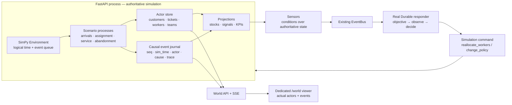

# Observable Actor Simulator — Design Spec

**Date:** 2026-07-13  
**Status:** Approved design  
**Supersedes for implementation:** [`2026-07-10-organisational-world-simulator-design.md`](2026-07-10-organisational-world-simulator-design.md). The earlier stock-and-flow engine remains a proven integration spike; this spec defines the engine we will scale.

**Goal:** Turn Zava into a genuine, observable organisational simulator: explicit customers, work items, workers and resources evolve through deterministic discrete events; sparse real Durable agents observe that world and issue commands that change it; the UI renders those actual actors, events and consequences rather than decorating aggregate numbers.

---

## 0. Decision

The current proof established something important:

> A condition in simulated world state can trigger a real Azure Durable
> Functions workflow, whose data-driven decision feeds back into the world.

That integration is correct and stays.

What does **not** scale is the current aggregate-only `WorldEngine` plus a
four-number panel on the cosmic lens. A world containing only
`backlog=150`, `agents=20` and `arrival=90/h` cannot show tickets arriving,
workers claiming them, customers abandoning, resources moving, or an agent
intervening. Any UI over that model can only make the numbers prettier.

We therefore replace the aggregate simulator with a **hybrid actor +
discrete-event simulation**:

- Thousands of cheap, explicit world actors use deterministic/stochastic
  rules.
- A logical event clock advances directly to meaningful events.
- Shared queues and finite resources create real contention.
- A causal event journal is the source for inspection, replay and rendering.
- Real Durable/LLM agents are reserved for consequential organisational
  decisions.
- Aggregate stocks and signals become projections derived from actors and
  events.

Theatre is allowed, but it follows one rule:

> **Theatre may amplify a real simulation event; it must never fabricate one.**

---

## 1. Reference architecture

This design follows established simulator patterns:

- [SimPy](https://simpy.readthedocs.io/en/latest/) provides process-based
  discrete-event simulation, shared finite resources, queues, fast-forward,
  real-time and manual stepping.
- [ABIDES](https://github.com/abides-sim/abides) demonstrates tens of
  thousands of message-driven agents over a discrete-event kernel.
- [Mesa](https://mesa.readthedocs.io/latest/) demonstrates explicit agents,
  schedulers, spatial models, browser visualisation and data collection.
- [Factorio's deterministic lockstep](https://factorio.com/blog/post/fff-188)
  demonstrates the operational value of deterministic state transitions,
  input journals and reproducible desync investigation.
- Stanford's
  [Generative Agents](https://arxiv.org/abs/2304.03442) demonstrates why
  expensive cognition belongs in a sparse layer above the cheap world
  simulation rather than inside every actor.

For Zava:

- **SimPy is the v1 simulation kernel.**
- **ABIDES is the scale/message-passing reference.**
- **Durable Functions remain the sparse cognitive/organisational layer.**
- We do **not** introduce an ECS framework in v1. Compact Python records and
  indexed dictionaries are sufficient for the support proof; adopt
  data-oriented component stores only if profiling requires them.

---

## 2. System picture



### Authority boundary

The simulation runtime is the **only writer** of actor/world state.

Durable agents never mutate dictionaries directly. They return a typed
`SimulationCommand`. The runtime validates and applies that command, writing
the resulting events to the same journal as every other world transition.

The browser is read-only except for explicit operator controls
(`pause`, `resume`, `step`, `speed`, `restart`, `inject`).

---

## 3. Runtime model

New package shape:

```text
api/server/world/
  model.py                 actor, event and command records
  runtime.py               SimPy environment, logical clock, control, journal
  projection.py            derived stocks/signals/KPIs
  packs/
    support.py             first explicit-actor scenario
```

The current aggregate `contract.py`, `engine.py` and `packs/toy.py` are
replaced after the new runtime reaches parity.

### 3.1 Simulation runtime

`SimulationRuntime` owns:

- `simpy.Environment`
- one seeded random source
- actor indexes
- append-only event journal
- scenario processes
- simulation status (`running`, `paused`, `completed`, `failed`)
- speed (`1x`, `10x`, `100x`, `max`)

The FastAPI lifespan drives it from one asyncio task. SimPy remains
synchronous and single-threaded; the task repeatedly executes the next
scheduled event, then yields to asyncio. This preserves one authoritative
writer while allowing HTTP/SSE and Durable polling to proceed.

Supported controls:

- `run`: advance continuously
- `pause`: stop before the next event
- `step`: execute exactly one scheduled event
- `speed`: alter wall-clock pacing without changing logical results
- `restart(seed)`: rebuild the scenario from a seed
- `inject(name, payload)`: schedule a declared exogenous event

### 3.2 Actor store

Actors have stable IDs and typed state. The support proof uses:

```python
Customer(
    id, segment, value_band, patience_minutes,
    sentiment, churn_risk, active_ticket_ids
)

Ticket(
    id, customer_id, severity, required_skill,
    created_at, queued_at, assigned_at, resolved_at,
    status, assigned_worker_id, sla_deadline
)

Worker(
    id, team_id, skills, service_rate,
    status, current_ticket_id, available_at
)

Team(
    id, name, worker_ids, queue_id
)
```

Use dataclasses with `slots=True` and dictionaries keyed by ID. This is
simple, inspectable and sufficient for the first 1,000–10,000 actor proof.
Measure before moving to arrays/ECS.

### 3.3 Scenario processes

The support pack installs real SimPy processes:

- customer population creation
- stochastic ticket arrival
- ticket routing by required skill
- worker assignment
- service duration
- SLA expiry
- customer abandonment
- ticket resolution
- sentiment and churn-risk updates
- staffing interventions

Queues use SimPy `Store`/`FilterStore`; constrained capacity uses SimPy
resources or explicit worker availability.

No actor calls an LLM. Actor behaviour is deterministic given the seed and
inputs.

---

## 4. Causal event journal

Every visible or inspectable transition is an immutable
`SimulationEvent`:

```python
SimulationEvent(
    seq: int,
    event_id: str,
    sim_time: float,
    type: str,
    actor_id: str | None,
    target_id: str | None,
    cause_event_id: str | None,
    trace_id: str,
    payload: dict,
)
```

Representative event types:

```text
simulation.started
customer.created
ticket.arrived
ticket.queued
ticket.assigned
ticket.service_started
ticket.sla_breached
ticket.abandoned
ticket.resolved
sensor.tripped
responder.requested
responder.started
responder.observed
responder.decided
command.accepted
command.rejected
workers.reallocated
simulation.paused
simulation.resumed
```

### Causality

- `cause_event_id` links each consequence to the event that caused it.
- `trace_id` links one cross-system episode from perturbation through Durable
  response to world recovery.
- The viewer can reconstruct a complete explanation without interpreting log
  prose.

### Persistence and replay

V1 keeps the live journal in memory and can export one run as NDJSON.
Replay loads:

- initial seed/configuration
- operator inputs/perturbations
- recorded external responder commands

Replaying a run does not call Durable/LLM again; it re-applies the recorded
commands at their logical times.

---

## 5. Derived state

Stocks/signals remain useful, but they are projections:

```text
support_backlog      = count(ticket.status == "queued")
agents_available     = count(worker.status == "idle")
sla_breach_pct       = breached_tickets / opened_tickets
average_wait_minutes = mean(assigned_at - queued_at)
abandonment_rate     = abandoned / arrived
customer_sentiment   = aggregate(customer.sentiment)
```

`WorldProjection` updates from journal events and actor state. Sensors read
the authoritative projection, but a sensor event records the actor IDs and
measurements that tripped it.

---

## 6. Durable cognitive layer

The existing real proof remains the integration seam:

```text
sensor.tripped
  → EventBus
  → WorldBridge schedules a real Durable orchestration
  → responder receives a bounded world observation
  → responder returns a typed SimulationCommand
  → runtime validates and applies command
  → command/world events are journaled
```

The current `SurgeStaffingOrchestrator` is evolved, not discarded.

### Observation

Its input includes:

- sensor/episode trace ID
- relevant actor IDs
- current queue composition
- worker availability and skills
- arrival velocity
- SLA and abandonment risk
- allowed command vocabulary

### Command

V1 supports:

```python
SimulationCommand(
    command_id,
    trace_id,
    issued_by="surge_staffing",
    type="reallocate_workers",
    payload={
        "worker_ids": [...],
        "from_team_id": "...",
        "to_team_id": "...",
        "duration_minutes": 30,
    },
)
```

The decision changes actual workers. Their availability, assignments and
service rates change; subsequent ticket events reflect the intervention.

### Failure behaviour

- Durable timeout/failure writes `responder.failed`; the simulation
  continues without the intervention.
- Invalid commands write `command.rejected` with a reason; world state is
  unchanged.
- Duplicate `command_id` values are idempotently ignored.

---

## 7. Dedicated world viewer

The simulator gets a dedicated `/world` route in the Control Plane. It does
not live as another panel on the constellation.

### 7.1 What the viewer shows

The default support-world scene is a **live operational floor**, generated
from real actor state:

- Incoming tickets appear as individual work items.
- Queue lanes show tickets waiting by severity/skill.
- Worker lanes show named/numbered workers as idle, serving or temporarily
  reallocated.
- A ticket moves only when the journal records its transition.
- Customer patience/sentiment visibly deteriorates while waiting.
- A sensor trip highlights the exact tickets/measurements involved.
- The Durable responder appears as an intervention episode:
  objective → observation → decision → command.
- Reallocated workers visibly move between teams.
- Queue behaviour changes because those real worker records changed.

The UI may interpolate between event states for legibility. It cannot invent
an actor, transition or decision.

### 7.2 Inspection

Clicking any ticket, customer, worker or intervention opens its factual
history:

- current state
- all events involving that actor
- causal parent/children
- associated trace
- decisions that affected it

### 7.3 Controls

- pause/resume
- step one simulation event
- `1x`, `10x`, `100x`, `max`
- restart with same seed
- restart with new seed
- inject declared perturbation

### 7.4 Data transport

- `GET /api/world/state` returns the current snapshot plus journal sequence.
- `GET /api/world/events?after=<seq>` provides reconnect/catch-up.
- `GET /api/world/stream` uses SSE for live journal events.
- `POST /api/world/control` handles pause/resume/step/speed/restart.
- `POST /api/world/inject/{name}` remains the perturbation ingress.

The frontend reduces the snapshot + events into local render state. SSE
events carry their journal sequence; gaps trigger catch-up from
`/api/world/events`.

### 7.5 Constellation relationship

Remove `WorldSignalsPanel` from the constellation.

The constellation may later receive one subtle, event-backed indication that
a world episode is active and a link to `/world`. It does not attempt to
render the world itself.

---

## 8. Scale and compute

The target machine (48 GB Apple Silicon MacBook) is ample for the first
proof. Scale comes from hierarchy, not from making every actor cognitive:

- 1,000–10,000 explicit cheap actors in v1
- 30–50 explicit workers
- hundreds/thousands of tickets per accelerated run
- one or a few real Durable cognitive responders

The simulation is event-driven, so idle actors cost no per-tick work.

Performance gates:

- 10,000 actors can complete a one-day accelerated run without exhausting
  memory.
- `/world` remains responsive while the simulator runs at `100x`.
- event journal and actor inspection remain interactive for the first
  100,000 events.

If profiling shows Python-object overhead is material, move high-volume actor
attributes to data-oriented arrays without changing journal/API contracts.

---

## 9. Determinism

A run is identified by:

```text
scenario version + seed + operator inputs + external responder commands
```

Requirements:

- all world randomness comes from the runtime's seeded generator
- no wall-clock reads inside scenario behaviour
- stable event ordering for equal logical timestamps
- external commands are journaled
- same inputs reproduce the same actor states and event journal

Tests compare canonical journals, excluding generated run IDs.

---

## 10. Migration from the spike

Keep:

- `ZAVA_WORLD` opt-in posture
- real Durable orchestration registration
- EventBus boundary
- `/api/world` namespace
- end-to-end proof script, updated for the actor model

Replace:

- aggregate `WorldEngine`
- aggregate `WorldPack` primitives as the primary model
- toy support pack
- state-polling `WorldSignalsPanel`
- bridge outcomes that mutate aggregate counters

The current commits remain useful historical evidence, but the eventual PR
must present the actor-based implementation as the product architecture.

---

## 11. Testing and proof

### Kernel

- exact event ordering
- pause/resume/step semantics
- speed changes do not alter logical results
- deterministic journal for same seed/input
- causal links reference existing prior events

### Support scenario

- tickets cannot be assigned twice
- workers cannot serve two tickets simultaneously
- skill routing is respected
- queue/SLA/sentiment projections match actor state
- abandonment and resolution are mutually exclusive
- staffing commands move real workers and affect subsequent service events

### Durable integration

- real Functions host indexes the responder
- live sensor creates exactly one orchestration per episode
- orchestration input contains actor-level observation
- completed output is a typed command
- command is accepted once and journalled
- affected workers/tickets have causal events linked to the responder trace

### Viewer

- reducer reconstructs actor state from snapshot + journal
- sequence gaps invoke catch-up
- every rendered transition maps to an event ID
- entity inspection shows correct causal history
- controls alter the authoritative runtime

### Final end-to-end proof

Boot:

```text
Azurite + Functions host + FastAPI + Control Plane
```

Then prove:

1. A deterministic population produces actual tickets.
2. Workers claim and resolve them.
3. A perturbation overwhelms capacity.
4. Ticket wait/SLA/customer state visibly deteriorates.
5. A real Durable responder observes actor-level state.
6. It issues a worker-reallocation command.
7. The runtime moves actual workers.
8. Subsequent ticket events improve.
9. The viewer renders the entire causal chain.
10. Replay produces the same journal without re-calling Durable.

Evidence includes journal NDJSON, Durable instance status/history, final
actor snapshot and Playwright screenshots/video.

---

## 12. Implementation sequence

1. Add SimPy and implement the runtime + causal journal.
2. Build the explicit-actor support scenario.
3. Add projections, sensors and deterministic replay.
4. Evolve the Durable responder to actor observations + typed commands.
5. Add snapshot/events/SSE/control APIs.
6. Build the dedicated `/world` viewer.
7. Remove the constellation stats panel.
8. Run and record the real end-to-end proof.

Telco begins only after this support proof passes.

### Plan decomposition

This spec is one coherent vertical outcome but is deliberately executed as
three plans. Each plan must leave working, independently provable software:

1. **Actor simulation kernel + support world**
   - SimPy runtime, actors, causal journal, controls, deterministic replay
   - explicit customer/ticket/worker scenario
   - no Durable or UI dependency
   - proof: seeded actor run produces a valid, replayable journal

2. **Durable command loop + world APIs**
   - actor-level observation
   - typed command validation/application
   - real Durable responder
   - snapshot/events/SSE/control endpoints
   - proof: real orchestration moves real workers and improves later events

3. **Dedicated world viewer + final proof**
   - `/world` route
   - event-backed actor rendering, inspection and controls
   - remove the constellation stats panel
   - Playwright + recorded end-to-end evidence

Do not begin the next plan until the preceding proof passes.
