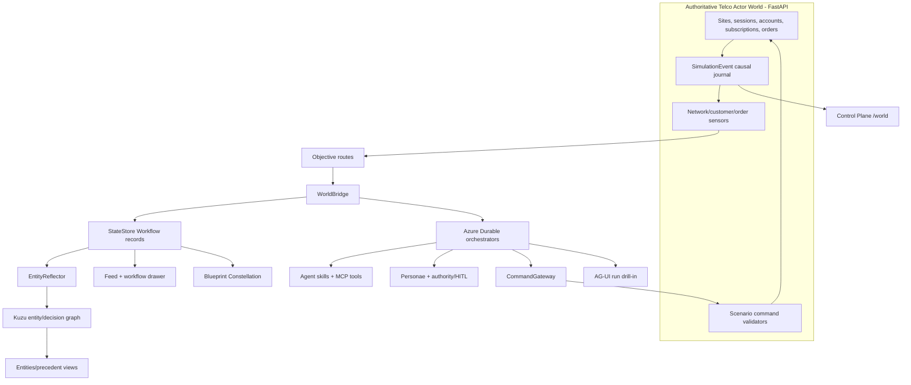

# Telco Zava Demonstrator - Grounded Design Spec

**Date:** 2026-07-14
**Status:** Proposed; rebuilt from live code audit
**Scope:** A demonstrable Telco Zava spanning simulator, Durable workflows,
agents, governance, entity graph, AG-UI, operator UI and replay evidence.

**Inputs:**

- [`2026-07-14-telco-oss-process-catalogue.md`](2026-07-14-telco-oss-process-catalogue.md)
- [`2026-07-14-telco-bss-process-catalogue.md`](2026-07-14-telco-bss-process-catalogue.md)

## 0. Decision

Do not implement 37 catalogue rows. Build one coherent Telco operating world
and prove two reusable process archetypes:

1. **World-driven response:** site failure -> network recovery -> proactive
   customer care.
2. **Business-driven fulfilment:** service order -> network feasibility ->
   activation.

Together they cover the important OSS/BSS shapes: sensing, prediction,
closed-loop action, customer impact, commercial policy, HITL, fulfilment and
outcome verification.

## 1. Codebase truth: what exists now

Verified on 2026-07-14 from imports and focused tests:

| Area | Shipped fact | Source |
|---|---|---|
| Registry | 40 domains, 39 live; 11 functions | `api/shared/domains.py`, `api/shared/functions.py` |
| Actor worlds | `support` and `telco` only | `api/server/world/registry.py` |
| World responders | `support_capacity`, `network_service_recovery` only | `api/server/services/world_responders.py` |
| Telco actors | 12 sites, 2,000 subscribers, 2,200 sessions in default live config | `api/server/world/registry.py`, `api/server/world/packs/telco.py` |
| Durable response | `NetworkIncidentOrchestrator` calls one deterministic decision activity | `api/functions/workflows/network_incident.py`, `network_incident_activities.py` |
| World viewer | Real site/session state and causal journal at `/world` | `web/client/routes/TelcoWorld.tsx`, `useWorldSimulation.ts` |
| Workflow drill-in | Per-workflow AG-UI SSE | `api/server/routes/workflow_agui.py`, `substrate_to_agui.py` |
| Entity graph | 19 node kinds, 40 relationship types | `api/server/services/entity_graph.py` |
| Telco graph projection | Workflow + incident site as `Asset`; no subscriber/service graph | `entity_projections/network_incident.py` |
| Proof | Unmocked Azurite + Functions + FastAPI + Vite + Playwright | `tools/telco_world_e2e_proof.sh`, `.mjs` |

Focused verification passed:

```text
tests/api/world/actor/test_telco_service.py
tests/api/server/services/entity_projections/test_network_incident_projection.py
tests/api/routes/test_workflow_agui.py
9 passed
```

## 2. Current telco flow

The current loop is real:

```mermaid
flowchart LR
    A[NetworkScenario] -->|site.failed| B[sensor.tripped]
    B --> C[WorldBridge]
    C --> D[ObjectiveManager]
    D --> E[NetworkIncidentOrchestrator]
    E --> F[network_incident_decide_activity]
    F -->|reroute_sessions| G[CommandGateway]
    G --> H[NetworkScenario.apply_command]
    H --> I[session.rerouted + site.recovered]
    I --> J[/world viewer]
```

Code path:

1. `NetworkScenario.inject_site_failure()` fails one real `CellSite`.
2. Sessions become `degraded`; neighbours receive reattach congestion.
3. `_sensor_loop()` emits `sensor.tripped`.
4. `WorldBridge` opens/claims an objective and schedules
   `NetworkIncidentOrchestrator`.
5. `network_incident_decide_activity()` greedily places voice first, then other
   sessions on healthy neighbours with capacity.
6. `CommandGateway` checks objective status, trace, issuer and command type.
7. `NetworkScenario.apply_command()` validates the whole assignment before
   mutation, then journals reroutes and recovery.
8. `TelcoWorld.tsx` renders the resulting actors and events.

`tools/telco_world_e2e_proof.sh` proves the Durable instance completed and that
the Durable output assignments equal journal events, snapshot state and DOM
tokens.

## 3. Why this is not yet a complete Telco Zava

The current loop is a strong simulator proof but a side path around several
Zava planes:

| Gap | Code reason | Visible consequence |
|---|---|---|
| No canonical Workflow record | Actor-triggered `WorldBridge` schedules Durable directly and never calls `StateStore.upsert_workflow()` | Network incident absent from normal Feed/detail surfaces |
| No standard Durable checkpoints | `network_incident.py` does not call `checkpoint_activity_trigger` | No phase timeline, ledger or normal orchestration history |
| No AG-UI run for the live incident | AG-UI filters strictly by `workflow_id`; live actor response has no stored workflow/history | `/api/workflows/{id}/agui` cannot explain the live incident |
| No entity reflection from live incident | `EntityReflector` requires a `FleetEvent.workflow_id` and a matching stored workflow | Existing network projection is exercised by synthetic/stored workflows, not the live actor incident |
| No Constellation activity | Actor events are `world.*`; observatory consumes standard workflow/Durable events | Telco domain exists in catalogue but does not light during the live actor proof |
| No actor-world HITL/authority | Network response is intentionally reversible and autonomous | Correct for reroute, insufficient for customer credits, restrictions or order exceptions |
| One objective per world pack | `WorldPackRegistration` carries one objective type/command set | Cannot route network recovery, customer care and fulfilment independently |
| Evaluation never completes | `CommandGateway` emits `evaluation.started` only | Objective remains `evaluating`; no measured success verdict |
| UI is scenario-specific | `World.tsx` branches directly to `TelcoWorld` | Rich telco UI exists, but no generic industry layout system exists |
| "Agent" phases are labels | No `impact_diagnosis` or `reroute_execution` runtime skill folders; decision code is deterministic | Current incident is autonomous automation, not an LLM/tool-using agent |

These are the actual integration tasks.

## 4. Target demonstrator

### 4.1 One world, not separate OSS and BSS simulators

`ZAVA_WORLD=telco` continues to select one authoritative `ActorWorldService`.
The telco scenario grows both network and commercial actors:

```text
Account
  -> Subscription
  -> Subscriber
  -> NetworkSession
  -> CellSite

Account
  -> ServiceOrder
  -> Subscription

Incident
  -> affected Sessions
  -> affected Subscriptions
  -> affected Accounts
  -> Notifications / Credits / Care Cases
```

OSS and BSS processes operate on the same IDs. No cross-world synchronization
is required.

### 4.2 Two proof slices

#### Slice A: incident to proactive care

```text
site failure
  -> network anomaly objective
  -> NetworkIncidentOrchestrator
  -> reroute_sessions
  -> site/session recovery
  -> customer impact objective
  -> ProactiveCustomerCareOrchestrator
  -> entitlement agent + policy/HITL
  -> notify and credit impacted accounts
  -> network and customer outcomes verified
```

#### Slice B: order to activate

```text
service-order API creates a real ServiceOrder actor
  -> service-order sensor
  -> OrderToActivateOrchestrator
  -> catalogue/order validation
  -> network feasibility agent
  -> exception HITL when capacity is insufficient
  -> activate_service typed command
  -> subscription/session actors created
  -> order and activation outcomes verified
```

Slice A proves world -> organisation. Slice B proves organisation -> world.

## 5. Target architecture



## 6. Canonical world-to-workflow seam

Add a small adapter around the existing bridge; do not create a second
workflow system.

When a sensor opens an objective:

1. Resolve an `ObjectiveRoute` by `sensor_event.actor_id`.
2. Allocate a deterministic workflow ID from sensor event ID.
3. Build a normal `api.shared.types.Workflow` using a shared registered-domain
   factory extracted from the simulator spawner's existing strategic-workflow
   factory. Derive `current_phase` from the first registered `Domain.phase`;
   do not retain the strategic factory's current hardcoded `"Intake"` default.
4. Store it with `StateStore.upsert_workflow()`.
5. Schedule Durable with `workflow_id`, `type`, `trace_id`, `objective_id` and
   observation.
6. Actor responder orchestrators emit standard checkpoint activities:
   `workflow.started`, `step.started`, `step.completed`, `suspended`, `resumed`.
7. WorldBridge applies the returned typed command.
8. Outcome evaluation updates workflow payload/status and emits terminal
   standard events only after the world outcome is known.

This one seam unlocks Feed, AG-UI history, entity reflection, audit ledger and
Constellation for actor-triggered work.

The checkpoint ingestion logic currently lives inside
`routes/internal_durable_event.py`. Extract its non-HTTP logic into a service so
both HTTP checkpoints and the world bridge use one implementation.

## 7. Objective and outcome routing

Replace the single objective fields on `WorldPackRegistration` with routes:

```python
ObjectiveRoute(
    sensor_id="sensor:network_anomaly",
    objective_type="network_service_recovery",
    allowed_command_types={"reroute_sessions"},
    success_events={"site.recovered"},
)

ObjectiveRoute(
    sensor_id="sensor:customer_impact",
    objective_type="proactive_customer_care",
    allowed_command_types={"apply_customer_remediation"},
    success_events={"care.completed"},
)
```

The current bridge suppresses all work sharing one trace. Change its in-flight
key to sensor event ID; semantic duplicate suppression remains in
`ObjectiveManager` by `(objective_type, target)`.

Complete `Evaluation` from declared evidence events:

```text
evaluation.started
  -> evaluation.succeeded | evaluation.failed | evaluation.timed_out
  -> objective.resolved | objective.failed
  -> workflow.resolved | workflow.failed
```

The evaluator must be active before scenario mutation, or consume the complete
command journal slice afterward. Current telco mutation emits
`site.recovered` synchronously inside `apply_command()`, so attaching only
after that call would miss the success evidence.

## 8. Data generation

Keep the current deterministic pattern:

- one seeded RNG in `SimulationRuntime`;
- actor factories run during scenario installation;
- all telemetry derives from actor state;
- all mutations append causal events;
- same seed + injections = same journal.

Add only V1 actors:

| Actor | Purpose |
|---|---|
| `CustomerAccount` | Segment, vulnerability, balance, communication preference |
| `ServiceSubscription` | Account/subscriber link, product, SLA, monthly value |
| `ServiceOrder` | Requested product, status, requested activation |
| `Notification` | Channel, incident/order, delivery status |
| `CreditAdjustment` | Account, incident, amount, authority status |

Generate 2,000 accounts and subscriptions aligned one-to-one with the existing
2,000 subscribers for V1. Include deterministic hero cases:

- one priority business account;
- one vulnerable consumer;
- one high-value credit requiring approval;
- one order that fails feasibility and reaches HITL.

Do not generate independent telemetry fixtures. Customer impact is derived by
walking degraded session -> subscriber -> subscription -> account.

## 9. Agents, Durable workflows and governance

### 9.1 Network recovery

Keep reroute planning deterministic and reversible. Label it honestly as a
bounded decision activity, not an LLM agent.

Split the current combined function into deterministic diagnosis and reroute
planning activities so checkpoint phases match real execution boundaries.
Update the domain registry/brief to mark them deterministic and remove runtime
skill claims. An optional diagnosis agent can be added after the integrated
loop works, but it must not be on the command safety path.

### 9.2 Proactive customer care

Create a real composed domain with:

```text
Impact assessment       deterministic
Entitlement decision    agent
Credit approval         HITL when policy threshold is exceeded
Care execution          agent/tool
Outcome verification    deterministic
```

The entitlement agent reads impacted accounts and policy. Tools perform
notification and credit preparation. The final orchestration output is one
typed `apply_customer_remediation` command; the world validates all account
actions before mutation.

Reuse the existing `cs_manager` persona and its exact
`external_event: cs_manager_decision` contract for high-credit approval.

Use existing:

- compose-domain workflow/skill/persona patterns;
- `checkpoint_activity_trigger`;
- `api.server.services.persona_responder`;
- authority matrix and `AuthorityCard`;
- audit ledger and governance kernel.

### 9.3 Order to activate

Create a second composed domain with:

```text
Order validation
Network feasibility
Exception approval
Activation
Verification
```

It returns `activate_service`; the world creates or updates real subscription,
subscriber and session actors only after validation.

## 10. Entity and decision graph

The actor world remains authoritative for high-volume live state. Kuzu is a
durable projection for business identity, decisions and provenance.

Use existing node kinds:

| Telco concept | Graph kind |
|---|---|
| Customer | `Person` |
| Billing account | `Account` |
| Subscription/service/site/device | `Asset` with `kind` |
| Credit/bill/charge | `Money` with `kind` |
| Region | `Place` |
| Process run | `Workflow` |
| Agent/HITL decision | `Decision` |

Add only missing generic relationships:

```text
HOLDS_ACCOUNT      Person -> Account
SUBSCRIBED_TO      Person -> Asset
HOSTED_ON          Asset -> Asset
DECIDED_ACCOUNT    Decision -> Account
```

Do not project every session tick. Project:

- durable account/subscription/site identities;
- incident/order Workflow nodes;
- customer credits and material service changes;
- agent and HITL Decisions with `decided_on` edges.

The current `network_incident` projection already writes Workflow + site
Asset. It begins working for the live actor path once that path creates a
stored workflow and emits workflow-scoped events.

## 11. Visualisation

Do not build a generic UI schema in V1. Current evidence supports explicit
scenario views plus shared primitives.

### 11.1 Control Plane `/world`

Extend `TelcoWorld.tsx` into a telco operations workspace with four lenses:

1. **Network:** existing sites, sessions, failure and reroute.
2. **Customer impact:** impacted accounts, SLA, notification and credit state.
3. **Orders:** submitted, checking, awaiting approval, activating, active,
   failed.
4. **Control:** objectives, workflows, evaluation outcome and causal journal.

Reuse:

- `WorldObjectiveStrip`;
- `WorldInterventionStrip`;
- journal filtering by actor/trace;
- real-event pulse rule;
- existing polling hook.

No visual state may exist without snapshot or journal evidence.

### 11.2 Feed and workflow detail

Closing the world-to-workflow seam makes actor-triggered runs appear in the
existing Feed and workflow drawer. No telco-specific Feed implementation is
needed.

### 11.3 AG-UI

AG-UI remains per-workflow transport for reasoning, tools, state and HITL. It
does not define the world layout. Clicking a telco workflow/objective opens the
existing run drill-in.

### 11.4 Blueprint Constellation

The domain catalogue already derives from `DOMAINS`. Once live actor workflows
emit standard workflow/Durable events with workflow IDs, existing
`/api/blueprint/stream` handling can pulse telco domains without a new 3D
engine.

### 11.5 Entity view

Use the existing Entities page and precedent routes. Add relationship support
and telco projection tests; do not build another graph UI.

## 12. Telco profile

Add a small static vertical profile, not another domain registry:

```python
VerticalProfile(
    name="telco",
    world="telco",
    workflow_types=(
        "network-incident",
        "proactive-customer-care",
        "order-to-activate",
    ),
)
```

`ZAVA_VERTICAL=telco`:

- defaults `ZAVA_WORLD` to `telco`;
- disables timer-ramp spawning for sensor-driven Telco hero domains;
- filters blueprint composition/domain chips to Telco domains;
- leaves global `DOMAINS` and `FUNCTIONS` authoritative.

Profile consumers intersect configured workflow types with live `DOMAINS`, so
future Telco types remain invisible until their domains graduate.

Default/unset behaviour stays unchanged.

The existing `spawn_network_incident_workflow()` remains a secondary
registry-resolvability path. It supplies no affected sessions and therefore
defers; Telco profile must not run it as background demo noise.

For V1, `WorldBridge` still waits asynchronously for Durable completion.
Proactive-care HITL must resolve inside its configured 300-second demo timeout,
and the proof must not restart FastAPI mid-gate. Restart-safe recovery of
in-flight HITL objectives is a follow-on durability feature, not a V1 claim.

## 13. Demonstration

### Local live proof

The primary demo remains the unmocked local stack:

```text
Azurite -> Azure Functions -> FastAPI
                         -> Control Plane Vite
                         -> Blueprint Vite
```

Walk:

1. Open `/world`; show real network/account actors.
2. Inject site failure.
3. Watch network objective and Durable reroute.
4. Watch customer-impact objective and care workflow.
5. Pause at high-value credit HITL; resolve it.
6. Show account notified/credited and evaluations resolved.
7. Open workflow AG-UI drill-in.
8. Show projected site/account/credit/decisions in Entities.
9. Show Telco domain activity in Constellation.
10. Submit service order and show activation path.

### Public/replay proof

The public blueprint deployment is replay-based, not a live Functions stack.
After local proof passes, record the real telco traces with existing recorder
infrastructure and deploy those recordings. Do not describe public replay as
live autonomous execution.

## 14. Acceptance

Telco Zava V1 is demonstrable only when:

- one actor-caused incident appears as a normal stored Workflow;
- standard phase/checkpoint events populate Feed, AG-UI and Constellation;
- network and customer objectives share one causal incident but execute
  independently;
- typed commands mutate authoritative actors and reject invalid batches;
- commercial actions exercise authority/HITL;
- evaluations reach terminal evidence-backed states;
- graph contains Workflow, site, account, service, credit and Decision
  provenance;
- `/world` renders network, customer, order and control lenses from real state;
- unmocked Playwright proof cross-checks Durable output, world journal,
  workflow state, graph state and DOM;
- recorded replay is generated from the passing live trace.

## 15. Explicit non-goals

- Implementing every OSS/BSS catalogue row.
- A generic scenario DSL.
- Agent-generated operational layouts.
- Running separate OSS and BSS world engines.
- Projecting every transient session event into Kuzu.
- Replacing Durable Functions, EventBus, StateStore or domain registry.
- Claiming the deterministic reroute planner is an LLM agent.
- Claiming public replay is a live production deployment.
